

    </img> 
    <strong>Universidad Peruana de Ciencias Aplicadas</strong> 
     
    <strong>Facultad de Ingeniería</strong> 
    <strong>Carrera de Ingeniería de Software</strong> 
    <strong>Ciclo 2026-10</strong>

  <strong>Código del curso: </strong>1ASI0657 
  <strong>Curso: </strong>Fundamentos de Arquitectura de Software 

  <strong>NRC: 7940</strong>

    <strong>Profesor: </strong>Daniel Enrique Mori Yzaguirre

    <strong>Informe de Trabajo Final</strong>

    <strong>Nombre del startup: </strong> FuelTrack

    <strong>Nombre del producto:</strong> FuelTrack Pro

    <strong>Relación de integrantes:</strong> 
    Allcca Guerrero Irving – U202213241 
    Gabriel Omar Lapa de la Cruz - U202216831 
    Gianfranco Jared Durand Vega - U202312614 

    <strong>Marzo, 2026</strong>

---

## Registro de Versiones del Informe

| Versión | Fecha | Autor(es) | Descripción |
|---------|-------|-----------|-------------|
| 1.0 | Marzo 2026 | [Equipo] | Versión inicial del informe (Capítulos I–III) |
| 1.1 | Abril 2026 | [Equipo] | Avance 1: Product Backlog |
| 1.2 | Mayo 2026 | [Equipo] | Avance 2: ADD Iterations |
| 1.3 | Junio 2026 | [Equipo] | Avance 3: Sprint 2 |
| 1.4 | Julio 2026 | [Equipo] | Avance 4: Sprint 3 |
| 2.0 | Agosto 2026 | [Equipo] | Entrega Final (TF1) |

---

## Student Outcome

[Contenido] 

---

## Contenido

### Tabla de contenidos

- [Student Outcome](#student-outcome)
- [Capítulo I: Introducción](#capítulo-i-introducción)
  - [1.1 Startup Profile](#11-startup-profile)
    - [1.1.1 Descripción de la Startup](#111-descripción-de-la-startup)
    - [1.1.2 Perfiles de integrantes del equipo](#112-perfiles-de-integrantes-del-equipo)
  - [1.2 Solution Profile](#12-solution-profile)
    - [1.2.1 Nombre del producto](#121-nombre-del-producto)
    - [1.2.2 Antecedentes y problemática](#122-antecedentes-y-problemática)
    - [1.2.3 Lean UX Process](#123-lean-ux-process)
      - [1.2.3.1 Lean UX Problem Statement](#1231-lean-ux-problem-statement)
      - [1.2.3.2 Lean UX Assumptions](#1232-lean-ux-assumptions)
      - [1.2.3.3 Lean UX Hypothesis](#1233-lean-ux-hypothesis)
      - [1.2.3.4 Lean UX Canvas](#1234-lean-ux-canvas)
  - [1.3 Segmentos objetivo](#13-segmentos-objetivo)
- [Capítulo II: Requirements & Analysis](#capítulo-ii-requirements--analysis)
  - [2.1 Competidores](#21-competidores)
  - [2.2 Entrevistas](#22-entrevistas)
  - [2.3 Needfinding](#23-needfinding)
    - [2.3.1 User Personas](#231-user-personas)
    - [2.3.2 User Task Matrix](#232-user-task-matrix)
    - [2.3.3 Empathy Maps](#233-empathy-maps)
    - [2.3.4 As-is Scenario Mapping](#234-as-is-scenario-mapping)
- [Capítulo III: Requirements Specification](#capítulo-iii-requirements-specification)
  - [3.1 To-Be Scenario Mapping](#31-to-be-scenario-mapping)
  - [3.2 User Stories](#32-user-stories)
  - [3.3 Impact Map](#33-impact-map)
  - [3.4 Product Backlog](#34-product-backlog)
- [Capítulo IV: Product Architecture Design](#capítulo-iv-product-architecture-design)
  - [4.1 Design Concepts, ViewPoints & ER Diagrams](#41-design-concepts-viewpoints--er-diagrams)
    - [4.1.1 Principles Statements](#411-principles-statements)
    - [4.1.2 Approaches Statements Architectural Styles & Patterns](#412-approaches-statements-architectural-styles--patterns)
    - [4.1.3 Context Diagram](#413-context-diagram)
    - [4.1.4 Approach driven ViewPoints Diagrams](#414-approach-driven-viewpoints-diagrams)
    - [4.1.5 Relational/Non Relational Database Diagram](#415-relationalnon-relational-database-diagram)
    - [4.1.6 Design Patterns](#416-design-patterns)
    - [4.1.7 Tactics](#417-tactics)
  - [4.2 Architectural Drivers](#42-architectural-drivers)
    - [4.1.8 Design Purpose](#418-design-purpose)
    - [4.1.9 Primary Functionality (Primary User Stories)](#419-primary-functionality-primary-user-stories)
    - [4.1.10 Quality Attribute Scenarios](#4110-quality-attribute-scenarios)
    - [4.1.11 Constraints](#4111-constraints)
    - [4.1.12 Architectural Concerns](#4112-architectural-concerns)
  - [4.3 ADD Iterations](#43-add-iterations)
- [Capítulo V: Product Implementation, Validation & Deployment](#capítulo-v-product-implementation-validation--deployment)
  - [5.1 Testing Suites & General Patterns](#51-testing-suites--general-patterns)
    - [5.1.1 Backend Application Core Testing Suite](#511-backend-application-core-testing-suite)
    - [5.1.2 Pattern Based Backend Application(s)](#512-pattern-based-backend-applications)
    - [5.1.3 Pattern Based Custom Software Library](#513-pattern-based-custom-software-library)
    - [5.1.4 Framework Pattern Driven Refactoring Report](#514-framework-pattern-driven-refactoring-report)
  - [5.2 Software Configuration Management](#52-software-configuration-management)
    - [5.2.1 Software Development Environment Configuration](#521-software-development-environment-configuration)
    - [5.2.2 Source Code Management](#522-source-code-management)
    - [5.2.3 Source Code Style Guide & Conventions](#523-source-code-style-guide--conventions)
    - [5.2.4 Software Deployment Configuration](#524-software-deployment-configuration)
  - [5.3 Microservices Implementation](#53-microservices-implementation)
    - [Sprint 1](#sprint-1)
    - [Sprint 2](#sprint-2)
    - [Sprint 3](#sprint-3)
    - [Sprint 4](#sprint-4)
  - [5.4 Microservices Deployment](#54-microservices-deployment)
    - [5.3.1 Cloud Architecture Diagram](#531-cloud-architecture-diagram)
    - [5.3.2 Cloud Architecture Deployment](#532-cloud-architecture-deployment)
- [Conclusiones](#conclusiones)
- [Referencias Bibliográficas](#referencias-bibliográficas)
- [Anexos](#anexos)

---

## Capítulo I: Introducción

### 1.1 Startup Profile

#### 1.1.1 Descripción de la Startup

**FuelTrack** es una startup orientada a mejorar la gestión de pedidos de combustible entre empresas demandantes y proveedores. Creada por estudiantes de la Universidad Peruana de Ciencias Aplicadas (UPC), su propuesta se enfoca en digitalizar un sector que aún depende en gran medida de procesos manuales. A través de una plataforma tecnológica, busca ofrecer mayor eficiencia operativa, transparencia en las transacciones y un control más preciso de las operaciones.

**Misión:** Nuestra misión es diseñar e implementar soluciones tecnológicas innovadoras que optimicen la gestión de pedidos de combustible, sustituyendo los procesos informales y minimizando los errores mediante una plataforma web fácil de usar y accesible.

**Visión:** Nuestra visión es consolidarnos como referentes en la transformación digital del sector energético, brindando a las empresas herramientas que permitan una gestión más eficiente, segura y sostenible, impulsando así su competitividad y desarrollo tecnológico.

#### 1.1.2 Perfiles de integrantes del equipo

| Foto                                          | Nombre completo               | Código     | Carrera                | Habilidades técnicas y rol                                   |
|-----------------------------------------------|-------------------------------|------------|------------------------|--------------------------------------------------------------|
|             | Gabriel Omar Lapa de la Cruz | U202216831 | Ingeniería de Software | Desarrollo Backend, UI/UX, Arquitectura DDD |
| ![Gianfranco Durand] | Gianfranco Jared Durand Vega    | U202312614 | Ingeniería de Software | Desarrollo Frontend (Vue/React), UI/UX, Integración de servicios externos |
|      | Irving Allcca Guerrero     | U202213241	 | Ingeniería de Software | DATOS, Desarrollo Frontend, UI/UX |

### 1.2 Solution Profile

#### 1.2.1 Nombre del producto

**FuelTrack** es una plataforma diseñada para digitalizar y centralizar la gestión de pedidos de combustible entre empresas solicitantes y proveedores. Nuestra misión es erradicar la dependencia de métodos informales (llamadas, correos y mensajería) mediante un flujo de trabajo único con trazabilidad en tiempo real.

#### 1.2.2 Antecedentes y problemática

El sector de distribución de combustibles presenta importantes ineficiencias debido a la persistencia de procesos manuales en la gestión de pedidos, donde predominan medios informales como llamadas telefónicas, correos electrónicos y aplicaciones de mensajería. Esta falta de digitalización genera desorganización operativa, incrementa la probabilidad de errores humanos y limita significativamente la visibilidad en tiempo real del estado de los pedidos, afectando tanto la toma de decisiones como la relación con los clientes. Asimismo, la ausencia de un sistema centralizado impide la integración de la información, provocando duplicidad de esfuerzos, retrasos en la entrega y dificultades en el seguimiento logístico. Este tipo de problemáticas evidencia la necesidad de aplicar metodologías estructuradas de análisis y mejora de procesos, como el enfoque 5W2H, que permite identificar de manera clara las causas, impactos y posibles soluciones dentro de un contexto organizacional (Alvarez, 2020). Además, la implementación de soluciones tecnológicas basadas en principios de diseño orientado al dominio puede contribuir a modelar de forma más precisa las necesidades del negocio y mejorar la eficiencia de los sistemas involucrados (Alaminkarno, 2024). En conjunto, estas limitaciones generan pérdidas de tiempo y un aumento considerable en los costos operativos, evidenciando la urgencia de una transformación digital en este sector.

### Análisis 5W+2H

| Pregunta | Descripción |
| :--- | :--- |
| **What? (¿Qué?)** | Falta de un sistema centralizado y digital para gestionar pedidos. |
| **When? (¿Cuándo?)** | Durante todo el proceso de pedido, agravado en momentos de alto volumen. |
| **Where? (¿Dónde?)** | En empresas solicitantes y proveedores (áreas urbanas y rurales). |
| **Who? (¿Quién?)** | Encargados de logística, proveedores y empresas medianas/grandes. |
| **Why? (¿Por qué?)** | Fragmentación de canales (WhatsApp, correo) sin integración. |
| **How? (¿Cómo?)** | Uso de plataformas desconectadas que impiden un flujo eficiente. |
| **How Much? (¿Cuánto?)** | Pérdida de horas valiosas e incremento significativo de costos operativos. |

#### 1.2.3 Lean UX Process

##### 1.2.3.1 Lean UX Problem Statement

FuelTrack es una plataforma que digitaliza y centraliza la gestión de pedidos de combustible entre empresas solicitantes y proveedores, reemplazando prácticas informales (llamadas, correos y mensajería) por un flujo único con trazabilidad en tiempo real.

En el mercado de combustibles predominan canales desorganizados y no integrados, lo que genera errores en los pedidos, retrasos en las entregas y retrabajo. La ausencia de un sistema centralizado disminuye la eficiencia operativa de los proveedores y deteriora la satisfacción del cliente.

Ante una demanda creciente por logística ágil y confiable, se requiere una plataforma que estandarice, automatice y compacte la gestión de pedidos para reducir pérdidas operativas y mejorar la experiencia del cliente.

¿Cómo podríamos diseñar una solución digital que centralice y automatice la gestión de pedidos de combustible, integrando a proveedores y solicitantes en una misma plataforma, para disminuir errores y elevar la eficiencia operativa?

##### 1.2.3.2 Lean UX Assumptions

**Business Assumptions**

* Las empresas proveedoras tienen en la adopción de nuevas tecnologías para automatizar multiples procesos de gestión con el fin de tener un servicio más eficiente y reducir el número de operadores comerciales que necesitan.
* Las empresas están buscando formas de reducir errores y retrasos logísticos para optimizar sus costos operativos.
* Los proveedores estan dispuestos a invertir para mejorar su nivel de servicio y aumentar su competitividad en el mercado.
* Las empresas usuarias apreciarán tener un mayor control de sus órdenes y ser capaces de seguirlas en una plataforma centralizada.
* La dificil trazabilidad de los pedidos y la posibilidad de fallas en la comunicación hace que dejar los métodos informales sea una necesidad crítica para el sector en general.

**User Assumptions**

**¿Quién es el usuario?**
Los usuarios principales serían los encargados logísticos de los proovedores y las empresas compradoras de combustible.

**¿Dónde encaja nuestro producto en su trabajo o vida?**
FuelTracks encajaría en el día a día de los usuarios como una plataforma de gestión centralizada, que ayudaría a coordinar, rastrear y organizar pedidos de combustible de forma confiable. Reemplazando así los sistemas dispersos que se utilizan hoy en día.

**¿Qué problemas tiene nuestro producto que resolver?**
FuelTracks debe resolver la desorganización causada por métodos informales de venta, reducir errores humanos y mejorar la experiencia del cliente.

**¿Cuándo y cómo es nuestro producto usado?**
Será utilizado diariamente por solicitantes y los proveedores por igual. Por el lado de los usuarios solicitantes, usarán la plataforma para registrar y monitorear pedidos de combustible, y por el lado de proveedores para gestionar la recepción, programación y entrega de dichos pedidos.

**¿Qué características son importantes?**
El seguimiento de pedidos en tiempo real, actualizaciones de estado mediante notificiaciones, historial de entregas, paneles de control y una interfaz clara y rápida.

**¿Cómo debe verse nuestro producto y cómo debe comportarse?**
El producto debe presentar una interfaz limpia y profesional. Adaptada al perfil corporativo de los clientes objetivos. Debe ser eficiente, permitiendo la creación, modificación y seguimiento de pedidos en pocos clics. También debe ser altamente confiable, debido al alto valor y magnitud de las órdenes que se realizarán en la plataforma

**Feature Assumptions**

* Creemos que al proporcionar una plataforma centralizada con trazabilidad en tiempo real, ayudaremos a las empresas a reducir errores y mejorar la eficiencia logística.
* Creemos que al ofrecer una interfaz clara y rápida con funciones de seguimiento, aumentaremos la adopción entre proveedores y solicitantes.
* Creemos que al automatizar la gestión de pedidos, los usuarios reducirán su dependencia de métodos informales y ganarán en control y visibilidad.
* Creemos que al integrar notificaciones en tiempo real sobre estados de pedido, mejoraremos la coordinación entre actores y reduciremos los retrasos.
* Creemos que al incluir visualización de métricas, facilitaremos la toma de decisiones y la optimización operativa de los proveedores.

##### 1.2.3.3 Lean UX Hypothesis

### Hypothesis Statement 01
Creemos que la centralización de los pedidos en nuestra plataforma reducirá el ratio de errores causados por problemas de coordinación entre las empresas solicitantes y los proveedores.

**Sabremos que hemos tenido éxito**
Cuando luego de los primeros tres meses de uso se reporte que más de un 70% de los pedidos realizados fueron confirmados sin necesidad de correcciones posteriores.

### Hypothesis Statement 02
Creemos que ofrecer más herramientas para el control y seguimiento de pedidos mejorará la satisfacción de los clientes solicitantes.

**Sabremos que hemos tenido éxito**
Cuando se observe una reducción del 30% en llamadas de seguimiento.

### Hypothesis Statement 03
Creemos que la plataforma permitirá a los proveedores optimizar el proceso de gestión de los pedidos y reducir el tiempo que toma cumplir con cada uno.

**Sabremos que hemos tenido éxito**
Cuando los proveedores logren reducir en un 20% el tiempo promedio entre confirmación y entrega de pedidos.

### Hypothesis Statement 04
Creemos que las notificaciones automáticas sobre el estado de los pedidos reducirán la necesidad de una gran cantidad de operadores comerciales de alta disponibilidad.

**Sabremos que hemos tenido éxito**
Cuando las solicitudes de información por parte de clientes disminuyan en un 40% y el tiempo promedio de atención se reduzca en un 60% tras el primer trimestre de uso.

##### 1.2.3.4 Lean UX Canvas

 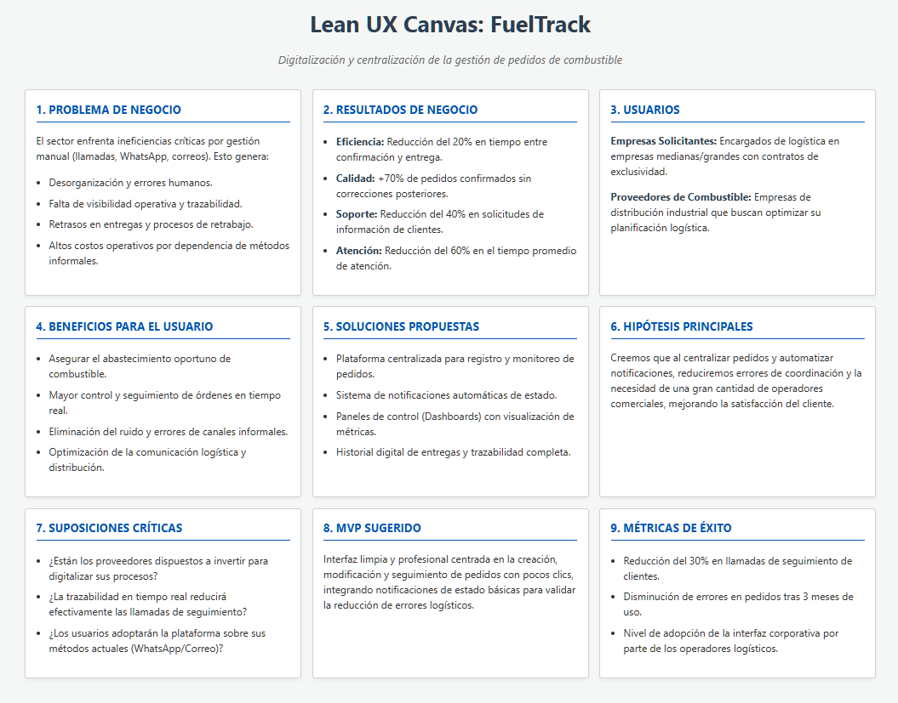</img> 

### 1.3 Segmentos objetivo

### A. Empresas solicitantes de combustible

Empresas medianas y grandes que requieren de combustible de forma constante para el desarrollo de sus operaciones. Utilizan este recurso para alimentar maquinaria, vehículos o equipos, y buscan procesos más ágiles, ordenados y confiables para su gestión de pedidos. Además, mantienen un contrato de exclusividad con un proveedor de combustible, lo que les permite tener un flujo constante de pedidos y una relación comercial estable.

**Necesidades:**
* Asegurar el abastecimiento oportuno de combustible.
* Reducir errores derivados de la informalidad en los procesos.
* Mantener constante comunicación con proveedores.

### B. Proveedores de combustible

Son empresas dedicadas a la distribución de combustibles, atendiendo principalmente a clientes corporativos o industriales. Buscan herramientas que les permitan, optimizar sus operaciones y diferenciarse en un mercado cada vez más competitivo.

**Motivaciones:**
* Mejorar la experiencia del cliente mediante canales digitales.
* Reducir errores en la entrega por información incompleta o mal gestionada.
* Optimizar la planificación logística y distribución.

---

## Capítulo II: Requirements & Analysis

### 2.1 Competidores

PetroApp es una plataforma digital que facilita la compra y venta de combustible, principalmente orientada a consumidores finales y estaciones de servicio. Permite ubicar estaciones cercanas, gestionar pagos electrónicos y controlar el consumo desde una app. Esta enfocada principalmente en el uso personal, pero también ofrece soluciones para empresas, con funcionalidades que permiten cierta trazabilidad y control, aunque con menos enfoque en el flujo completo del pedido corporativo.

FuelCloud es una solución tecnológica centrada en el control del despacho de combustible mediante una combinación de hardware y software. Este ofrece monitoreo en tiempo real, control de acceso al combustible, reportes detallados de consumo y ubicación, lo que la hace ideal para empresas con tanques propios. Además, se enfoca más en el control físico del combustible que en la gestión administrativa o logística del pedido entre proveedor y cliente.

Wialon es una plataforma global de gestión de flotas que incluye funcionalidades para el control de combustible, seguimiento de vehículos por GPS, y análisis de consumo. Ofrece herramientas de visualización en tiempo real, alertas automatizadas y reportes avanzados. Si bien no gestiona directamente el flujo de pedidos entre proveedores y solicitantes, es altamente utilizada por empresas distribuidoras y logísticas que transportan combustible, lo que la convierte en un competidor indirecto pero funcionalmente cercano a FuelTrack.

<table border="1">
  <tr>
    <th colspan="6" style="text-align:left">Competitive Analysis Landscape</th>
  </tr>
  <tr>
    <td><strong>¿Por qué llevar a cabo este análisis?</strong></td>
    <td colspan="5">Este análisis se está llevando a cabo porque queremos conocer las ventajas y desventajas de nuestra aplicación frente a la competencia, y cómo nos diferenciamos de ellas.</td>
  </tr>
  <tr>
  <td colspan="2"><strong>(En la cabecera colocar por cada competidor nombre y logo)</strong></td>
  <td><strong>FuelTrack</strong> 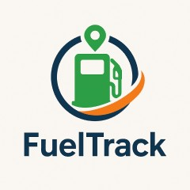</td>
  <td><strong>Zavgar</strong> </td>
  <td><strong>FuelCloud</strong> </td>
  <td><strong>Wialon</strong> </td>
</tr>

  <tr>
    <th rowspan="3">Perfil</th>
    <td><strong>Visión general</strong></td>
    <td>Plataforma web que digitaliza y estructura el proceso completo de pedido de combustible entre empresas y proveedores.</td>
    <td>SaaS para la gestión de consumo de combustible de flotas, con enfoque en eficiencia, monitoreo y costos.</td>
    <td>Solución con hardware/software para el control físico del despacho de combustible.</td>
    <td>Plataforma de gestión de flotas con control de combustible, GPS y reportes operativos.</td>
  </tr>
  <tr>
    <td><strong>Ventaja competitiva</strong></td>
    <td>Especialización en el flujo completo de pedido, despacho y análisis; integración de pagos y logística; UI intuitiva.</td>
    <td>No requiere hardware; ofrece métricas, control de gastos y reportes sobre consumo.</td>
    <td>Control físico preciso del combustible, monitoreo en tiempo real.</td>
    <td>Seguimiento en tiempo real, visualización de rutas, integración con sensores de combustible.</td>
  </tr>
  <tr>
    <td><strong>¿Qué valor ofrece al cliente?</strong></td>
    <td>Trazabilidad total, eficiencia operativa, reportes de consumo y validación segura de pedidos.</td>
    <td>Optimización de costos y control sobre el uso de combustible en flotas.</td>
    <td>Seguridad y precisión operativa en el control de combustible.</td>
    <td>Trazabilidad de flotas, alertas automáticas, análisis de rutas y consumo de combustible.</td>
  </tr>
  <tr>
    <th rowspan="2">Perfil de Marketing</th>
    <td><strong>Mercado objetivo</strong></td>
    <td>Empresas que solicitan combustible a proveedores.</td>
    <td>Empresas con flotas vehiculares que desean monitorear y reducir el consumo de combustible.</td>
    <td>Empresas con tanques de combustible propios.</td>
    <td>Empresas logísticas, distribuidoras y de transporte de combustible.</td>
  </tr>
  <tr>
    <td><strong>Estrategias de marketing</strong></td>
    <td>Alianzas con proveedores, demostraciones de ahorro, marketing de contenido enfocado en eficiencia.</td>
    <td>Enfoque digital, contenido técnico, integración con proveedores de tarjetas de combustible.</td>
    <td>Ferias industriales, distribuidores, venta consultiva entre empresas.</td>
    <td>Alianzas con distribuidores de GPS, marketing técnico, ferias de transporte.</td>
  </tr>
  <tr>
    <th rowspan="3">Perfil de Producto</th>
    <td><strong>Productos & Servicios</strong></td>
    <td>Plataforma para gestión completa de pedidos, seguimiento, reportes, validación y alertas.</td>
    <td>Plataforma web con módulo de abastecimiento, reportes de consumo, integración GPS y tarjetas.</td>
    <td>Hardware IoT y software para gestión, y control de combustible.</td>
    <td>Plataforma SaaS + app móvil con monitoreo, alertas, mapas y módulos personalizables.</td>
  </tr>
  <tr>
    <td><strong>Precios & Costos</strong></td>
    <td>Modelo SaaS con suscripción escalable según volumen y servicios.</td>
    <td>SaaS con modelos por flota activa o vehículos monitoreados.</td>
    <td>Venta e instalación de hardware + licencias de software.</td>
    <td>Modelo SaaS modular, basado en vehículos activos y funcionalidades activadas.</td>
  </tr>
  <tr>
    <td><strong>Canales de distribución</strong></td>
    <td>Web app responsive, potencial app móvil futura.</td>
    <td>Web app, marketing digital y comunidad de flotas.</td>
    <td>Plataforma web + hardware instalado en sitio.</td>
    <td>Red de partners global, distribuidores locales e integradores de sistemas GPS.</td>
  </tr>
  <tr>
    <th rowspan="4">Análisis SWOT</th>
    <td><strong>Fortalezas</strong></td>
    <td>Enfoque especializado, experiencia de usuario optimizada, integraciones clave, análisis avanzado de consumo.</td>
    <td>Implementación ágil, sin hardware, fácil adopción en empresas medianas.</td>
    <td>Control físico riguroso, solución probada en industrias exigentes.</td>
    <td>Plataforma robusta, cobertura internacional, integración con más de 2,400 dispositivos GPS.</td>
  </tr>
  <tr>
    <td><strong>Debilidades</strong></td>
    <td>Nueva en el mercado, menor reconocimiento de marca, necesita consolidar confianza.</td>
    <td>No gestiona el flujo completo del pedido, enfoque parcial en flotas.</td>
    <td>Alto costo, dependencia de hardware, menor adaptabilidad en mercados emergentes.</td>
    <td>No gestiona pedidos entre proveedor y solicitante, requiere configuración técnica inicial.</td>
  </tr>
  <tr>
    <td><strong>Oportunidades</strong></td>
    <td>Alta informalidad en el sector, digitalización creciente en logística, necesidad de trazabilidad y control.</td>
    <td>Mayor conciencia en eficiencia de flotas y digitalización de costos operativos.</td>
    <td>Nuevos mercados industriales con enfoque en seguridad y control.</td>
    <td>Creciente necesidad de control logístico y monitoreo de distribución en países en desarrollo.</td>
  </tr>
  <tr>
    <td><strong>Amenazas</strong></td>
    <td>Aparición de soluciones similares, resistencia al cambio en empresas tradicionales, competencia ERP.</td>
    <td>SaaS especializados con mayor cobertura funcional (ERP, proveedores, logística).</td>
    <td>SaaS ágiles y sin hardware físico, que ofrecen soluciones más accesibles.</td>
    <td>SaaS más específicos y ligeros, enfocados exclusivamente en la trazabilidad de entregas.</td>
  </tr>
</table>

## Estrategias y tácticas frente a competidores.

#### a. Diferenciación a través de especialización
Una de las principales estrategias de **FuelTrack** es la **especialización en el flujo completo de pedido de combustible**. A diferencia de soluciones como **Zavgar**, que están orientadas principalmente al control y análisis del consumo de combustible en flotas, nuestra plataforma se enfoca en las **interacciones B2B** entre empresas solicitantes y proveedores. Esto nos permite ofrecer un **control dedicado del pedido**, **gestión de la logística**, y **reportes detallados de consumo y entregas**, lo cual no está presente en la mayoría de las plataformas competidoras.

- **Táctica**: Desarrollar funcionalidades para la **validación automática de pagos**, **gestión de stock en tiempo real** y la **optimización del transporte** logrando la automatización de procesos que solo eran logrados de forma manual. Esto crea una ventaja frente a competidores como **FuelCloud**, que se centran más en el control físico del combustible y menos en la administración a nivel operativo.

#### b. Innovación en la interfaz de usuario y experiencia

El sistema de **FuelTrack** está diseñado para ofrecer una **experiencia de usuario optimizada**, algo que **Wialon**, **FuelCloud** y la propia **OSINERGMIN** no abordan en sus plataformas. Al ser una solución especializada y dirigida a una tarea específica, podemos dedicar más recursos en crear una interfaz intuitiva y procesos bien definidos brindando comodidad y seguridad a nuestros usuarios.

- **Táctica**: Diseñar una **interfaz intuitiva y consistente** que permita a los usuarios acceder a reportes de consumo, validar pedidos y coordinar logística con facilidad. Además, ofrecer **soporte y formación continua** para asegurar que los usuarios aprovechen al máximo todas las funcionalidades del sistema.

#### c. Flexibilidad en precios y modelo SaaS escalable
El modelo de precios de **FuelTrack** ofrece **planes escalables basados en suscripción**, lo que hace que sea más accesible para medianas y grandes empresas. Esto es más competitivo frente a **Wialon**, que puede no ser una opción viable para empresas que solo requieren una solución de pedidos de combustible. También es más asequible que **FuelCloud**, que requiere una inversión considerable en hardware, instalación y mantenimiento.

- **Táctica**: Ofrecer un modelo de suscripción flexible y **precios competitivos**, con **múltiples niveles de suscripción** adaptados a las necesidades de diferentes empresas. Esto permitirá que empresas de menor tamaño puedan acceder a la plataforma sin comprometer su presupuesto, a la vez que se asegura el crecimiento a largo plazo a medida que la empresa crece.

#### d. Aprovechamiento de la digitalización en la logística
El sector de la logística está experimentando una transformación digital acelerada. **FuelTrack** se aprovechará de esta tendencia buscando la integración de la plataforma con otras soluciones logísticas (como los sistemas de gestión de vehículos o flotas). De esta forma podemos ofrecer una solución más completa y eficiente.

- **Táctica**: Colaborar con empresas de **gestión de flotas** para optimizar el proceso de asignación de vehículos, cisternas y choferes. También se considerará la posibilidad de integrar **sensores IoT** en los camiones de reparto para un control más preciso sobre el combustible transportado y la entrega.

#### e. Expansión hacia mercados internacionales
Si bien **FuelTrack** está inicialmente orientada a empresas locales, el modelo de negocio y la flexibilidad de la plataforma la hacen ideal para expandirse a **mercados internacionales**. Competidores como **Wialon** ya tienen presencia en mercados globales, pero su enfoque en empresas grandes y sus altos costos de implementación pueden ser una barrera para empresas de menor tamaño, limitando su alcance.

- **Táctica**: Iniciar la expansión en mercados emergentes donde la digitalización en la logística es una necesidad creciente. Esto incluirá la **localización de la plataforma** (idioma, moneda, regulaciones locales) para facilitar la adaptabilidad de los nuevos mercados.

### 2.2 Entrevistas

Para comprender mejor a nuestros segmentos objetivo, se han definido dos entrevistas diferenciadas según el segmento objetivo: 
- Proveedores de combustible
- Empresas con contratos de suministro (clientes corporativos)

---
#### A. Proveedores de Combustible

**Preguntas:**

1. ¿Cómo gestionan actualmente los pedidos de empresas clientes?
2. ¿Usan algún sistema digital para registrar pedidos o es manual?
3. ¿Qué pasos se siguen desde que un cliente hace un pedido hasta que se entregue?
4. ¿Cómo controlan que lo despachado coincida con lo solicitado?
5. ¿Qué tipo de reportes requieren generar (volúmenes, facturación, entregas, etc.)?
6. ¿Tienen un sistema para validar el stock antes de preparar el despacho de un pedido?
7. ¿Cómo hacen el seguimiento de los pedidos? ¿Informan al cliente en tiempo real?
8. ¿Qué problemas suelen ocurrir en el proceso de atención de pedidos empresariales?
9. ¿Cómo se realiza la conciliación de pagos con los clientes?
10. ¿Estarían dispuestos a integrar su sistema actual con una plataforma SaaS que unifique y centralice estos procesos?

**Preguntas complementarias:**

- ¿Qué edad tiene?
- ¿Cuál es su nivel de experiencia en logística o ventas?
- ¿Qué tipo de dispositivo usa en el trabajo? (PC, tablet, celular)
- ¿Qué aplicaciones o herramientas digitales usa en su día a día?
- ¿Cómo describiría su nivel de habilidad con la tecnología?

---

#### B. Empresas Solicitantes

**Preguntas:**

1. ¿Cómo solicitan actualmente combustible a su proveedor?
2. ¿Utilizan un sistema propio o envían pedidos por correo, WhatsApp, etc.?
3. ¿Cómo verifican que lo entregado coincida con lo solicitado?
4. ¿Tienen problemas con entregas incompletas o fuera de tiempo?
5. ¿Con qué frecuencia necesitan reportes de consumo, entregas o pagos?
6. ¿Qué tan importante es para ustedes tener trazabilidad de cada entrega?
7. ¿Quiénes son los responsables de validar pedidos y autorizar pagos?
8. ¿Cómo gestionan las reprogramaciones o cancelaciones de pedidos?
9. ¿Qué herramientas utilizan para monitorear el consumo mensual?
10. ¿Qué mejoras desearían ver en el proceso actual?

**Preguntas complementarias:**

- ¿Qué edad tiene?
- ¿En qué distrito vive y trabaja?
- ¿Qué nivel de estudios tiene?
- ¿Qué dispositivos utiliza más frecuentemente en el trabajo?
- ¿Qué aplicaciones o plataformas usa para su gestión operativa?
- ¿Cuáles son sus principales frustraciones en el proceso actual?

---

<h3>2.2.2. Registro de entrevistas</h3>

<h4><u>Entrevista 1</u></h4>

<strong>Nombres:</strong> Angela Fabiola

<strong>Apellidos:</strong> Ushiñahua Becerra

<strong>Edad:</strong> 25 años

<strong>Distrito:</strong> Villa El Salvador

<strong>Captura de la entrevista:</strong> 

<strong>Inicio:</strong> 00:02 
<strong>Fin:</strong> 04:06 
<strong>Duración:</strong> 04:10 

<strong>URL de Entrevista:</strong> 
<a href="#anexos">Ver anexo</a>

<h5><strong>Resumen:</strong></h5>

Como proveedora de combustible, Angela indicó que los pedidos se gestionan mediante coordinación con el área de logística y el uso de herramientas digitales básicas, aunque varios procesos aún son manuales. El control de los despachos se realiza comparando recibos con el cliente, y no cuentan con sistemas para seguimiento en tiempo real ni validación de stock. Entre los principales problemas se encuentran errores en los pedidos o retrasos en la entrega. Finalmente, mostró interés en una plataforma que centralice y optimice estos procesos para mejorar la eficiencia y atención al cliente.

---
<h4><u>Entrevista 2</u></h4>

<strong>Nombres:</strong> Jhony

<strong>Apellidos:</strong> De la Cruz Salazar

<strong>Edad:</strong> 46 años

<strong>Distrito:</strong> Villa El Salvador

<strong>Captura de la entrevista:</strong> 

<strong>Inicio:</strong> 00:02 
<strong>Fin:</strong> 06:14 
<strong>Duración:</strong> 06:16 
<strong>URL de Entrevista:</strong> 
<a href="#anexos">Ver anexo</a>

<h5><strong>Resumen:</strong></h5>

Como empresa solicitante de combustible, Jhony indicó que actualmente los pedidos se realizan mediante correo, llamadas o aplicaciones como WhatsApp, lo que genera dificultades en la coordinación y seguimiento de las entregas. El control de lo recibido se realiza de forma manual mediante medición en tanques, lo que puede resultar impreciso. Además, mencionó problemas como retrasos en las entregas que afectan directamente las operaciones del negocio. La trazabilidad es considerada muy importante, ya que permite monitorear el estado de los pedidos y tomar decisiones oportunas. Actualmente utilizan herramientas como Excel y sistemas básicos para el control de consumo, pero expresaron la necesidad de contar con una plataforma que permita hacer seguimiento en tiempo real desde la solicitud hasta la entrega del pedido.

---
<h4><u>Entrevista 3</u></h4>

<strong>Nombres:</strong> Carmen

<strong>Apellidos:</strong> Ruiz

<strong>Edad:</strong> 34 años

<strong>Distrito:</strong> San Juan de Miraflores

<strong>Captura de la entrevista:</strong> 

<strong>Inicio:</strong> 00:05 
<strong>Fin:</strong> 05:12 
<strong>Duración:</strong> 05:07 
<strong>URL de Entrevista:</strong> 
<a href="#anexos">Ver anexo</a>

<h5><strong>Resumen:</strong></h5>

Como proveedora de combustible, indicó que los pedidos se gestionan con herramientas básicas y coordinación manual, lo que puede generar retrasos y errores. Considera importante mejorar el seguimiento y control mediante una plataforma digital.

---
<h4><u>Entrevista 4</u></h4>

<strong>Nombres:</strong> Manuel

<strong>Apellidos:</strong> Rojas

<strong>Edad:</strong> 41 años

<strong>Distrito:</strong> Villa María del Triunfo

<strong>Captura de la entrevista:</strong> 

<strong>Inicio:</strong> 00:03 
<strong>Fin:</strong> 05:45 
<strong>Duración:</strong> 05:42 
<strong>URL de Entrevista:</strong> 
<a href="#anexos">Ver anexo</a>

<h5><strong>Resumen:</strong></h5>

Como proveedor de combustible, mencionó que el proceso actual depende de coordinación manual y herramientas básicas, lo que puede generar errores y retrasos. Considera necesario contar con un sistema que centralice la gestión y mejore el seguimiento de pedidos.

---
<h4><u>Entrevista 5</u></h4>

<strong>Nombres:</strong> Daniel

<strong>Apellidos:</strong> Ortega

<strong>Edad:</strong> 38 años

<strong>Distrito:</strong> San Isidro

<strong>Captura de la entrevista:</strong> 

<strong>Inicio:</strong> 00:04 
<strong>Fin:</strong> 06:20 
<strong>Duración:</strong> 06:16 
<strong>URL de Entrevista:</strong> 
<a href="#anexos">Ver anexo</a>

<h5><strong>Resumen:</strong></h5>

Como empresa solicitante, indicó que los pedidos se realizan mediante canales informales como correo o mensajería, lo que dificulta el seguimiento y control. Considera importante contar con una solución que permita monitorear los pedidos en tiempo real y mejorar la coordinación con los proveedores.

---
<h4><u>Entrevista 6</u></h4>

<strong>Nombres:</strong> Lucía

<strong>Apellidos:</strong> Castillo

<strong>Edad:</strong> 32 años

<strong>Distrito:</strong> Miraflores

<strong>Captura de la entrevista:</strong> 

<strong>Inicio:</strong> 00:03 
<strong>Fin:</strong> 05:58 
<strong>Duración:</strong> 05:55 
<strong>URL de Entrevista:</strong> 
<a href="#anexos">Ver anexo</a>

<h5><strong>Resumen:</strong></h5>

Como empresa solicitante, señaló que el proceso actual de pedidos se realiza mediante canales no centralizados, lo que genera dificultades en el control y seguimiento. Considera necesario implementar una plataforma que permita mejorar la trazabilidad y la coordinación con los proveedores.

### 2.3 Needfinding

#### 2.3.1 User Personas

a. User Persona 1: Empresas solicitantes de combustible
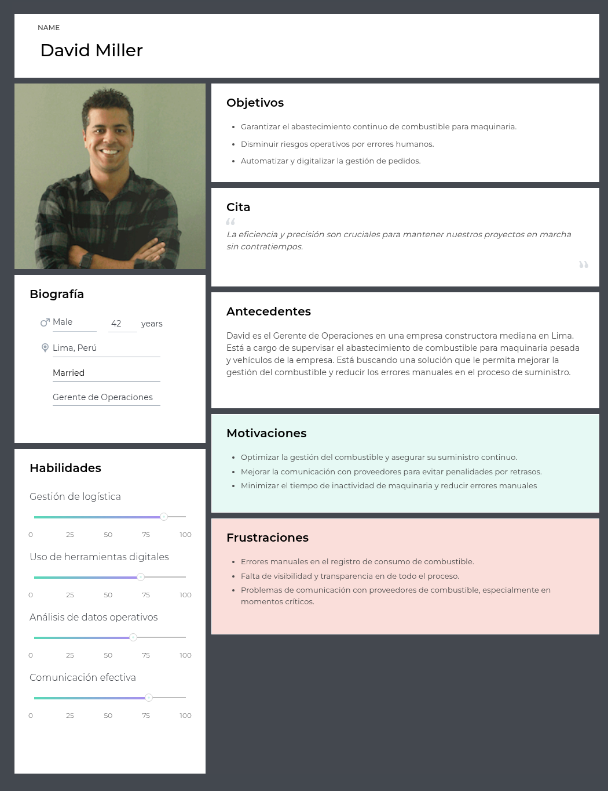

b. User Persona 2: Proveedores de combustible
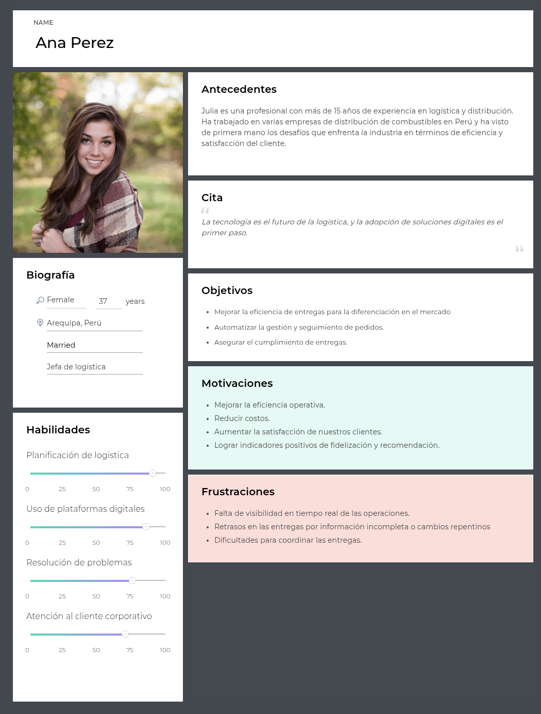

#### 2.3.2 User Task Matrix

| **Tarea**                                      | **David Miller – Frecuencia** | **David Miller – Importancia** | **Ana Pérez – Frecuencia** | **Ana Pérez – Importancia** |
|------------------------------------------------|-------------------------------|---------------------------------|-----------------------------|------------------------------|
| Revisar nivel de stock de combustible          | Alta | Alta | Baja | Baja |
| Realizar pedido de combustible                 | Media | Alta | Alta | Alta |
| Validar confirmación de pedido                 | Alta | Alta | Alta | Alta |
| Hacer seguimiento a la entrega                 | Alta | Alta | Alta | Alta |
| Supervisar descarga y recepción                | Media | Alta | Media | Media |
| Evaluar proceso post-servicio                  | Baja | Media | Alta | Alta |
| Gestionar atención al cliente                  | Media | Alta | Alta | Alta |
| Revisar encuestas o feedback                   | Baja | Media | Media | Alta |

#### 2.3.3 Empathy Maps

#### 2.3.4 As-is Scenario Mapping

 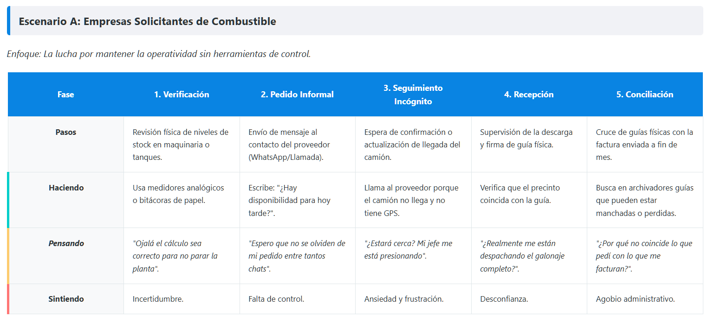</img> 
 
 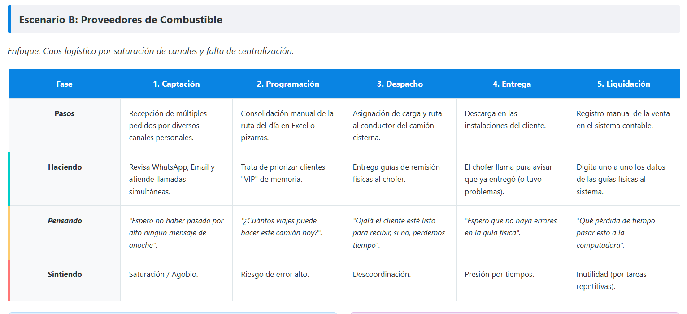</img> 

---

## Capítulo III: Requirements Specification

### 3.1 To-Be Scenario Mapping

 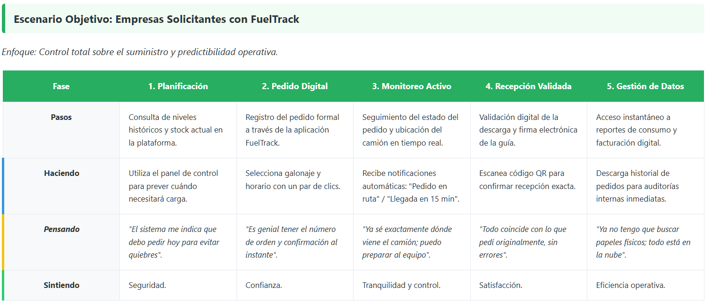</img> 
 
 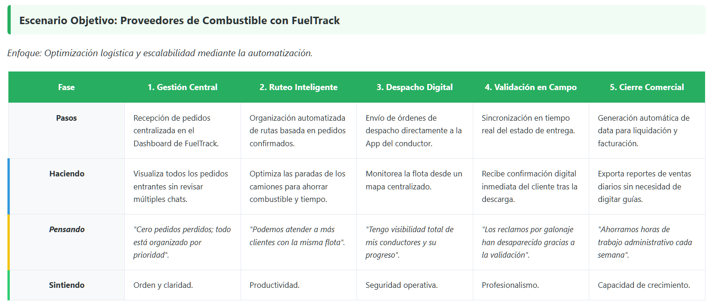</img> 

### 3.2 User Stories

### Introducción
Este apartado presenta el conjunto de **Epics** y **User Stories** (incluyendo **Technical Stories** y **Spike Stories**) con **criterios de aceptación** en formato **Gherkin**. Las prioridades quedan **TBD** para definición del Product Owner. Los criterios son verificables, en presente y tercera persona, sin referencias a elementos de interfaz.

### Cuadro único de Epics & Stories

| Story ID | User/Rol | Priority | Epic | Title (verbo) | Description | Acceptance Criteria |
|---|---|---|---|---|---|---|
| **EP01** | Solicitante | TBD | EP01 | **Gestionar pedidos como solicitante** | Como solicitante, quiere registrar, consultar y ajustar pedidos con trazabilidad para reducir errores. | **Esc 1 – Registrar pedido**: **Given** que el solicitante completa datos válidos, **When** registra el pedido, **Then** el sistema crea el pedido con ID y estado inicial “Pendiente”. **Esc 2 – Consultar historial**: **Given** que existen pedidos, **When** el solicitante solicita su historial, **Then** el sistema retorna la lista con estados actuales. **Esc 3 – Editar antes de confirmación**: **Given** un pedido “Pendiente”, **When** solicita edición, **Then** el sistema permite modificar campos permitidos y registra cambios. |
| **EP02** | Proveedor | TBD | EP02 | **Gestionar pedidos como proveedor** | Como proveedor, quiere revisar y actualizar pedidos, coordinar asignaciones y notificar al cliente para ejecutar la entrega. | **Esc 1 – Ver pedidos entrantes**: **Given** que hay pedidos activos, **When** el proveedor los consulta, **Then** obtiene la lista con datos operativos y estado. **Esc 2 – Actualizar estado**: **Given** un pedido activo, **When** lo cambia a “Confirmado/En ruta/Entregado/Rechazado”, **Then** el nuevo estado queda persistido y trazado. **Esc 3 – Notificar cambios**: **Given** un cambio de estado, **When** se confirma, **Then** el sistema emite notificación al solicitante. |
| **EP03** | Todos | TBD | EP03 | **Asegurar identidad y acceso** | Como usuario del sistema, quiere autenticación, control por roles y MFA en operaciones sensibles para proteger la información. | **Esc 1 – Autenticar**: **Given** credenciales válidas, **When** inicia sesión, **Then** accede a recursos según su rol. **Esc 2 – Restringir por rol**: **Given** sesión activa, **When** intenta acceder a un recurso de otro rol, **Then** el acceso es denegado. **Esc 3 – MFA en operación crítica**: **Given** una acción sensible (p. ej., confirmación de pedido), **When** se ejecuta, **Then** requiere verificación adicional exitosa. |
| **EP04** | Visitante | TBD | EP04 | **Informar la propuesta (Landing)** | Como visitante, quiere entender beneficios y flujo para registrarse según su segmento. | **Esc 1 – Acceso público**: **Given** acceso sin autenticación, **When** solicita información, **Then** el sistema presenta contenido informativo y llamados a registro. **Esc 2 – Derivar registro por segmento**: **Given** interés de registro, **When** el visitante elige su segmento, **Then** el sistema lo redirige al flujo de alta correspondiente. |
| **US01** | Solicitante | TBD | EP01 | **Registrar pedido** | Como solicitante, quiere registrar pedidos para agilizar la solicitud y evitar llamadas. | **Esc 1 – Registro válido**: **Given** datos de pedido válidos, **When** envía la solicitud, **Then** el sistema crea el pedido con ID y estado “Pendiente”. **Esc 2 – Datos inválidos**: **Given** datos incompletos/incorrectos, **When** intenta registrar, **Then** el sistema rechaza y detalla validaciones. |
| **US02** | Solicitante | TBD | EP01 | **Consultar historial de pedidos** | Como solicitante, quiere consultar su historial con estados y detalles. | **Esc 1 – Con registros**: **Given** pedidos existentes, **When** consulta historial, **Then** el sistema retorna pedidos con estado actual (“Pendiente/Confirmado/En ruta/Entregado/Rechazado”). **Esc 2 – Sin registros**: **Given** ausencia de pedidos, **When** consulta, **Then** el sistema retorna lista vacía con causa. |
| **US03** | Solicitante | TBD | EP01 | **Editar pedido no confirmado** | Como solicitante, quiere editar parámetros antes de confirmación del proveedor. | **Esc 1 – Pedido editable**: **Given** pedido “Pendiente”, **When** solicita edición, **Then** el sistema permite modificar campos permitidos. **Esc 2 – Pedido no editable**: **Given** pedido “Confirmado” o superior, **When** solicita edición, **Then** el sistema impide cambios y registra el intento. |
| **US05** | Proveedor | TBD | EP02 | **Actualizar pedido** | Como proveedor, quiere actualizar estado e información operativa del pedido. | **Esc 1 – Cambio de estado**: **Given** un pedido activo, **When** cambia su estado a uno permitido, **Then** el sistema persiste la transición con marca de tiempo. **Esc 2 – Cambio inválido**: **Given** reglas de flujo, **When** intenta transición no permitida, **Then** el sistema rechaza y explica la regla. |
| **US06** | Proveedor | TBD | EP02 | **Notificar cambios al cliente** | Como proveedor, quiere que el cliente reciba notificaciones automáticas ante cambios del pedido. | **Esc 1 – Notificación por estado**: **Given** un cambio a “Confirmado/En ruta/Entregado/Rechazado”, **When** se registra, **Then** el sistema envía la notificación al solicitante. **Esc 2 – Falla de notificación**: **Given** indisponibilidad del servicio de mensajería, **When** se intenta notificar, **Then** el sistema registra el error y reintenta según política. |
| **US07** | Proveedor | TBD | EP02 | **Cancelar o rechazar pedido** | Como proveedor, quiere rechazar/cancelar pedidos con motivo para mantener claridad. | **Esc 1 – Rechazo con motivo**: **Given** imposibilidad de atención, **When** registra rechazo con motivo, **Then** el sistema cambia estado y asocia la justificación. **Esc 2 – Cancelación operativa**: **Given** pedido activo, **When** solicita cancelación con motivo, **Then** el sistema cambia a “Cancelado” y notifica al solicitante. |
| **US08** | Usuario | TBD | EP03 | **Iniciar sesión** | Como usuario, quiere iniciar sesión con credenciales válidas. | **Esc 1 – Éxito**: **Given** credenciales válidas, **When** inicia sesión, **Then** el sistema autentica y emite token de acceso. **Esc 2 – Falla**: **Given** credenciales inválidas, **When** intenta autenticarse, **Then** el sistema niega acceso sin revelar detalles. |
| **US09** | Visitante | TBD | EP03 | **Registrar cuenta** | Como visitante, quiere crear una cuenta con rol (Solicitante/Proveedor). | **Esc 1 – Alta válida**: **Given** datos válidos, **When** confirma el alta, **Then** el sistema crea la cuenta y habilita acceso. **Esc 2 – Alta inválida**: **Given** datos inválidos, **When** solicita alta, **Then** el sistema rechaza y detalla validaciones. |
| **US10** | Usuario | TBD | EP03 | **Recuperar contraseña** | Como usuario, quiere recuperar acceso por correo. | **Esc 1 – Correo registrado**: **Given** un correo válido, **When** solicita recuperación, **Then** el sistema genera token de restablecimiento y lo envía. **Esc 2 – Correo no registrado**: **Given** un correo no existente, **When** solicita recuperación, **Then** el sistema informa que no encuentra el identificador. |
| **US11** | Administrador | TBD | EP03 | **Restringir acceso por rol** | Como administrador, quiere que cada usuario acceda solo a recursos de su rol. | **Esc 1 – Acceso permitido**: **Given** rol y permisos, **When** accede a su recurso, **Then** el sistema permite la operación. **Esc 2 – Acceso denegado**: **Given** recurso de otro rol, **When** intenta acceso, **Then** el sistema deniega y audita. |
| **US12** | Solicitante | TBD | EP03 | **Verificar MFA en pedidos** | Como solicitante, quiere MFA al emitir pedidos para mayor seguridad. | **Esc 1 – Verificación exitosa**: **Given** MFA activo, **When** confirma un pedido, **Then** finaliza solo si la verificación adicional es válida. **Esc 2 – Verificación fallida**: **Given** MFA activo, **When** falla la verificación, **Then** el sistema cancela la acción. |
| **US13** | Visitante | TBD | EP04 | **Explorar landing** | Como usuario no autenticado, quiere visualizar la propuesta y caminos a registro. | **Esc 1 – Información visible**: **Given** acceso público, **When** solicita información, **Then** el sistema expone beneficios y flujo de valor. **Esc 2 – Derivación a registro**: **Given** interés, **When** elige registrarse, **Then** el sistema dirige al alta según segmento. |
| **TS01** | Developer | TBD | EP01 | **Exponer endpoint de pedidos (POST)** | Como developer, quiere un endpoint REST para registrar pedidos. | **Esc 1 – Request válido (201)**: **Given** payload válido, **When** invoca el endpoint, **Then** persiste y retorna 201 con ID. **Esc 2 – Request inválido (400)**: **Given** payload inválido, **When** invoca, **Then** retorna 400 con detalle de validación. |
| **TS02** | Developer | TBD | EP03 | **Emitir token de autenticación (JWT)** | Como developer, quiere servicio de autenticación con JWT. | **Esc 1 – Credenciales válidas (200)**: **Given** credenciales correctas, **When** solicita token, **Then** retorna JWT y vencimiento. **Esc 2 – Credenciales inválidas (401)**: **Given** credenciales incorrectas, **When** solicita, **Then** retorna 401. |
| **TS03** | Developer | TBD | EP02 | **Enviar notificaciones por cambio de estado** | Como developer, quiere servicio que emite notificaciones ante cambios de pedido. | **Esc 1 – Notificación emitida**: **Given** cambio de estado, **When** se confirma, **Then** el servicio envía notificación al destinatario. **Esc 2 – Error de mensajería**: **Given** caída del proveedor de mensajería, **When** intenta enviar, **Then** registra error y gestiona reintentos/backoff. |
| **TS04** | Developer | TBD | EP02 | **Registrar ubicación GPS en ruta** | Como developer, quiere registrar coordenadas para trazabilidad. | **Esc 1 – Registro exitoso**: **Given** coordenadas válidas, **When** se reciben, **Then** el sistema almacena con marca de tiempo y pedido asociado. **Esc 2 – Datos inválidos**: **Given** coordenadas inválidas, **When** se reciben, **Then** el sistema rechaza y audita. |
| **US14** | Visitante (Proveedor) | TBD | EP04 | **Consultar Home pública** | Como visitante proveedor, quiere un resumen del valor de la solución. | **Esc 1 – Resumen visible**: **Given** acceso público, **When** consulta el inicio, **Then** el sistema presenta propósito y propuesta de valor. **Esc 2 – CTA disponible**: **Given** interés del visitante, **When** solicita continuar, **Then** existe un camino a registro o contacto. |
| **US15** | Visitante | TBD | EP04 | **Conocer About Us** | Como visitante, quiere conocer el equipo y propósito para generar confianza. | **Esc 1 – Información del equipo**: **Given** acceso a About, **When** lo solicita, **Then** el sistema presenta información institucional verificable. **Esc 2 – Principios de la solución**: **Given** About, **When** lo consulta, **Then** el sistema presenta visión/valores. |
| **US16** | Visitante | TBD | EP04 | **Entender cómo funciona** | Como visitante, quiere comprender el flujo de operación. | **Esc 1 – Flujo comprensible**: **Given** sección “Cómo funciona”, **When** la revisa, **Then** entiende la interacción solicitante–proveedor a alto nivel. **Esc 2 – Casos de uso**: **Given** la sección, **When** la consulta, **Then** identifica ejemplos típicos del proceso. |
| **US17** | Visitante | TBD | EP04 | **Enviar contacto** | Como visitante, quiere remitir un mensaje de contacto. | **Esc 1 – Envío válido**: **Given** datos válidos, **When** remite el mensaje, **Then** el sistema registra y confirma recepción. **Esc 2 – Datos faltantes**: **Given** datos incompletos, **When** intenta enviar, **Then** el sistema rechaza e indica los campos requeridos. |
| **US18** | Proveedor | TBD | EP02 | **Aprobar pedido** | Como proveedor, quiere aprobar pedidos según stock disponible. | **Esc 1 – Aprobación con stock**: **Given** stock suficiente, **When** aprueba, **Then** el estado cambia a “Confirmado”. **Esc 2 – Rechazo por falta de stock**: **Given** stock insuficiente, **When** decide no aprobar, **Then** registra motivo y cambia a “Rechazado”. |
| **US19** | Proveedor | TBD | EP02 | **Despachar pedido** | Como proveedor, quiere marcar un pedido como despachado para notificar al cliente. | **Esc 1 – Despacho válido**: **Given** pedido “Confirmado”, **When** marca “En ruta/Despachado”, **Then** el sistema actualiza estado y registra hora de salida. **Esc 2 – Restricción sin confirmación**: **Given** pedido sin confirmar, **When** intenta despachar, **Then** el sistema rechaza la transición. |
| **US20** | Proveedor | TBD | EP02 | **Cerrar pedido** | Como proveedor, quiere cerrar el pedido cuando la entrega se confirma. | **Esc 1 – Cierre tras confirmación**: **Given** entrega confirmada por el solicitante, **When** ejecuta cierre, **Then** el pedido pasa a “Entregado/Finalizado” e impide modificaciones. **Esc 2 – Intento sin confirmación**: **Given** sin confirmación, **When** intenta cerrar, **Then** el sistema rechaza la acción. |
| **US21** | Proveedor | TBD | EP02 | **Generar reporte de ventas** | Como proveedor, quiere reportes operativos por rango de fechas. | **Esc 1 – Rango con datos**: **Given** fechas válidas con ventas, **When** solicita el reporte, **Then** el sistema genera el resumen. **Esc 2 – Rango sin datos**: **Given** rango vacío, **When** solicita, **Then** el sistema informa ausencia de resultados. |
| **US22** | Solicitante | TBD | EP01 | **Visualizar KPIs de pedidos (Solicitante)** | Como solicitante, quiere ver un resumen por estado. | **Esc 1 – Con datos**: **Given** pedidos, **When** consulta KPIs, **Then** ve conteos por estado. **Esc 2 – Sin datos**: **Given** sin pedidos, **When** consulta KPIs, **Then** el sistema indica que no hay registros. |
| **US23** | Proveedor | TBD | EP02 | **Visualizar KPIs de pedidos (Proveedor)** | Como proveedor, quiere ver resumen operativo por estado. | **Esc 1 – Con datos**: **Given** pedidos, **When** consulta, **Then** ve KPIs por estado. **Esc 2 – Error de carga**: **Given** falla de fuente, **When** consulta, **Then** el sistema indica error y permite reintentar. |
| **TS05** | Developer | TBD | EP03 | **Autenticar (endpoint login)** | Como developer, quiere endpoint de login. | **Esc 1 – 200 con token**: **Given** credenciales válidas, **When** envía request, **Then** obtiene 200 + JWT. **Esc 2 – 401**: **Given** credenciales inválidas, **When** envía request, **Then** obtiene 401. **Esc 3 – 500**: **Given** error interno, **When** procesa, **Then** retorna 500 y registra en logs. |
| **TS06** | Developer | TBD | EP03 | **Recuperar contraseña (endpoint)** | Como developer, quiere endpoint de recuperación. | **Esc 1 – Correo válido (202)**: **Given** correo existente, **When** solicita, **Then** genera token y envía email. **Esc 2 – 404**: **Given** correo no registrado, **When** solicita, **Then** retorna 404. **Esc 3 – 500**: **Given** fallo de correo, **When** envía, **Then** 500 y traza error. |
| **TS07** | Developer | TBD | EP03 | **Cerrar sesión (endpoint logout)** | Como developer, quiere endpoint para invalidar sesión. | **Esc 1 – 200**: **Given** token válido, **When** solicita logout, **Then** invalida sesión. **Esc 2 – 401**: **Given** token inválido/expirado, **When** solicita, **Then** retorna 401. |
| **US24** | Proveedor | TBD | EP02 | **Asignar vehículo a pedido** | Como proveedor, quiere asignar vehículo a pedido confirmado. | **Esc 1 – Asignación válida**: **Given** vehículo disponible y pedido “Confirmado”, **When** asigna, **Then** queda vinculado. **Esc 2 – Vehículo ocupado**: **Given** vehículo con conflicto, **When** intenta asignar, **Then** el sistema rechaza por superposición. |
| **US25** | Proveedor | TBD | EP02 | **Asignar conductor a pedido** | Como proveedor, quiere asignar conductor disponible. | **Esc 1 – Asignación válida**: **Given** conductor libre y pedido listo, **When** asigna, **Then** queda vinculado. **Esc 2 – Conflicto de horario**: **Given** conductor asignado en el mismo tramo, **When** intenta asignar, **Then** el sistema rechaza y explica conflicto. |
| **US26** | Proveedor | TBD | EP02 | **Validar disponibilidad de transporte** | Como proveedor, quiere verificar disponibilidad de vehículos antes de asignar. | **Esc 1 – No disponible por superposición**: **Given** vehículo con asignación en la misma ventana, **When** se consulta, **Then** se marca no disponible. **Esc 2 – Disponible**: **Given** sin conflictos, **When** se consulta, **Then** es seleccionable. **Esc 3 – Carrera concurrente**: **Given** asignación reciente por otro usuario, **When** intenta seleccionar, **Then** el sistema rechaza y actualiza disponibilidad. |
| **US27** | Usuario | TBD | EP03 | **Consultar perfil** | Como usuario, quiere ver su perfil para revisar datos. | **Esc 1 – Éxito**: **Given** sesión activa, **When** consulta, **Then** el sistema retorna su información de perfil. **Esc 2 – Error de fuente**: **Given** falla al obtener datos, **When** consulta, **Then** el sistema informa el error conservando la sesión. |
| **US28** | Usuario | TBD | EP03 | **Actualizar perfil** | Como usuario, quiere actualizar sus datos vigentes. | **Esc 1 – Guardado válido**: **Given** cambios válidos, **When** confirma, **Then** el sistema persiste cambios. **Esc 2 – Validación**: **Given** campos requeridos faltantes, **When** intenta guardar, **Then** el sistema rechaza la operación con detalle. |
| **US29** | Usuario | TBD | EP01/EP02 | **Buscar pedido por código** | Como usuario, quiere localizar rápidamente un pedido por su código. | **Esc 1 – Encontrado**: **Given** código existente, **When** busca, **Then** el sistema retorna el pedido. **Esc 2 – No encontrado**: **Given** código inexistente, **When** busca, **Then** el sistema informa ausencia de coincidencias. |
| **US30** | Usuario | TBD | EP01/EP02 | **Filtrar pedidos por estado** | Como usuario, quiere filtrar pedidos por estado operativo. | **Esc 1 – Filtro con resultados**: **Given** estado con coincidencias, **When** filtra, **Then** el sistema retorna solo los pedidos de ese estado. **Esc 2 – Sin resultados**: **Given** estado sin coincidencias, **When** filtra, **Then** el sistema informa que no hay resultados. |
| **US31** | Solicitante | TBD | EP01 | **Recibir notificación de aprobación/rechazo** | Como solicitante, quiere ser notificado cuando cambie el estado del pedido. | **Esc 1 – Notificación visible**: **Given** cambio de estado, **When** el solicitante accede, **Then** la notificación está disponible hasta marcar como leída. |
| **US32** | Solicitante | TBD | EP01 | **Recibir notificación de despacho** | Como solicitante, quiere ser notificado cuando el pedido salga a entrega. | **Esc 1 – Despacho confirmado**: **Given** cambio a “En ruta/Despachado”, **When** consulta, **Then** la notificación está disponible y asociada al pedido. |
| **US33** | Proveedor | TBD | EP02 | **Listar empresas solicitantes** | Como proveedor, quiere listar empresas para gestión de clientes. | **Esc 1 – Lista con datos**: **Given** empresas registradas, **When** consulta, **Then** el sistema retorna el listado con métricas operativas. **Esc 2 – Lista vacía**: **Given** sin empresas, **When** consulta, **Then** el sistema informa ausencia de registros. |
| **US34** | Proveedor | TBD | EP02 | **Consultar detalle de empresa** | Como proveedor, quiere ver detalle e historial de una empresa. | **Esc 1 – Con historial**: **Given** empresa con pedidos, **When** consulta, **Then** el sistema retorna pedidos, cantidades y fechas. **Esc 2 – Sin historial**: **Given** empresa sin pedidos, **When** consulta, **Then** el sistema informa que no hay historial. |
| **US35** | Solicitante | TBD | EP01 | **Visualizar gráfico de consumo** | Como solicitante, quiere visualizar consumo mensual. | **Esc 1 – Con datos**: **Given** pedidos históricos, **When** consulta, **Then** el sistema calcula y expone consumo mensual. **Esc 2 – Sin datos**: **Given** sin pedidos, **When** consulta, **Then** el sistema informa falta de datos suficientes. |
| **US36** | Proveedor | TBD | EP02 | **Visualizar gráfico de ventas** | Como proveedor, quiere visualizar ventas por mes. | **Esc 1 – Con datos**: **Given** despachos realizados, **When** consulta, **Then** el sistema expone totales por mes. **Esc 2 – Sin datos**: **Given** sin ventas, **When** consulta, **Then** el sistema informa que no hay datos suficientes. |
| **US37** | Usuario | TBD | EP01/EP02 | **Descargar reporte en PDF** | Como usuario, quiere descargar resúmenes operativos en PDF. | **Esc 1 – Exportación con datos**: **Given** periodo con información, **When** solicita exportar, **Then** el sistema genera el documento. **Esc 2 – Exportación sin datos**: **Given** periodo vacío, **When** solicita, **Then** el sistema informa que no hay contenido exportable. **Esc 3 – Falla de generación**: **Given** error de backend, **When** exporta, **Then** el sistema informa el fallo y conserva sesión. |
| **SP01** | Equipo (Spike) | TBD | EP02/EP03 | **Investigar conciliación de pagos y validación automática** | Como equipo, quiere investigar opciones de integración (e.g., pasarela/conciliación bancaria) para reducir retrasos por validación manual. | **Esc 1 – Documentación revisada**: **Given** proveedores de pago seleccionados, **When** se revisa documentación y webhooks, **Then** se documentan flujos recomendados. **Esc 2 – PoC mínimo**: **Given** entorno de pruebas, **When** se implementa PoC de conciliación, **Then** se registra en repo y se documentan resultados. **Esc 3 – Criterios de decisión**: **Given** hallazgos, **When** se comparan costos/riesgos, **Then** se proponen alternativas y estimaciones. |

---

### 3.3 Impact Map

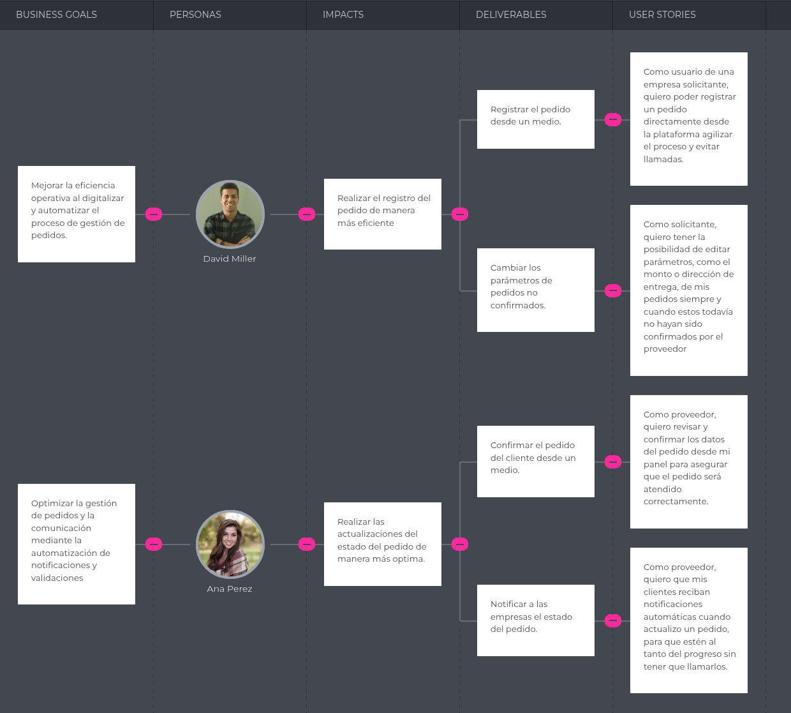

### 3.4 Product Backlog

| # Orden | User Story Id | Título | Story Points (1/2/3/5/8) |
|---:|:---:|---|:---:|
| 01 | US01 | Crear nuevo pedido | 5 |
| 02 | US02 | Consultar historial de pedidos | 3 |
| 03 | US03 | Editar pedido no confirmado | 5 |
| 04 | US04 | Confirmar recepción de pedido | 3 |
| 05 | US05 | Actualizar pedido | 5 |
| 06 | US06 | Notificar cambios al cliente | 5 |
| 07 | US07 | Cancelar o rechazar pedido | 3 |
| 08 | US08 | Iniciar sesión | 3 |
| 09 | US09 | Registrar cuenta nueva | 3 |
| 10 | US10 | Recuperar contraseña | 3 |
| 11 | US11 | Restringir acceso por rol | 2 |
| 12 | US12 | Verificar MFA en pedidos | 5 |
| 13 | US13 | Explorar landing (pública) | 2 |
| 14 | TS01 | Exponer endpoint de pedidos (POST) | 5 |
| 15 | TS02 | Emitir token de autenticación (JWT) | 5 |
| 16 | TS03 | Enviar notificaciones por cambio de estado | 3 |
| 17 | TS04 | Registrar ubicación GPS en ruta | 5 |

**URL de evidencia de la gestión del Product Backlog:** https://trello.com/invite/b/68fc3234e665196894efe656/ATTId9f853897aa3fa54b670c6c712d4bf54825FB1B3/fueltrack-product-backlog

---

## Capítulo IV: Product Architecture Design

### 4.1 Design Concepts, ViewPoints & ER Diagrams

#### 4.1.1 Principles Statements

Para el diseño arquitectónico de FuelTrack, se consideran principios que permitan construir una plataforma segura, escalable y mantenible para la gestión de pedidos de combustible entre empresas solicitantes y proveedores. Estos principios buscan asegurar trazabilidad, control operativo y una experiencia confiable para los usuarios.

- **Desacoplamiento de componentes:** El sistema debe dividirse en módulos independientes, como gestión de pedidos, autenticación, notificaciones, reportes y seguimiento de entregas. Esto permitirá que cada parte pueda evolucionar o mantenerse sin afectar directamente a las demás.

- **Seguridad por diseño:** La plataforma debe incorporar mecanismos de seguridad desde su arquitectura, considerando autenticación, autorización por roles, protección de datos sensibles y validación de operaciones críticas, como la aprobación de pedidos o conciliación de pagos.

- **Trazabilidad operativa:** FuelTrack debe registrar los cambios importantes durante el ciclo de vida del pedido, desde su creación hasta la entrega final. Esto permitirá conocer el estado del pedido, responsables, fechas, modificaciones y evidencias de atención.

- **Escalabilidad:** La arquitectura debe permitir que la plataforma soporte un mayor número de empresas, proveedores, pedidos y operaciones sin afectar el rendimiento del sistema, especialmente en horarios de alta demanda.

- **Disponibilidad y resiliencia:** El sistema debe mantenerse operativo ante fallos parciales, como problemas en servicios de notificación o reportes, evitando que una falla afecte todo el flujo principal de pedidos.

- **Consistencia de interfaz:** La plataforma debe ofrecer una experiencia clara, ordenada e intuitiva para ambos segmentos: empresas solicitantes y proveedores. Esto facilitará la adopción del sistema y reducirá errores en el uso diario.

- **Reutilización de componentes:** Se deben reutilizar servicios, validaciones y componentes comunes, como autenticación, gestión de usuarios, generación de reportes y notificaciones, para reducir duplicidad y mejorar la mantenibilidad del proyecto.

#### 4.1.2 Approaches Statements, Architectural Styles & Patterns

**Approaches Statements:**  
Para el diseño arquitectónico de FuelTrack se consideran enfoques que permitan representar correctamente el dominio del negocio y asegurar el cumplimiento de los atributos de calidad identificados en etapas previas.

- **Domain-Oriented Design (DDD):** Este enfoque se utilizará para estructurar el núcleo del sistema en base a la lógica del negocio, permitiendo modelar de forma precisa los procesos relacionados con la gestión de pedidos de combustible. De esta manera, se podrán definir claramente entidades como pedidos, proveedores, empresas solicitantes, entregas y validaciones, logrando un sistema organizado, flexible y fácil de mantener.

- **Attribute-Oriented Design (ADD):** Se aplicará este enfoque para guiar las decisiones arquitectónicas tomando en cuenta atributos de calidad como la disponibilidad del sistema, la seguridad en las operaciones, la escalabilidad frente al crecimiento de usuarios y la trazabilidad de los pedidos. Esto permitirá que la solución no solo cumpla con funcionalidades, sino también con estándares de rendimiento y confiabilidad.

---

**Architectural Styles and Patterns:**  

Los estilos arquitectónicos y patrones seleccionados para el desarrollo de FuelTrack buscan responder a las necesidades de escalabilidad, mantenimiento y organización del sistema.

- **Estilos Arquitectónicos:**

  - **Arquitectura Cliente-Servidor:** La solución se estructurará separando la capa de cliente (interfaz web o móvil utilizada por empresas y proveedores) de la capa de servidor (donde se gestionan la lógica de negocio y los datos). Esta separación facilita la comunicación, el mantenimiento y la evolución del sistema.

  - **Arquitectura basada en Microservicios:** Se propone dividir el sistema en múltiples servicios independientes, cada uno encargado de una funcionalidad específica, como gestión de pedidos, autenticación, notificaciones, reportes y seguimiento logístico. Esto permitirá escalar componentes de manera independiente y mejorar la tolerancia a fallos.

- **Patrones:**

  - **Patrón MVC (Modelo-Vista-Controlador):** Este patrón será utilizado principalmente en el frontend para separar la lógica de presentación, la interacción del usuario y el manejo de datos, lo que mejora la organización del código y facilita su mantenimiento.

  - **Patrón API Gateway:** Se implementará un punto de entrada centralizado que gestione todas las solicitudes provenientes del cliente, permitiendo redirigirlas hacia los microservicios correspondientes, además de encargarse de aspectos como autenticación, validación y control de acceso.

#### 4.1.3 Context Diagram

El diagrama de contexto muestra la interacción general entre **FuelTrack**, sus usuarios principales y los sistemas externos que apoyan el funcionamiento de la plataforma. En este nivel, se observa que el **Cliente** utiliza FuelTrack para registrar pedidos de combustible, realizar pagos, consultar el estado de sus solicitudes y descargar facturas. Por otro lado, el **Proveedor** administra sus pedidos, asigna recursos operativos y actualiza los estados de atención. Además, FuelTrack se comunica con servicios externos como una pasarela de pagos, un sistema de transporte y un servicio de exportación para completar el flujo de operación.

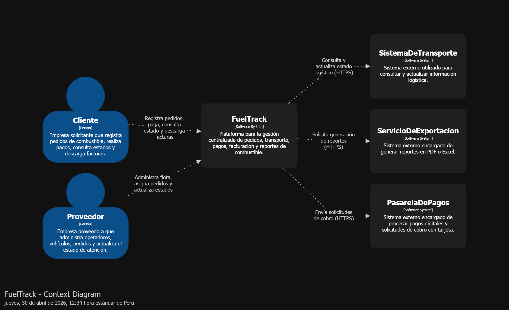

#### 4.1.4 Approach driven ViewPoints Diagrams

##### Diagrama de contenedores

**Diagrama de Contenedores:**

El diagrama de contenedores muestra la estructura principal de FuelTrack a nivel de aplicaciones y servicios. En esta vista se identifican los contenedores que forman parte del sistema, como la Landing Page, la Web Application, el API Gateway, los servicios principales del backend y la base de datos. Esta separación permite organizar mejor las responsabilidades del sistema, facilitando la escalabilidad, el mantenimiento y la integración con servicios externos como pagos, transporte y exportación de reportes.

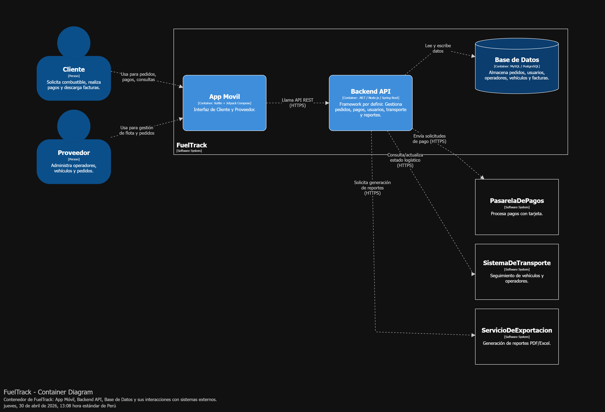

**Diagramas de Actividades:**

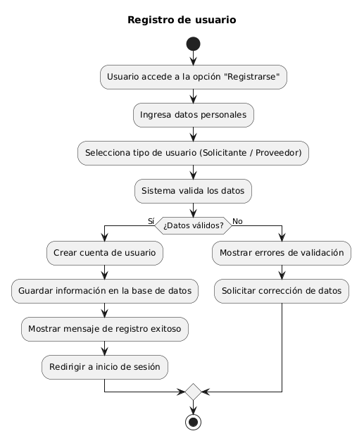
 
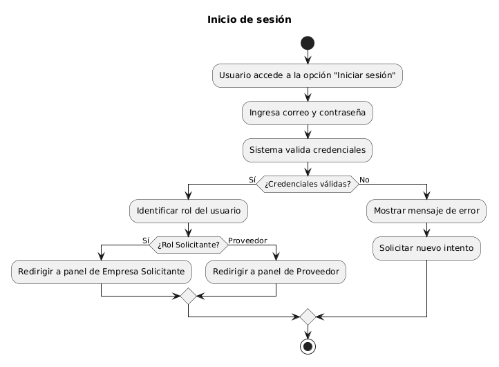
 
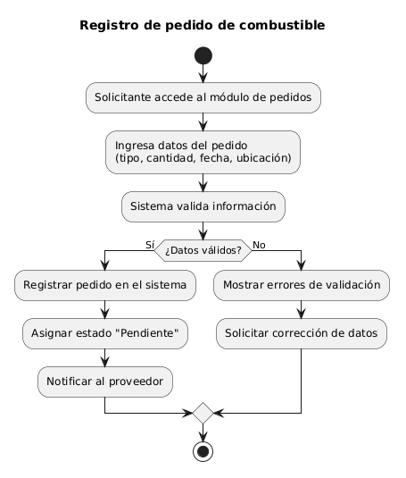
 
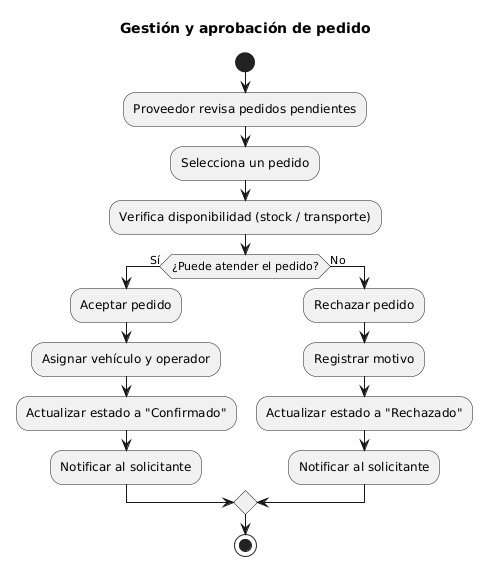
 
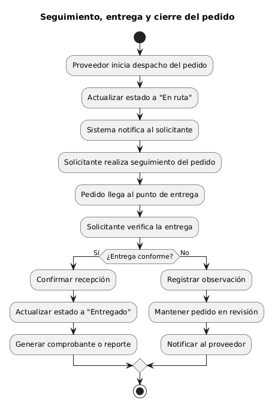

**Diagramas de Clases:**

#### 4.1.5 Relational/Non Relational Database Diagram

El diseño de esta base de datos se construyó pensando en que sea muy práctico, directo y fácil de leer para el sistema. Aquí te explico de manera sencilla las razones detrás de cómo conectamos la información:

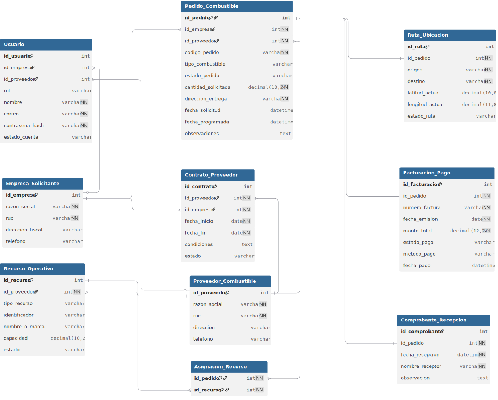

* **Un solo registro central para todos los accesos (Usuarios):** 
  En lugar de tener listas separadas de credenciales para clientes y proveedores, se unificó todo en una sola tabla de `Usuario`. Esto centraliza la seguridad, haciendo que el sistema valide el acceso en un solo lugar y luego dirija a la persona directamente hacia los datos de su empresa, evitando duplicar procesos de inicio de sesión.

* **Estados y categorías con lectura directa:** 
  Para clasificaciones sencillas, como el estado del pedido o el tipo de combustible, se guarda el texto directamente dentro de la tabla del pedido en lugar de usar códigos que remitan a otras tablas. Esto permite que el sistema consulte y muestre la información de forma inmediata, acelerando la lectura de los datos.

* **Agrupar camiones y choferes (Recursos Operativos):** 
  Se juntó a los operadores y a los vehículos en una sola tabla llamada `Recurso_Operativo`. En la logística del sistema, ambos son recursos que deben ser asignados a un viaje. Agruparlos bajo este concepto crea un flujo de trabajo mucho más limpio para la asignación, en lugar de manejar personas y máquinas en procesos completamente separados.

* **La parte financiera en un solo lugar (Facturación y Pagos):** 
  La información de la factura y su pago respectivo se agrupó en una sola tabla vinculada de forma exclusiva a cada pedido. Dado que cada entrega genera su propio cobro y transacción, mantener esta información financiera en un solo bloque mantiene los registros ordenados y hace que la consulta de saldos sea directa.

#### 4.1.6 Design Patterns

[Contenido]

#### 4.1.7 Tactics

Para FuelTrack se seleccionan tres tácticas arquitectónicas principales, alineadas con los atributos de calidad más importantes del sistema: disponibilidad, seguridad y modificabilidad. Estas tácticas buscan asegurar que la plataforma pueda operar de forma continua, proteger la información sensible de pedidos y pagos, y permitir cambios futuros sin afectar toda la solución.

**Disponibilidad**

- **Detección de fallos:** Implementar monitoreo sobre el Backend API, la base de datos y los servicios externos para identificar caídas o errores en el menor tiempo posible.
- **Recuperación:** Aplicar mecanismos de reintento cuando fallen servicios externos como la pasarela de pagos, el sistema de transporte o el servicio de exportación de reportes.
- **Prevención de fallos:** Validar solicitudes antes de procesarlas y controlar errores para evitar que una falla puntual afecte el flujo completo de pedidos.

**Seguridad**

- **Detectar ataques:** Registrar intentos fallidos de inicio de sesión, accesos no autorizados y operaciones sospechosas dentro del sistema.
- **Resistir ataques:** Utilizar autenticación mediante tokens, control de acceso por roles y comunicación segura mediante HTTPS.
- **Reaccionar ante incidentes:** Bloquear sesiones inválidas, registrar eventos de seguridad y restringir operaciones cuando se detecten acciones no permitidas.

**Modificabilidad**

- **Reducir acoplamiento:** Separar responsabilidades en módulos o servicios como pedidos, autenticación, pagos, transporte y reportes.
- **Aumentar cohesión:** Agrupar funcionalidades relacionadas dentro de cada módulo para que cada componente tenga una responsabilidad clara.
- **Encapsulamiento:** Ocultar la lógica interna de cada servicio mediante APIs bien definidas, permitiendo cambios internos sin afectar a otros componentes.

### 4.2 Architectural Drivers

#### 4.1.8 Design Purpose

El propósito del diseño arquitectónico de **FuelTrack** es establecer una solución tecnológica robusta que permita digitalizar y centralizar la gestión de pedidos de combustible entre empresas solicitantes y proveedores. Para ello, se propone una arquitectura basada en microservicios que facilite la separación de responsabilidades, la escalabilidad del sistema y la evolución independiente de sus componentes.

Esta arquitectura permitirá gestionar de manera eficiente procesos críticos como la creación de pedidos, seguimiento logístico, gestión de pagos y generación de reportes. Asimismo, se busca mejorar la trazabilidad de las operaciones, reducir errores derivados de procesos manuales y optimizar la comunicación entre los actores involucrados.

Además, el diseño considera la necesidad de soportar variaciones en la demanda, especialmente en contextos donde el volumen de pedidos puede incrementarse significativamente. Por ello, se prioriza la disponibilidad, resiliencia y capacidad de respuesta del sistema.

Finalmente, esta aproximación permite implementar mejoras continuas y desplegar nuevas funcionalidades sin afectar el funcionamiento general de la plataforma, asegurando una experiencia confiable y eficiente para los usuarios.

#### 4.1.9 Primary Functionality (Primary User Stories)

En este punto se identifican los requisitos funcionales que impactan directamente en la estructura de la aplicación FuelTrack, ya que definen los principales flujos de interacción entre empresas solicitantes, proveedores y el sistema.

| User Story ID | Título | Descripción |
|--------------|--------|------------|
| US01 | Registrar pedido | Como solicitante, quiero registrar pedidos para agilizar la solicitud y evitar llamadas. |
| US02 | Consultar historial de pedidos | Como solicitante, quiero consultar mi historial con estados y detalles. |
| US03 | Editar pedido no confirmado | Como solicitante, quiero editar parámetros antes de la confirmación del proveedor. |
| US05 | Actualizar pedido | Como proveedor, quiero actualizar el estado e información operativa del pedido. |
| US06 | Notificar cambios al cliente | Como proveedor, quiero que el cliente reciba notificaciones automáticas ante cambios del pedido. |
| US07 | Cancelar o rechazar pedido | Como proveedor, quiero rechazar o cancelar pedidos con motivo para mantener claridad. |
| US08 | Iniciar sesión | Como usuario, quiero iniciar sesión con credenciales válidas. |
| US09 | Registrar cuenta | Como visitante, quiero crear una cuenta con rol (Solicitante o Proveedor). |
| US10 | Recuperar contraseña | Como usuario, quiero recuperar el acceso a mi cuenta mediante correo. |

#### 4.1.10 Quality Attribute Scenarios

Los escenarios de atributos de calidad definen cómo debe comportarse el sistema FuelTrack frente a situaciones críticas que impactan su desempeño y uso. Estos escenarios se relacionan directamente con las historias de usuario, reflejando necesidades reales del sistema en términos de rendimiento, seguridad, disponibilidad y experiencia de uso.

| ID | Atributo de calidad | Escenario | US asociada |
|----|--------------------|-----------|-------------|
| AC-01 | Usabilidad | El usuario debe poder registrarse, iniciar sesión y crear un pedido de combustible de forma intuitiva, completando el proceso sin errores y en pocos minutos, evitando métodos informales. | US01 - US08 - US09 |
| AC-02 | Rendimiento | El usuario consulta pedidos o historial y el sistema debe responder en menos de 2 segundos, mostrando la información sin retrasos perceptibles incluso en condiciones normales de uso. | US01 - US02 |
| AC-03 | Disponibilidad | La plataforma debe estar disponible en todo momento para que los usuarios puedan gestionar pedidos y autenticarse sin interrupciones durante la operación diaria. | US08 - US05 |
| AC-04 | Seguridad | El sistema debe proteger la información mediante autenticación segura, control de acceso por roles y validación de credenciales, evitando accesos no autorizados. | US08 - US11 |
| AC-05 | Trazabilidad | El sistema debe registrar cada cambio en el estado de un pedido (fecha, hora y estado), permitiendo seguimiento completo y notificación al usuario ante actualizaciones. | US05 - US06 |

#### 4.1.11 Constraints

Las restricciones arquitectónicas representan las limitaciones técnicas y de entorno que influyen directamente en el diseño del sistema FuelTrack. Estas condiciones deben ser consideradas desde el inicio, ya que afectan decisiones clave como la arquitectura, tecnologías utilizadas, integración con sistemas externos y tiempos de desarrollo.

| ID | Constraints |
|----|-------------|
| CON-01 | El sistema debe implementarse utilizando una arquitectura basada en microservicios, permitiendo escalabilidad, mantenimiento independiente y evolución del sistema. |
| CON-02 | El backend debe exponer APIs REST seguras (por ejemplo: Node.js, .NET o Spring Boot) para la comunicación con el frontend y servicios externos. |
| CON-03 | La base de datos debe ser relacional (MySQL o PostgreSQL), garantizando integridad y consistencia en la gestión de pedidos, usuarios y pagos. |
| CON-04 | El sistema debe integrarse con servicios externos como pasarela de pagos, sistemas de transporte y generación de reportes mediante protocolos seguros (HTTPS). |
| CON-05 | El sistema debe ser desplegado en un entorno web (cloud o local) asegurando disponibilidad, acceso remoto y compatibilidad con navegadores modernos. |

#### 4.1.12 Architectural Concerns

Las preocupaciones arquitectónicas representan los aspectos críticos que influyen en el diseño del sistema FuelTrack, ya sea desde el punto de vista de los requisitos, riesgos o decisiones técnicas. Estas preocupaciones reflejan lo que los stakeholders esperan del sistema y los posibles riesgos que deben gestionarse para asegurar una arquitectura robusta, escalable y mantenible.

| ID | Architectural Concerns |
|----|------------------------|
| ARC-01 | Seleccionar tecnologías (frameworks y lenguajes) que el equipo domine, con el fin de acelerar el desarrollo y reducir riesgos de implementación. |
| ARC-02 | Diseñar una arquitectura modular basada en microservicios que permita escalar el sistema conforme aumente la demanda de pedidos de combustible. |
| ARC-03 | Asegurar una correcta integración con sistemas externos (pasarela de pagos, transporte y reportes) evitando fallas en la comunicación entre servicios. |
| ARC-04 | Mantener la coherencia entre frontend y backend mediante el uso de APIs REST bien definidas y documentadas. |
| ARC-05 | Garantizar la seguridad de la información (usuarios, pedidos y pagos) mediante autenticación, control de acceso y uso de protocolos seguros. |

### 4.3 ADD Iterations

#### 4.3.1 Iteration 1: <FuelTrack Core Quality Boost>

##### 4.3.1.1 Architectural Design Backlog 1

En el punto **Architectural Design Backlog** para FuelTrack, nos centraremos en definir las características arquitectónicas principales que permitirán que la plataforma gestione pedidos de combustible de forma segura, disponible y modificable. Esta iteración prioriza los elementos base del sistema, como autenticación, gestión de pedidos, actualización de estados, notificaciones y comunicación con servicios externos. Para ello, se consideran tres tácticas arquitectónicas principales: **disponibilidad**, para mantener el sistema operativo durante la gestión de pedidos; **seguridad**, para proteger usuarios, pedidos y pagos; y **modificabilidad**, para facilitar cambios futuros sin afectar toda la plataforma.

**Disponibilidad**

- **Historias de Usuario (User Stories):**
  - Como proveedor, quiero actualizar el estado de un pedido para mantener informado al solicitante.
  - Como solicitante, quiero consultar el estado de mis pedidos para hacer seguimiento al proceso.
  - Como usuario, quiero recibir notificaciones ante cambios importantes del pedido.

- **Tareas:**
  - Implementar manejo de errores en el Backend API.
  - Aplicar reintentos cuando fallen servicios externos como pagos, transporte o reportes.
  - Registrar fallos en logs para facilitar la detección y recuperación.
  - Validar que una falla en notificaciones no interrumpa el flujo principal del pedido.

- **Criterios de Aceptación:**
  - El sistema debe seguir permitiendo consultar y actualizar pedidos aunque un servicio externo falle temporalmente.
  - Los errores deben registrarse correctamente para su revisión.
  - Las operaciones críticas no deben perder información ante fallos parciales.

**Seguridad**

- **Historias de Usuario (User Stories):**
  - Como usuario, quiero iniciar sesión con credenciales válidas para acceder de forma segura.
  - Como administrador, quiero restringir el acceso por rol para proteger las funciones del sistema.
  - Como solicitante, quiero confirmar operaciones sensibles mediante MFA para evitar accesos indebidos.

- **Tareas:**
  - Implementar autenticación mediante tokens JWT.
  - Definir roles para solicitante, proveedor y administrador.
  - Proteger endpoints del Backend API según permisos.
  - Aplicar HTTPS para la comunicación entre cliente, backend y servicios externos.

- **Criterios de Aceptación:**
  - Solo usuarios autenticados pueden acceder a funciones privadas.
  - Los usuarios no pueden acceder a funcionalidades fuera de su rol.
  - Las operaciones sensibles requieren validación adicional.

**Modificabilidad**

- **Historias de Usuario (User Stories):**
  - Como usuario, quiero buscar pedidos por código para encontrar información rápidamente.
  - Como usuario, quiero filtrar pedidos por estado para organizar mejor la información.
  - Como proveedor, quiero gestionar pedidos sin afectar otros módulos del sistema.

- **Tareas:**
  - Separar responsabilidades en módulos: autenticación, pedidos, pagos, transporte y reportes.
  - Definir APIs claras entre frontend y backend.
  - Reducir dependencias directas entre componentes.
  - Encapsular la lógica de negocio dentro de servicios específicos.

- **Criterios de Aceptación:**
  - Nuevas funcionalidades pueden agregarse sin modificar todo el sistema.
  - Los cambios en un módulo no deben romper otros módulos.
  - Las interfaces entre servicios deben mantenerse claras y documentadas.

##### 4.3.1.2 Establish Iteration Goal by Selecting Drivers

En esta iteración, se seleccionan los **drivers arquitectónicos clave** que permitirán establecer objetivos concretos para el desarrollo del sistema FuelTrack. Estos drivers están alineados con los atributos de calidad más relevantes identificados previamente: **seguridad, disponibilidad y modificabilidad**, los cuales son fundamentales para garantizar una plataforma confiable, escalable y adaptable a cambios futuros.

---

### Meta de Seguridad

**Objetivo:** Proteger la información sensible de los usuarios, pedidos y pagos, asegurando que solo usuarios autorizados puedan acceder al sistema.

- **Acciones Clave:**
  - Implementar autenticación mediante tokens (JWT) para el acceso seguro.
  - Definir control de acceso basado en roles (solicitante, proveedor, administrador).
  - Aplicar comunicación segura mediante HTTPS entre cliente, backend y servicios externos.
  - Validar operaciones sensibles como creación de pedidos y pagos.

---

### Meta de Alta Disponibilidad

**Objetivo:** Garantizar que el sistema esté disponible para la gestión de pedidos en todo momento, evitando interrupciones que afecten la operación del negocio.

- **Acciones Clave:**
  - Implementar manejo de errores en el Backend API.
  - Aplicar reintentos automáticos en la comunicación con servicios externos (pagos, transporte, reportes).
  - Registrar fallos en logs para facilitar la recuperación del sistema.
  - Asegurar que fallos parciales no interrumpan el flujo principal de pedidos.

---

### Meta de Modificabilidad

**Objetivo:** Permitir que el sistema pueda evolucionar fácilmente, agregando nuevas funcionalidades sin afectar los componentes existentes.

- **Acciones Clave:**
  - Separar el sistema en módulos independientes (autenticación, pedidos, pagos, transporte, reportes).
  - Definir APIs claras y desacopladas entre frontend y backend.
  - Encapsular la lógica de negocio dentro de servicios específicos.
  - Reducir dependencias directas entre componentes para facilitar cambios futuros.

##### 4.3.1.3 Choose One or More Elements of the System to Refine

Para continuar con el proceso ADD en FuelTrack, se seleccionan los elementos del sistema que requieren mayor refinamiento arquitectónico. Esta elección se realiza considerando los drivers definidos previamente: **seguridad**, **disponibilidad** y **modificabilidad**. Los elementos seleccionados son críticos porque soportan el flujo principal del sistema: acceso de usuarios, gestión de pedidos, actualización de estados e integración con servicios externos.

- **Módulo de Autenticación y Control de Acceso:**
  - **Elemento a refinar:** Servicio encargado del registro, inicio de sesión, emisión de tokens y validación de roles.
  - **Razón para el refinamiento:** Es necesario proteger el acceso a la plataforma y asegurar que solicitantes, proveedores y administradores solo puedan realizar acciones permitidas según su rol.
  - **Esperado:** Un módulo seguro que gestione credenciales, tokens y permisos de forma confiable.

- **Módulo de Gestión de Pedidos:**
  - **Elemento a refinar:** Servicio responsable de registrar, consultar, editar, aprobar, rechazar y actualizar pedidos de combustible.
  - **Razón para el refinamiento:** Este módulo representa el núcleo del negocio de FuelTrack, por lo que debe ser estable, trazable y fácil de modificar.
  - **Esperado:** Un flujo de pedidos claro, con estados definidos y registro de cambios durante todo el proceso.

- **Integración con Servicios Externos:**
  - **Elemento a refinar:** Comunicación con pasarela de pagos, sistema de transporte y servicio de exportación de reportes.
  - **Razón para el refinamiento:** Estos servicios apoyan operaciones importantes del sistema, pero pueden fallar o responder lentamente, por lo que se requiere manejo de errores y reintentos.
  - **Esperado:** Integraciones desacopladas, seguras y tolerantes a fallos parciales.

##### 4.3.1.4 Choose One or More Design Concepts That Satisfy the Selected Drivers

Luego de identificar los elementos de FuelTrack que requieren refinamiento, se seleccionan conceptos de diseño que permitan responder a los drivers arquitectónicos definidos previamente: **seguridad**, **disponibilidad** y **modificabilidad**. Estos conceptos guían la estructura del sistema y ayudan a que la plataforma pueda operar de forma segura, continua y adaptable a futuros cambios.

**Seguridad**

- **Concepto de Diseño: Control de Acceso Basado en Roles (RBAC)**
  - **Descripción:** Implementar permisos diferenciados para solicitantes, proveedores y administradores, de modo que cada usuario solo pueda acceder a las funcionalidades correspondientes a su rol.
  - **Justificación:** Este concepto reduce el riesgo de accesos no autorizados y protege información sensible relacionada con pedidos, usuarios y pagos.

- **Concepto de Diseño: Autenticación mediante Tokens**
  - **Descripción:** Utilizar tokens JWT para validar sesiones y controlar el acceso a los servicios protegidos del Backend API.
  - **Justificación:** Permite mantener una comunicación segura entre la aplicación y el backend, evitando que usuarios no autenticados ejecuten operaciones privadas.

**Disponibilidad**

- **Concepto de Diseño: Manejo de Fallos y Reintentos**
  - **Descripción:** Implementar mecanismos de reintento cuando fallen servicios externos como la pasarela de pagos, el sistema de transporte o el servicio de exportación.
  - **Justificación:** Permite que una falla temporal no interrumpa completamente el flujo de pedidos, mejorando la continuidad del servicio.

- **Concepto de Diseño: Monitoreo y Registro de Errores**
  - **Descripción:** Registrar errores del sistema, fallos de integración y eventos relevantes mediante logs.
  - **Justificación:** Facilita la detección temprana de problemas y permite tomar acciones de recuperación con mayor rapidez.

**Modificabilidad**

- **Concepto de Diseño: Separación por Servicios**
  - **Descripción:** Dividir el sistema en módulos o servicios especializados, como autenticación, pedidos, pagos, transporte y reportes.
  - **Justificación:** Permite modificar o extender una funcionalidad sin afectar directamente a los demás componentes del sistema.

- **Concepto de Diseño: Interfaces REST Bien Definidas**
  - **Descripción:** Establecer APIs claras entre la aplicación cliente, el backend y los servicios externos.
  - **Justificación:** Reduce el acoplamiento entre componentes y facilita la evolución del sistema durante futuras iteraciones.

##### 4.3.1.5 Instantiate Architectural Elements, Allocate Responsibilities, and Define Interfaces

En esta etapa se definen los módulos arquitectónicos principales de FuelTrack, detallando sus responsabilidades y la forma en que interactúan entre sí. Estos módulos han sido estructurados considerando los drivers de **seguridad, disponibilidad y modificabilidad**, permitiendo una arquitectura desacoplada, escalable y preparada para futuras extensiones.

---

### Módulo de Autenticación y Control de Acceso

- **Elementos Arquitectónicos:**
  - Servicio de autenticación
  - Base de datos de usuarios
  - Gestor de tokens (JWT)

- **Responsabilidades:**
  - Gestionar el registro e inicio de sesión de usuarios
  - Validar credenciales y emitir tokens de acceso
  - Controlar el acceso a funcionalidades según roles (solicitante, proveedor, administrador)
  - Proteger endpoints del sistema

- **Interfaces:**
  - API REST (/auth)
  - Comunicación segura mediante HTTPS

---

### Módulo de Gestión de Pedidos y Trazabilidad

- **Elementos Arquitectónicos:**
  - Servicio central de pedidos
  - Base de datos de pedidos y estados

- **Responsabilidades:**
  - Gestionar el ciclo completo del pedido de combustible
  - Registrar pedidos, actualizar estados y mantener historial
  - Controlar la trazabilidad de cada pedido desde su creación hasta su entrega
  - Coordinar con otros módulos (proveedores, transporte, notificaciones)

- **Interfaces:**
  - API REST (/orders)
  - Comunicación JSON vía HTTPS

---

### Módulo de Gestión Logística y Proveedores

- **Elementos Arquitectónicos:**
  - Servicio de proveedores
  - Base de datos de operadores y vehículos

- **Responsabilidades:**
  - Administrar la información de proveedores, operadores y vehículos
  - Asignar recursos logísticos a los pedidos
  - Gestionar la disponibilidad de transporte
  - Actualizar el estado logístico del pedido

- **Interfaces:**
  - API REST (/providers)
  - Integración con módulo de pedidos

---

### Módulo de Procesamiento de Pagos

- **Elementos Arquitectónicos:**
  - Servicio de integración con pasarela de pagos

- **Responsabilidades:**
  - Procesar pagos asociados a pedidos de combustible
  - Validar transacciones y estados de pago
  - Registrar información financiera del pedido
  - Manejar errores y reintentos ante fallos externos

- **Interfaces:**
  - API externa (pasarela de pagos)
  - HTTPS

---

### Módulo de Integración con Transporte

- **Elementos Arquitectónicos:**
  - Servicio de integración logística

- **Responsabilidades:**
  - Consultar y actualizar el estado del transporte
  - Sincronizar información de vehículos y operadores en ruta
  - Permitir el seguimiento del pedido en tiempo real

- **Interfaces:**
  - API externa (sistema de transporte)
  - HTTPS

---

### Módulo de Generación de Reportes

- **Elementos Arquitectónicos:**
  - Servicio de reportes

- **Responsabilidades:**
  - Generar reportes operativos y financieros
  - Exportar información en formatos como PDF y Excel
  - Proveer datos históricos para análisis

- **Interfaces:**
  - API REST (/reports)
  - Integración con servicio de exportación

---

### Módulo de Notificaciones y Eventos

- **Elementos Arquitectónicos:**
  - Servicio de notificaciones

- **Responsabilidades:**
  - Notificar a los usuarios sobre cambios en el estado del pedido
  - Informar eventos relevantes del sistema
  - Soportar comunicación asincrónica entre módulos

- **Interfaces:**
  - API interna
  - Comunicación mediante eventos o HTTP

##### 4.3.1.6 Sketch Views (C4 & UML) and Record Design Decisions

Para esta sección se seleccionó el **Módulo de Gestión de Pedidos y Trazabilidad**, debido a que representa el núcleo funcional de FuelTrack. Este módulo permite registrar pedidos, consultar su estado, validar reglas de negocio, actualizar transiciones y coordinar integraciones con pagos, transporte y notificaciones.

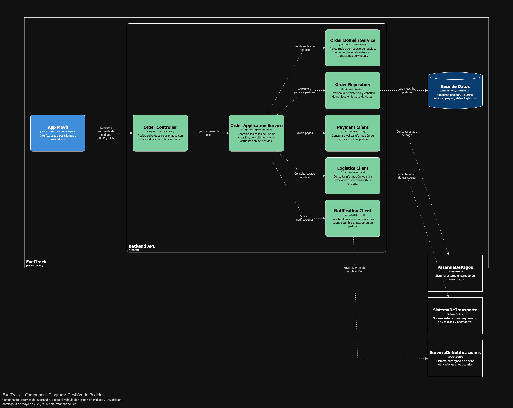

##### 4.2.1.7 Analysis of Current Design and Review Iteration Goal (Kanban Board)

[Contenido]

---

## Capítulo V: Product Implementation, Validation & Deployment

### 5.1 Testing Suites & General Patterns

#### 5.1.1 Backend Application Core Testing Suite

[Contenido]

#### 5.1.2 Pattern Based Backend Application(s)

[Contenido]

#### 5.1.3 Pattern Based Custom Software Library

[Contenido]

#### 5.1.4 Framework Pattern Driven Refactoring Report

[Contenido]

### 5.2 Software Configuration Management

#### 5.2.1 Software Development Environment Configuration

[Contenido]

#### 5.2.2 Source Code Management

[Contenido]

#### 5.2.3 Source Code Style Guide & Conventions

[Contenido]

#### 5.2.4 Software Deployment Configuration

[Contenido]

### 5.3 Microservices Implementation

#### Sprint 1

##### 5.2.1.1 Sprint Backlog 1

[Contenido]

##### 5.2.1.2 Development Evidence for Sprint Review

[Contenido]

##### 5.2.1.3 Testing Suite Evidence for Sprint Review

[Contenido]

##### 5.2.1.4 Execution Evidence for Sprint Review

[Contenido]

##### 5.2.1.5 Microservices Documentation Evidence for Sprint Review

[Contenido]

##### 5.2.1.6 Software Deployment Evidence for Sprint Review

[Contenido]

##### 5.2.1.7 Team Collaboration Insights during Sprint

[Contenido]

##### 5.2.1.8 Kanban Board

[Contenido]

#### Sprint 2

##### 5.2.2.1 Sprint Backlog 2

[Contenido]

##### 5.2.2.2 Development Evidence for Sprint Review

[Contenido]

##### 5.2.2.3 Testing Suite Evidence for Sprint Review

[Contenido]

##### 5.2.2.4 Execution Evidence for Sprint Review

[Contenido]

##### 5.2.2.5 Microservices Documentation Evidence for Sprint Review

[Contenido]

##### 5.2.2.6 Software Deployment Evidence for Sprint Review

[Contenido]

##### 5.2.2.7 Team Collaboration Insights during Sprint

[Contenido]

##### 5.2.2.8 Kanban Board

[Contenido] — Avance 3

#### Sprint 3

##### 5.2.3.1 Sprint Backlog 3

[Contenido]

##### 5.2.3.2 Development Evidence for Sprint Review

[Contenido]

##### 5.2.3.3 Testing Suite Evidence for Sprint Review

[Contenido]

##### 5.2.3.4 Execution Evidence for Sprint Review

[Contenido]

##### 5.2.3.5 Microservices Documentation Evidence for Sprint Review

[Contenido]

##### 5.2.3.6 Software Deployment Evidence for Sprint Review

[Contenido]

##### 5.2.3.7 Team Collaboration Insights during Sprint

[Contenido]

##### 5.2.3.8 Kanban Board

[Contenido] — Avance 4

#### Sprint 4

##### 5.2.4.1 Sprint Backlog 4

[Contenido]

##### 5.2.4.2 Development Evidence for Sprint Review

[Contenido]

##### 5.2.4.3 Testing Suite Evidence for Sprint Review

[Contenido]

##### 5.2.4.4 Execution Evidence for Sprint Review

[Contenido]

##### 5.2.4.5 Microservices Documentation Evidence for Sprint Review

[Contenido]

##### 5.2.4.6 Software Deployment Evidence for Sprint Review

[Contenido]

##### 5.2.4.7 Team Collaboration Insights during Sprint

[Contenido]

##### 5.2.4.8 Kanban Board

[Contenido]

### 5.4 Microservices Deployment

#### 5.3.1 Cloud Architecture Diagram

[Contenido]

#### 5.3.2 Cloud Architecture Deployment

[Contenido] 

---

## Conclusiones

### Conclusiones y recomendaciones

[Contenido]

### Video About-The-Team

[Contenido]

---

## Referencias Bibliográficas

Alaminkarno. (2024, enero 8). *DDD (Domain-Driven Design) in Flutter – Too much or just right?* DEV Community. https://dev.to/alaminkarno/ddd-domain-driven-design-in-flutter-too-much-or-just-right-d1g

Allen, C. (2024). *The impact of book clubs on millennials: Best way to instill a love of reading*. Recuperado de [https://catherineallenblog.com/the-impact-of-book-clubs-on-millennials-best-way-to-instill-a-love-of-reading](https://catherineallenblog.com/the-impact-of-book-clubs-on-millennials-best-way-to-instill-a-love-of-reading)

Alvarez, A. (2020, 5 de agosto). 5W2H: Qué significa, para qué sirve, cómo aplicarla y algunos ejemplos. LeanConstructionMexico. [https://www.leanconstructionmexico.com.mx/post/5w2h-qué-significa-para-qué-sirve-cómo-aplicarla-y-algunos-ejemplos](https://www.leanconstructionmexico.com.mx/post/5w2h-qu%C3%A9-significa-para-qu%C3%A9-sirve-c%C3%B3mo-aplicarla-y-algunos-ejemplos)

Dart Packages. (s. f.). *pub.dev*. https://pub.dev

Fabiana, E., & Vega, J. (2022). La motivación en el aprendizaje de la lectura en los estudiantes. Revista EDUCARE \- UPEL-IPB \- Segunda Nueva Etapa 2.0, 26(Extraordinario), 476–493. [https://doi.org/10.46498/reduipb.v26iExtraordinario.1641](https://doi.org/10.46498/reduipb.v26iExtraordinario.1641) 

Flutter Dev. (s. f.). *Flutter documentation*. https://docs.flutter.dev

Google Fonts. (s. f.). *Alexandria*. https://fonts.google.com/specimen/Alexandria

Google Fonts. (s. f.). *Asap Condensed*. https://fonts.google.com/specimen/Asap+Condensed

Mamani, B., Chata, L., & Choque, D. (2024). Efecto del uso de Tik Tok en el rendimiento académico de estudiantes de 5to grado . Revista Tribunal, 4(9), 161-175. [https://doi.org/10.59659/revistatribunal.v4i9.71](https://doi.org/10.59659/revistatribunal.v4i9.71)

Ministerio de Cultura del Perú & Instituto Nacional de Estadística e Informática. (2023). *Encuesta Nacional de Lectura 2022: Informe de lectores y no lectores*. Recuperado de [https://perulee.pe/sites/default/files/ENL%202022%20-%20Informe%20de%20lectores%20y%20no%20lectores.pdf](https://perulee.pe/sites/default/files/ENL%202022%20-%20Informe%20de%20lectores%20y%20no%20lectores.pdf?utm_source=chatgpt.com)

Statista. (2024). *Hablemos de los clubes de lectura y por qué esta tendencia va en aumento*. Recuperado de [https://globaltag.mx/uncategorized/leer-esta-de-moda-hablemos-de-los-clubes-de-lectura-y-por-que-esta-tendencia-va-en-aumento/](https://globaltag.mx/uncategorized/leer-esta-de-moda-hablemos-de-los-clubes-de-lectura-y-por-que-esta-tendencia-va-en-aumento/?utm_source=chatgpt.com)

Torres-Vega, E. (2025). Comprensión lectora en estudiantes de secundaria en Perú. Horizontes. Revista De Investigación En Ciencias De La Educación, 9(36), 177–187. [https://doi.org/10.33996/revistahorizontes.v9i36.909](https://doi.org/10.33996/revistahorizontes.v9i36.909)

---

## Anexos

### Links

  <strong>Link Entrevistas:</strong> 
  <a href="https://youtu.be/rhZVckUojLE" target="_blank">Ver entrevistas</a>

