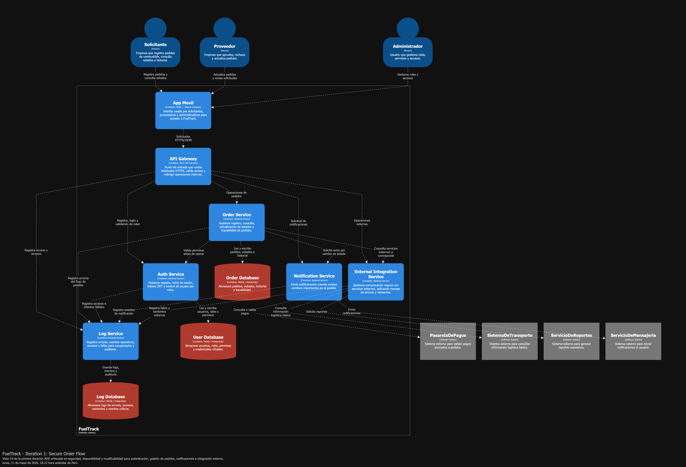
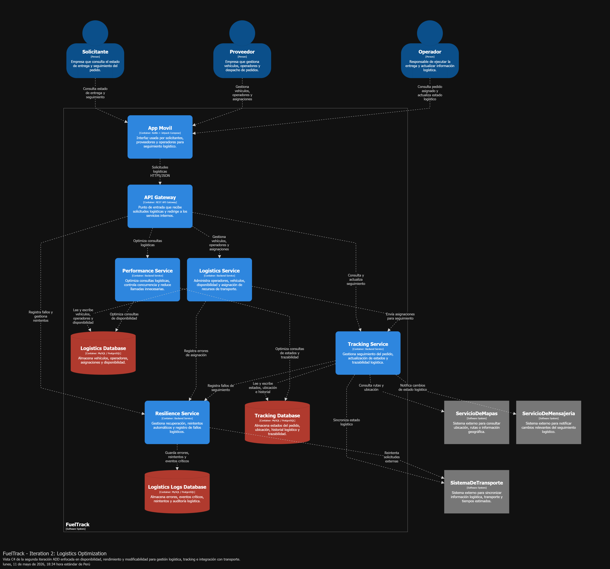
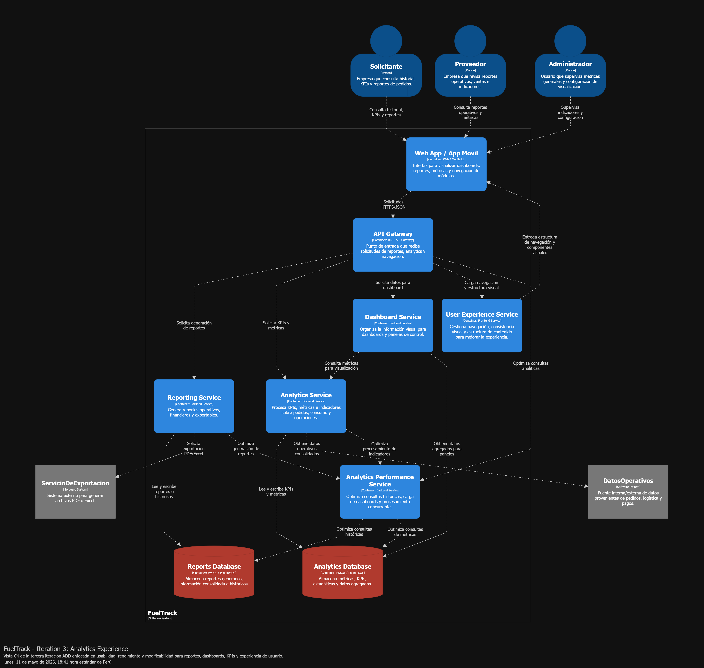

    </img> 
    <strong>Universidad Peruana de Ciencias Aplicadas</strong> 
     
    <strong>Facultad de Ingeniería</strong> 
    <strong>Carrera de Ingeniería de Software</strong> 
    <strong>Ciclo 2026-10</strong>

  <strong>Código del curso: </strong>1ASI0657 
  <strong>Curso: </strong>Fundamentos de Arquitectura de Software 

  <strong>NRC: 7940</strong>

    <strong>Profesor: </strong>Daniel Enrique Mori Yzaguirre

    <strong>Informe de Trabajo Final</strong>

    <strong>Nombre del startup: </strong> FuelTrack

    <strong>Nombre del producto:</strong> FuelTrack Pro

    <strong>Relación de integrantes:</strong> 
    Allcca Guerrero Irving – U202213241 
    Gabriel Omar Lapa de la Cruz - U202216831 
    Gianfranco Jared Durand Vega - U202312614 

    <strong>Marzo, 2026</strong>

---

## Registro de Versiones del Informe

| Versión | Fecha | Autor(es) | Descripción |
|---------|-------|-----------|-------------|
| 1.0 | Marzo 2026 | [Equipo] | Versión inicial del informe (Capítulos I–III) |
| 1.1 | Abril 2026 | [Equipo] | Avance 1: Product Backlog |
| 1.2 | Mayo 2026 | [Equipo] | Avance 2: ADD Iterations |
| 1.3 | Junio 2026 | [Equipo] | Avance 3: Sprint 2 |
| 1.4 | Julio 2026 | [Equipo] | Avance 4: Sprint 3 |
| 2.0 | Agosto 2026 | [Equipo] | Entrega Final (TF1) |

---

## Student Outcome

El curso contribuye al cumplimiento del Student Outcome ABET:

**ABET – EAC - Student Outcome 7**

**Aprendizaje Continuo y Autónomo**

**Criterio:** La capacidad de adquirir y aplicar nuevos conocimientos según sea necesario, utilizando estrategias de aprendizaje apropiadas.

En el siguiente cuadro se describen las acciones realizadas y las conclusiones del equipo que sustentan el cumplimiento del **ABET – EAC - Student Outcome 7**.

| Criterio específico | Acciones realizadas | Conclusiones |
|---------------------|--------------------|---------------|
| **Actualiza conceptos y conocimientos necesarios para su desarrollo profesional y en especial para su proyecto en soluciones de software.** | **Allcca Guerrero, Irving**     **TB1:** Participó en el análisis del problema, definición de la startup FuelTrack y elaboración de los elementos Lean UX, incluyendo hipótesis, assumptions y problem statements para comprender mejor las necesidades del dominio de distribución de combustible.    **TB2:** Contribuyó en el diseño de la arquitectura del producto, participando en la definición de drivers arquitectónicos, atributos de calidad y modelado de diagramas relacionados con el sistema.    **Lapa de la Cruz, Gabriel Omar**     **TB1:** Desarrolló la investigación del problema, análisis competitivo, entrevistas, user personas, empathy maps, user stories y product backlog, fortaleciendo conocimientos sobre análisis de requerimientos y diseño centrado en el usuario.    **TB2:** Participó en la mejora continua del trabajo anterior y en el diseño de arquitectura de software, incluyendo diagramas C4, ADD Iterations, tácticas arquitectónicas, restricciones, concerns y escenarios de calidad del sistema FuelTrack.    **Durand Vega, Gianfranco Jared**     **TB1:** Apoyó en la estructuración de la especificación de requisitos, escenarios To-Be, user stories y definición del alcance funcional del sistema.    **TB2:** Colaboró en el refinamiento de la arquitectura del sistema, apoyando en diagramas de actividades, modelado de módulos, patrones de diseño y organización de iteraciones ADD para asegurar coherencia arquitectónica. | Como equipo, se logró actualizar y aplicar nuevos conocimientos relacionados con arquitectura de software, Lean UX, modelado C4, atributos de calidad y metodologías de diseño arquitectónico. Estas actividades fortalecieron las competencias técnicas necesarias para el desarrollo del proyecto FuelTrack y contribuyeron al crecimiento profesional de cada integrante en el ámbito de soluciones de software. |
| **Reconoce la necesidad del aprendizaje permanente para el desempeño profesional y el desarrollo de proyectos en soluciones de software.** | **Allcca Guerrero, Irving**     **TB1:** Investigó conceptos relacionados con validación de problemas y metodologías de innovación para comprender mejor el contexto del proyecto.    **TB2:** Profundizó en conceptos de arquitectura de software, tácticas arquitectónicas y atributos de calidad aplicados al sistema FuelTrack.    **Lapa de la Cruz, Gabriel Omar**     **TB1:** Investigó herramientas y metodologías para el levantamiento de requerimientos, entrevistas, Lean UX y análisis de usuarios, fortaleciendo conocimientos necesarios para el proyecto.    **TB2:** Continuó ampliando conocimientos sobre arquitectura de software, diagramas C4, ADD, restricciones, concerns y patrones de diseño, integrando mejoras respecto a la entrega anterior mediante refinamiento arquitectónico y modelado más detallado.    **Durand Vega, Gianfranco Jared**     **TB1:** Participó en el aprendizaje y aplicación de técnicas de documentación funcional y priorización de requerimientos del sistema.    **TB2:** Reforzó conocimientos sobre diseño arquitectónico y modelado estructurado del sistema para contribuir en la evolución del producto y la calidad técnica del proyecto. | Como equipo, se reconoció la importancia del aprendizaje continuo para afrontar los desafíos técnicos y metodológicos del desarrollo de software. La evolución entre TB1 y TB2 permitió evidenciar una mejora progresiva en conocimientos de análisis, diseño arquitectónico y toma de decisiones técnicas, fortaleciendo la capacidad del equipo para adaptarse a nuevos retos y tecnologías dentro del proyecto FuelTrack. |

---

## Contenido

### Tabla de contenidos

- [Student Outcome](#student-outcome)
- [Capítulo I: Introducción](#capítulo-i-introducción)
  - [1.1 Startup Profile](#11-startup-profile)
    - [1.1.1 Descripción de la Startup](#111-descripción-de-la-startup)
    - [1.1.2 Perfiles de integrantes del equipo](#112-perfiles-de-integrantes-del-equipo)
  - [1.2 Solution Profile](#12-solution-profile)
    - [1.2.1 Nombre del producto](#121-nombre-del-producto)
    - [1.2.2 Antecedentes y problemática](#122-antecedentes-y-problemática)
    - [1.2.3 Lean UX Process](#123-lean-ux-process)
      - [1.2.3.1 Lean UX Problem Statement](#1231-lean-ux-problem-statement)
      - [1.2.3.2 Lean UX Assumptions](#1232-lean-ux-assumptions)
      - [1.2.3.3 Lean UX Hypothesis](#1233-lean-ux-hypothesis)
      - [1.2.3.4 Lean UX Canvas](#1234-lean-ux-canvas)
  - [1.3 Segmentos objetivo](#13-segmentos-objetivo)
- [Capítulo II: Requirements & Analysis](#capítulo-ii-requirements--analysis)
  - [2.1 Competidores](#21-competidores)
  - [2.2 Entrevistas](#22-entrevistas)
  - [2.3 Needfinding](#23-needfinding)
    - [2.3.1 User Personas](#231-user-personas)
    - [2.3.2 User Task Matrix](#232-user-task-matrix)
    - [2.3.3 Empathy Maps](#233-empathy-maps)
    - [2.3.4 As-is Scenario Mapping](#234-as-is-scenario-mapping)
- [Capítulo III: Requirements Specification](#capítulo-iii-requirements-specification)
  - [3.1 To-Be Scenario Mapping](#31-to-be-scenario-mapping)
  - [3.2 User Stories](#32-user-stories)
  - [3.3 Impact Map](#33-impact-map)
  - [3.4 Product Backlog](#34-product-backlog)
- [Capítulo IV: Product Architecture Design](#capítulo-iv-product-architecture-design)
  - [4.1 Design Concepts, ViewPoints & ER Diagrams](#41-design-concepts-viewpoints--er-diagrams)
    - [4.1.1 Principles Statements](#411-principles-statements)
    - [4.1.2 Approaches Statements Architectural Styles & Patterns](#412-approaches-statements-architectural-styles--patterns)
    - [4.1.3 Context Diagram](#413-context-diagram)
    - [4.1.4 Approach driven ViewPoints Diagrams](#414-approach-driven-viewpoints-diagrams)
    - [4.1.5 Relational/Non Relational Database Diagram](#415-relationalnon-relational-database-diagram)
    - [4.1.6 Design Patterns](#416-design-patterns)
    - [4.1.7 Tactics](#417-tactics)
  - [4.2 Architectural Drivers](#42-architectural-drivers)
    - [4.1.8 Design Purpose](#418-design-purpose)
    - [4.1.9 Primary Functionality (Primary User Stories)](#419-primary-functionality-primary-user-stories)
    - [4.1.10 Quality Attribute Scenarios](#4110-quality-attribute-scenarios)
    - [4.1.11 Constraints](#4111-constraints)
    - [4.1.12 Architectural Concerns](#4112-architectural-concerns)
  - [4.3 ADD Iterations](#43-add-iterations)
- [Capítulo V: Product Implementation, Validation & Deployment](#capítulo-v-product-implementation-validation--deployment)
  - [5.1 Testing Suites & General Patterns](#51-testing-suites--general-patterns)
    - [5.1.1 Backend Application Core Testing Suite](#511-backend-application-core-testing-suite)
    - [5.1.2 Pattern Based Backend Application(s)](#512-pattern-based-backend-applications)
    - [5.1.3 Pattern Based Custom Software Library](#513-pattern-based-custom-software-library)
    - [5.1.4 Framework Pattern Driven Refactoring Report](#514-framework-pattern-driven-refactoring-report)
  - [5.2 Software Configuration Management](#52-software-configuration-management)
    - [5.2.1 Software Development Environment Configuration](#521-software-development-environment-configuration)
    - [5.2.2 Source Code Management](#522-source-code-management)
    - [5.2.3 Source Code Style Guide & Conventions](#523-source-code-style-guide--conventions)
    - [5.2.4 Software Deployment Configuration](#524-software-deployment-configuration)
  - [5.3 Microservices Implementation](#53-microservices-implementation)
    - [Sprint 1](#sprint-1)
    - [Sprint 2](#sprint-2)
    - [Sprint 3](#sprint-3)
    - [Sprint 4](#sprint-4)
  - [5.4 Microservices Deployment](#54-microservices-deployment)
    - [5.3.1 Cloud Architecture Diagram](#531-cloud-architecture-diagram)
    - [5.3.2 Cloud Architecture Deployment](#532-cloud-architecture-deployment)
- [Conclusiones](#conclusiones)
- [Referencias Bibliográficas](#referencias-bibliográficas)
- [Anexos](#anexos)

---

## Capítulo I: Introducción

### 1.1 Startup Profile

#### 1.1.1 Descripción de la Startup

**FuelTrack** es una startup orientada a mejorar la gestión de pedidos de combustible entre empresas demandantes y proveedores. Creada por estudiantes de la Universidad Peruana de Ciencias Aplicadas (UPC), su propuesta se enfoca en digitalizar un sector que aún depende en gran medida de procesos manuales. A través de una plataforma tecnológica, busca ofrecer mayor eficiencia operativa, transparencia en las transacciones y un control más preciso de las operaciones.

**Misión:** Nuestra misión es diseñar e implementar soluciones tecnológicas innovadoras que optimicen la gestión de pedidos de combustible, sustituyendo los procesos informales y minimizando los errores mediante una plataforma web fácil de usar y accesible.

**Visión:** Nuestra visión es consolidarnos como referentes en la transformación digital del sector energético, brindando a las empresas herramientas que permitan una gestión más eficiente, segura y sostenible, impulsando así su competitividad y desarrollo tecnológico.

#### 1.1.2 Perfiles de integrantes del equipo

| Foto                                          | Nombre completo               | Código     | Carrera                | Habilidades técnicas y rol                                   |
|-----------------------------------------------|-------------------------------|------------|------------------------|--------------------------------------------------------------|
|             | Gabriel Omar Lapa de la Cruz | U202216831 | Ingeniería de Software | Desarrollo Backend, UI/UX, Arquitectura DDD |
| ] | Gianfranco Jared Durand Vega    | U202312614 | Ingeniería de Software | Desarrollo Frontend (Vue/React), UI/UX, Integración de servicios externos |
|      | Irving Allcca Guerrero     | U202213241	 | Ingeniería de Software | DATOS, Desarrollo Frontend, UI/UX |

### 1.2 Solution Profile

#### 1.2.1 Nombre del producto

**FuelTrack** es una plataforma diseñada para digitalizar y centralizar la gestión de pedidos de combustible entre empresas solicitantes y proveedores. Nuestra misión es erradicar la dependencia de métodos informales (llamadas, correos y mensajería) mediante un flujo de trabajo único con trazabilidad en tiempo real.

#### 1.2.2 Antecedentes y problemática

El sector de distribución de combustibles presenta importantes ineficiencias debido a la persistencia de procesos manuales en la gestión de pedidos, donde predominan medios informales como llamadas telefónicas, correos electrónicos y aplicaciones de mensajería. Esta falta de digitalización genera desorganización operativa, incrementa la probabilidad de errores humanos y limita significativamente la visibilidad en tiempo real del estado de los pedidos, afectando tanto la toma de decisiones como la relación con los clientes. Asimismo, la ausencia de un sistema centralizado impide la integración de la información, provocando duplicidad de esfuerzos, retrasos en la entrega y dificultades en el seguimiento logístico. Este tipo de problemáticas evidencia la necesidad de aplicar metodologías estructuradas de análisis y mejora de procesos, como el enfoque 5W2H, que permite identificar de manera clara las causas, impactos y posibles soluciones dentro de un contexto organizacional (Alvarez, 2020). Además, la implementación de soluciones tecnológicas basadas en principios de diseño orientado al dominio puede contribuir a modelar de forma más precisa las necesidades del negocio y mejorar la eficiencia de los sistemas involucrados (Alaminkarno, 2024). En conjunto, estas limitaciones generan pérdidas de tiempo y un aumento considerable en los costos operativos, evidenciando la urgencia de una transformación digital en este sector.

### Análisis 5W+2H

| Pregunta | Descripción |
|---|---|
| **What? ¿Qué?** | Existe una falta de una plataforma digital centralizada para gestionar de manera eficiente los pedidos de combustible, incluyendo procesos como solicitud, aprobación, despacho, seguimiento, pagos y facturación. Actualmente, muchas empresas dependen de métodos manuales y herramientas desconectadas que dificultan la integración de información y reducen la capacidad de monitorear operaciones en tiempo real. La transformación digital en cadenas de suministro permite optimizar procesos operativos, reducir errores y mejorar el control de la información dentro de organizaciones con alta dependencia logística (Oracle, 2023). |
| **When? ¿Cuándo?** | La problemática ocurre durante todo el ciclo de vida del pedido de combustible, desde la solicitud inicial hasta la entrega final y el cierre administrativo. Esta situación se vuelve más crítica durante periodos de alta demanda o múltiples solicitudes simultáneas, donde la ausencia de automatización incrementa significativamente retrasos, errores de coordinación y tiempos muertos operativos. La metodología 5W2H permite identificar con claridad los momentos críticos donde se originan ineficiencias dentro de los procesos organizacionales (Alvarez, 2020). |
| **Where? ¿Dónde?** | El problema se presenta principalmente en empresas solicitantes de combustible, proveedores y operadores logísticos involucrados en la distribución y transporte. Esto incluye centros de abastecimiento, áreas administrativas, operaciones de despacho y coordinación logística, donde la falta de sincronización entre actores genera pérdida de trazabilidad y dificultades de comunicación. Estudios recientes evidencian que la integración tecnológica en cadenas de distribución de combustibles mejora significativamente la agilidad logística y coordinación operativa (Ucheobi et al., 2025). |
| **Who? ¿Quién?** | Los principales involucrados son encargados de logística, empresas solicitantes, proveedores de combustible, operadores de transporte y personal administrativo responsable de validar pedidos, gestionar pagos y monitorear entregas. La falta de un entorno integrado impacta directamente a todos los actores, quienes deben coordinar manualmente actividades que podrían automatizarse mediante plataformas digitales centralizadas (FleetPanda, 2024). |
| **Why? ¿Por qué?** | La problemática surge debido a la dependencia de medios informales y procesos fragmentados, como llamadas telefónicas, correos electrónicos, hojas de cálculo y aplicaciones de mensajería instantánea. Estos mecanismos carecen de trazabilidad, dificultan el seguimiento en tiempo real y generan inconsistencias entre las áreas involucradas. La digitalización de procesos logísticos permite mejorar la coordinación, visibilidad y desempeño general de las operaciones de suministro (Oracle, 2023). |
| **How? ¿Cómo?** | El problema se manifiesta mediante procesos manuales, registros duplicados, errores humanos, poca sincronización entre áreas y ausencia de integración entre pedidos, pagos, despacho y facturación. La falta de herramientas diseñadas sobre principios del dominio del negocio también limita la capacidad de representar correctamente las necesidades operativas, situación que puede mitigarse mediante enfoques orientados al dominio para modelar procesos complejos de manera más precisa (Alaminkarno, 2024). |
| **How Much? ¿Cuánto?** | Estas limitaciones generan pérdidas significativas de tiempo, incremento de costos operativos, retrasos en la entrega, errores administrativos y baja visibilidad del estado real de los pedidos. Además, afectan negativamente la satisfacción del cliente y la eficiencia de la operación logística, impactando la rentabilidad del negocio. Soluciones especializadas en distribución de combustible han demostrado reducir errores operativos, optimizar rutas y mejorar considerablemente la trazabilidad de pedidos y recursos logísticos (FleetPanda, 2024). |

#### 1.2.3 Lean UX Process

##### 1.2.3.1 Lean UX Problem Statement

FuelTrack es una plataforma que digitaliza y centraliza la gestión de pedidos de combustible entre empresas solicitantes y proveedores, reemplazando prácticas informales (llamadas, correos y mensajería) por un flujo único con trazabilidad en tiempo real.

En el mercado de combustibles predominan canales desorganizados y no integrados, lo que genera errores en los pedidos, retrasos en las entregas y retrabajo. La ausencia de un sistema centralizado disminuye la eficiencia operativa de los proveedores y deteriora la satisfacción del cliente.

Ante una demanda creciente por logística ágil y confiable, se requiere una plataforma que estandarice, automatice y compacte la gestión de pedidos para reducir pérdidas operativas y mejorar la experiencia del cliente.

¿Cómo podríamos diseñar una solución digital que centralice y automatice la gestión de pedidos de combustible, integrando a proveedores y solicitantes en una misma plataforma, para disminuir errores y elevar la eficiencia operativa?

##### 1.2.3.2 Lean UX Assumptions

**Business Assumptions**

* Las empresas proveedoras tienen en la adopción de nuevas tecnologías para automatizar multiples procesos de gestión con el fin de tener un servicio más eficiente y reducir el número de operadores comerciales que necesitan.
* Las empresas están buscando formas de reducir errores y retrasos logísticos para optimizar sus costos operativos.
* Los proveedores estan dispuestos a invertir para mejorar su nivel de servicio y aumentar su competitividad en el mercado.
* Las empresas usuarias apreciarán tener un mayor control de sus órdenes y ser capaces de seguirlas en una plataforma centralizada.
* La dificil trazabilidad de los pedidos y la posibilidad de fallas en la comunicación hace que dejar los métodos informales sea una necesidad crítica para el sector en general.

**User Assumptions**

**¿Quién es el usuario?**
Los usuarios principales serían los encargados logísticos de los proovedores y las empresas compradoras de combustible.

**¿Dónde encaja nuestro producto en su trabajo o vida?**
FuelTracks encajaría en el día a día de los usuarios como una plataforma de gestión centralizada, que ayudaría a coordinar, rastrear y organizar pedidos de combustible de forma confiable. Reemplazando así los sistemas dispersos que se utilizan hoy en día.

**¿Qué problemas tiene nuestro producto que resolver?**
FuelTracks debe resolver la desorganización causada por métodos informales de venta, reducir errores humanos y mejorar la experiencia del cliente.

**¿Cuándo y cómo es nuestro producto usado?**
Será utilizado diariamente por solicitantes y los proveedores por igual. Por el lado de los usuarios solicitantes, usarán la plataforma para registrar y monitorear pedidos de combustible, y por el lado de proveedores para gestionar la recepción, programación y entrega de dichos pedidos.

**¿Qué características son importantes?**
El seguimiento de pedidos en tiempo real, actualizaciones de estado mediante notificiaciones, historial de entregas, paneles de control y una interfaz clara y rápida.

**¿Cómo debe verse nuestro producto y cómo debe comportarse?**
El producto debe presentar una interfaz limpia y profesional. Adaptada al perfil corporativo de los clientes objetivos. Debe ser eficiente, permitiendo la creación, modificación y seguimiento de pedidos en pocos clics. También debe ser altamente confiable, debido al alto valor y magnitud de las órdenes que se realizarán en la plataforma

**Feature Assumptions**

* Creemos que al proporcionar una plataforma centralizada con trazabilidad en tiempo real, ayudaremos a las empresas a reducir errores y mejorar la eficiencia logística.
* Creemos que al ofrecer una interfaz clara y rápida con funciones de seguimiento, aumentaremos la adopción entre proveedores y solicitantes.
* Creemos que al automatizar la gestión de pedidos, los usuarios reducirán su dependencia de métodos informales y ganarán en control y visibilidad.
* Creemos que al integrar notificaciones en tiempo real sobre estados de pedido, mejoraremos la coordinación entre actores y reduciremos los retrasos.
* Creemos que al incluir visualización de métricas, facilitaremos la toma de decisiones y la optimización operativa de los proveedores.

##### 1.2.3.3 Lean UX Hypothesis

### Hypothesis Statement 01
Creemos que la centralización de los pedidos en nuestra plataforma reducirá el ratio de errores causados por problemas de coordinación entre las empresas solicitantes y los proveedores.

**Sabremos que hemos tenido éxito**
Cuando luego de los primeros tres meses de uso se reporte que más de un 70% de los pedidos realizados fueron confirmados sin necesidad de correcciones posteriores.

### Hypothesis Statement 02
Creemos que ofrecer más herramientas para el control y seguimiento de pedidos mejorará la satisfacción de los clientes solicitantes.

**Sabremos que hemos tenido éxito**
Cuando se observe una reducción del 30% en llamadas de seguimiento.

### Hypothesis Statement 03
Creemos que la plataforma permitirá a los proveedores optimizar el proceso de gestión de los pedidos y reducir el tiempo que toma cumplir con cada uno.

**Sabremos que hemos tenido éxito**
Cuando los proveedores logren reducir en un 20% el tiempo promedio entre confirmación y entrega de pedidos.

### Hypothesis Statement 04
Creemos que las notificaciones automáticas sobre el estado de los pedidos reducirán la necesidad de una gran cantidad de operadores comerciales de alta disponibilidad.

**Sabremos que hemos tenido éxito**
Cuando las solicitudes de información por parte de clientes disminuyan en un 40% y el tiempo promedio de atención se reduzca en un 60% tras el primer trimestre de uso.

##### 1.2.3.4 Lean UX Canvas

 </img> 

### 1.3 Segmentos objetivo

### A. Empresas solicitantes de combustible

Empresas medianas y grandes que requieren de combustible de forma constante para el desarrollo de sus operaciones. Utilizan este recurso para alimentar maquinaria, vehículos o equipos, y buscan procesos más ágiles, ordenados y confiables para su gestión de pedidos. Además, mantienen un contrato de exclusividad con un proveedor de combustible, lo que les permite tener un flujo constante de pedidos y una relación comercial estable.

**Necesidades:**
* Asegurar el abastecimiento oportuno de combustible.
* Reducir errores derivados de la informalidad en los procesos.
* Mantener constante comunicación con proveedores.

### B. Proveedores de combustible

Son empresas dedicadas a la distribución de combustibles, atendiendo principalmente a clientes corporativos o industriales. Buscan herramientas que les permitan, optimizar sus operaciones y diferenciarse en un mercado cada vez más competitivo.

**Motivaciones:**
* Mejorar la experiencia del cliente mediante canales digitales.
* Reducir errores en la entrega por información incompleta o mal gestionada.
* Optimizar la planificación logística y distribución.

---

## Capítulo II: Requirements & Analysis

### 2.1 Competidores

PetroApp es una plataforma digital que facilita la compra y venta de combustible, principalmente orientada a consumidores finales y estaciones de servicio. Permite ubicar estaciones cercanas, gestionar pagos electrónicos y controlar el consumo desde una app. Esta enfocada principalmente en el uso personal, pero también ofrece soluciones para empresas, con funcionalidades que permiten cierta trazabilidad y control, aunque con menos enfoque en el flujo completo del pedido corporativo.

FuelCloud es una solución tecnológica centrada en el control del despacho de combustible mediante una combinación de hardware y software. Este ofrece monitoreo en tiempo real, control de acceso al combustible, reportes detallados de consumo y ubicación, lo que la hace ideal para empresas con tanques propios. Además, se enfoca más en el control físico del combustible que en la gestión administrativa o logística del pedido entre proveedor y cliente.

Wialon es una plataforma global de gestión de flotas que incluye funcionalidades para el control de combustible, seguimiento de vehículos por GPS, y análisis de consumo. Ofrece herramientas de visualización en tiempo real, alertas automatizadas y reportes avanzados. Si bien no gestiona directamente el flujo de pedidos entre proveedores y solicitantes, es altamente utilizada por empresas distribuidoras y logísticas que transportan combustible, lo que la convierte en un competidor indirecto pero funcionalmente cercano a FuelTrack.

<table border="1">
  <tr>
    <th colspan="6" style="text-align:left">Competitive Analysis Landscape</th>
  </tr>
  <tr>
    <td><strong>¿Por qué llevar a cabo este análisis?</strong></td>
    <td colspan="5">Este análisis se está llevando a cabo porque queremos conocer las ventajas y desventajas de nuestra aplicación frente a la competencia, y cómo nos diferenciamos de ellas.</td>
  </tr>
  <tr>
  <td colspan="2"><strong>(En la cabecera colocar por cada competidor nombre y logo)</strong></td>
  <td><strong>FuelTrack</strong> </td>
  <td><strong>Zavgar</strong> </td>
  <td><strong>FuelCloud</strong> </td>
  <td><strong>Wialon</strong> </td>
</tr>

  <tr>
    <th rowspan="3">Perfil</th>
    <td><strong>Visión general</strong></td>
    <td>Plataforma web que digitaliza y estructura el proceso completo de pedido de combustible entre empresas y proveedores.</td>
    <td>SaaS para la gestión de consumo de combustible de flotas, con enfoque en eficiencia, monitoreo y costos.</td>
    <td>Solución con hardware/software para el control físico del despacho de combustible.</td>
    <td>Plataforma de gestión de flotas con control de combustible, GPS y reportes operativos.</td>
  </tr>
  <tr>
    <td><strong>Ventaja competitiva</strong></td>
    <td>Especialización en el flujo completo de pedido, despacho y análisis; integración de pagos y logística; UI intuitiva.</td>
    <td>No requiere hardware; ofrece métricas, control de gastos y reportes sobre consumo.</td>
    <td>Control físico preciso del combustible, monitoreo en tiempo real.</td>
    <td>Seguimiento en tiempo real, visualización de rutas, integración con sensores de combustible.</td>
  </tr>
  <tr>
    <td><strong>¿Qué valor ofrece al cliente?</strong></td>
    <td>Trazabilidad total, eficiencia operativa, reportes de consumo y validación segura de pedidos.</td>
    <td>Optimización de costos y control sobre el uso de combustible en flotas.</td>
    <td>Seguridad y precisión operativa en el control de combustible.</td>
    <td>Trazabilidad de flotas, alertas automáticas, análisis de rutas y consumo de combustible.</td>
  </tr>
  <tr>
    <th rowspan="2">Perfil de Marketing</th>
    <td><strong>Mercado objetivo</strong></td>
    <td>Empresas que solicitan combustible a proveedores.</td>
    <td>Empresas con flotas vehiculares que desean monitorear y reducir el consumo de combustible.</td>
    <td>Empresas con tanques de combustible propios.</td>
    <td>Empresas logísticas, distribuidoras y de transporte de combustible.</td>
  </tr>
  <tr>
    <td><strong>Estrategias de marketing</strong></td>
    <td>Alianzas con proveedores, demostraciones de ahorro, marketing de contenido enfocado en eficiencia.</td>
    <td>Enfoque digital, contenido técnico, integración con proveedores de tarjetas de combustible.</td>
    <td>Ferias industriales, distribuidores, venta consultiva entre empresas.</td>
    <td>Alianzas con distribuidores de GPS, marketing técnico, ferias de transporte.</td>
  </tr>
  <tr>
    <th rowspan="3">Perfil de Producto</th>
    <td><strong>Productos & Servicios</strong></td>
    <td>Plataforma para gestión completa de pedidos, seguimiento, reportes, validación y alertas.</td>
    <td>Plataforma web con módulo de abastecimiento, reportes de consumo, integración GPS y tarjetas.</td>
    <td>Hardware IoT y software para gestión, y control de combustible.</td>
    <td>Plataforma SaaS + app móvil con monitoreo, alertas, mapas y módulos personalizables.</td>
  </tr>
  <tr>
    <td><strong>Precios & Costos</strong></td>
    <td>Modelo SaaS con suscripción escalable según volumen y servicios.</td>
    <td>SaaS con modelos por flota activa o vehículos monitoreados.</td>
    <td>Venta e instalación de hardware + licencias de software.</td>
    <td>Modelo SaaS modular, basado en vehículos activos y funcionalidades activadas.</td>
  </tr>
  <tr>
    <td><strong>Canales de distribución</strong></td>
    <td>Web app responsive, potencial app móvil futura.</td>
    <td>Web app, marketing digital y comunidad de flotas.</td>
    <td>Plataforma web + hardware instalado en sitio.</td>
    <td>Red de partners global, distribuidores locales e integradores de sistemas GPS.</td>
  </tr>
  <tr>
    <th rowspan="4">Análisis SWOT</th>
    <td><strong>Fortalezas</strong></td>
    <td>Enfoque especializado, experiencia de usuario optimizada, integraciones clave, análisis avanzado de consumo.</td>
    <td>Implementación ágil, sin hardware, fácil adopción en empresas medianas.</td>
    <td>Control físico riguroso, solución probada en industrias exigentes.</td>
    <td>Plataforma robusta, cobertura internacional, integración con más de 2,400 dispositivos GPS.</td>
  </tr>
  <tr>
    <td><strong>Debilidades</strong></td>
    <td>Nueva en el mercado, menor reconocimiento de marca, necesita consolidar confianza.</td>
    <td>No gestiona el flujo completo del pedido, enfoque parcial en flotas.</td>
    <td>Alto costo, dependencia de hardware, menor adaptabilidad en mercados emergentes.</td>
    <td>No gestiona pedidos entre proveedor y solicitante, requiere configuración técnica inicial.</td>
  </tr>
  <tr>
    <td><strong>Oportunidades</strong></td>
    <td>Alta informalidad en el sector, digitalización creciente en logística, necesidad de trazabilidad y control.</td>
    <td>Mayor conciencia en eficiencia de flotas y digitalización de costos operativos.</td>
    <td>Nuevos mercados industriales con enfoque en seguridad y control.</td>
    <td>Creciente necesidad de control logístico y monitoreo de distribución en países en desarrollo.</td>
  </tr>
  <tr>
    <td><strong>Amenazas</strong></td>
    <td>Aparición de soluciones similares, resistencia al cambio en empresas tradicionales, competencia ERP.</td>
    <td>SaaS especializados con mayor cobertura funcional (ERP, proveedores, logística).</td>
    <td>SaaS ágiles y sin hardware físico, que ofrecen soluciones más accesibles.</td>
    <td>SaaS más específicos y ligeros, enfocados exclusivamente en la trazabilidad de entregas.</td>
  </tr>
</table>

## Estrategias y tácticas frente a competidores.

#### a. Diferenciación a través de especialización
Una de las principales estrategias de **FuelTrack** es la **especialización en el flujo completo de pedido de combustible**. A diferencia de soluciones como **Zavgar**, que están orientadas principalmente al control y análisis del consumo de combustible en flotas, nuestra plataforma se enfoca en las **interacciones B2B** entre empresas solicitantes y proveedores. Esto nos permite ofrecer un **control dedicado del pedido**, **gestión de la logística**, y **reportes detallados de consumo y entregas**, lo cual no está presente en la mayoría de las plataformas competidoras.

- **Táctica**: Desarrollar funcionalidades para la **validación automática de pagos**, **gestión de stock en tiempo real** y la **optimización del transporte** logrando la automatización de procesos que solo eran logrados de forma manual. Esto crea una ventaja frente a competidores como **FuelCloud**, que se centran más en el control físico del combustible y menos en la administración a nivel operativo.

#### b. Innovación en la interfaz de usuario y experiencia

El sistema de **FuelTrack** está diseñado para ofrecer una **experiencia de usuario optimizada**, algo que **Wialon**, **FuelCloud** y la propia **OSINERGMIN** no abordan en sus plataformas. Al ser una solución especializada y dirigida a una tarea específica, podemos dedicar más recursos en crear una interfaz intuitiva y procesos bien definidos brindando comodidad y seguridad a nuestros usuarios.

- **Táctica**: Diseñar una **interfaz intuitiva y consistente** que permita a los usuarios acceder a reportes de consumo, validar pedidos y coordinar logística con facilidad. Además, ofrecer **soporte y formación continua** para asegurar que los usuarios aprovechen al máximo todas las funcionalidades del sistema.

#### c. Flexibilidad en precios y modelo SaaS escalable
El modelo de precios de **FuelTrack** ofrece **planes escalables basados en suscripción**, lo que hace que sea más accesible para medianas y grandes empresas. Esto es más competitivo frente a **Wialon**, que puede no ser una opción viable para empresas que solo requieren una solución de pedidos de combustible. También es más asequible que **FuelCloud**, que requiere una inversión considerable en hardware, instalación y mantenimiento.

- **Táctica**: Ofrecer un modelo de suscripción flexible y **precios competitivos**, con **múltiples niveles de suscripción** adaptados a las necesidades de diferentes empresas. Esto permitirá que empresas de menor tamaño puedan acceder a la plataforma sin comprometer su presupuesto, a la vez que se asegura el crecimiento a largo plazo a medida que la empresa crece.

#### d. Aprovechamiento de la digitalización en la logística
El sector de la logística está experimentando una transformación digital acelerada. **FuelTrack** se aprovechará de esta tendencia buscando la integración de la plataforma con otras soluciones logísticas (como los sistemas de gestión de vehículos o flotas). De esta forma podemos ofrecer una solución más completa y eficiente.

- **Táctica**: Colaborar con empresas de **gestión de flotas** para optimizar el proceso de asignación de vehículos, cisternas y choferes. También se considerará la posibilidad de integrar **sensores IoT** en los camiones de reparto para un control más preciso sobre el combustible transportado y la entrega.

#### e. Expansión hacia mercados internacionales
Si bien **FuelTrack** está inicialmente orientada a empresas locales, el modelo de negocio y la flexibilidad de la plataforma la hacen ideal para expandirse a **mercados internacionales**. Competidores como **Wialon** ya tienen presencia en mercados globales, pero su enfoque en empresas grandes y sus altos costos de implementación pueden ser una barrera para empresas de menor tamaño, limitando su alcance.

- **Táctica**: Iniciar la expansión en mercados emergentes donde la digitalización en la logística es una necesidad creciente. Esto incluirá la **localización de la plataforma** (idioma, moneda, regulaciones locales) para facilitar la adaptabilidad de los nuevos mercados.

### 2.2 Entrevistas

Para comprender mejor a nuestros segmentos objetivo, se han definido dos entrevistas diferenciadas según el segmento objetivo: 
- Proveedores de combustible
- Empresas con contratos de suministro (clientes corporativos)

---
#### A. Proveedores de Combustible

**Preguntas:**

1. ¿Cómo gestionan actualmente los pedidos de empresas clientes?
2. ¿Usan algún sistema digital para registrar pedidos o es manual?
3. ¿Qué pasos se siguen desde que un cliente hace un pedido hasta que se entregue?
4. ¿Cómo controlan que lo despachado coincida con lo solicitado?
5. ¿Qué tipo de reportes requieren generar (volúmenes, facturación, entregas, etc.)?
6. ¿Tienen un sistema para validar el stock antes de preparar el despacho de un pedido?
7. ¿Cómo hacen el seguimiento de los pedidos? ¿Informan al cliente en tiempo real?
8. ¿Qué problemas suelen ocurrir en el proceso de atención de pedidos empresariales?
9. ¿Cómo se realiza la conciliación de pagos con los clientes?
10. ¿Estarían dispuestos a integrar su sistema actual con una plataforma SaaS que unifique y centralice estos procesos?

**Preguntas complementarias:**

- ¿Qué edad tiene?
- ¿Cuál es su nivel de experiencia en logística o ventas?
- ¿Qué tipo de dispositivo usa en el trabajo? (PC, tablet, celular)
- ¿Qué aplicaciones o herramientas digitales usa en su día a día?
- ¿Cómo describiría su nivel de habilidad con la tecnología?

---

#### B. Empresas Solicitantes

**Preguntas:**

1. ¿Cómo solicitan actualmente combustible a su proveedor?
2. ¿Utilizan un sistema propio o envían pedidos por correo, WhatsApp, etc.?
3. ¿Cómo verifican que lo entregado coincida con lo solicitado?
4. ¿Tienen problemas con entregas incompletas o fuera de tiempo?
5. ¿Con qué frecuencia necesitan reportes de consumo, entregas o pagos?
6. ¿Qué tan importante es para ustedes tener trazabilidad de cada entrega?
7. ¿Quiénes son los responsables de validar pedidos y autorizar pagos?
8. ¿Cómo gestionan las reprogramaciones o cancelaciones de pedidos?
9. ¿Qué herramientas utilizan para monitorear el consumo mensual?
10. ¿Qué mejoras desearían ver en el proceso actual?

**Preguntas complementarias:**

- ¿Qué edad tiene?
- ¿En qué distrito vive y trabaja?
- ¿Qué nivel de estudios tiene?
- ¿Qué dispositivos utiliza más frecuentemente en el trabajo?
- ¿Qué aplicaciones o plataformas usa para su gestión operativa?
- ¿Cuáles son sus principales frustraciones en el proceso actual?

---

<h3>2.2.2. Registro de entrevistas</h3>

#### Entrevistas al Segmento 1: Proveedores de Combustible

A continuación, se presentan las entrevistas realizadas a proveedores de combustible, quienes actualmente participan en la distribución y despacho de pedidos para distintas empresas solicitantes. El objetivo de estas entrevistas fue comprender los principales problemas operativos, métodos de coordinación, dificultades de seguimiento y oportunidades de mejora dentro del proceso de abastecimiento de combustible.

##### Entrevista 1

<table style="width:100%; table-layout:fixed; border-collapse:collapse;">
  <tr>
    <th style="width:24%; text-align:left;">Campo</th>
    <th style="text-align:left;">Detalle</th>
  </tr>
  <tr><td><strong>Imagen</strong></td><td></td></tr>
  <tr><td><strong>Entrevistado</strong></td><td>Angela Fabiola Ushiñahua Becerra</td></tr>
  <tr><td><strong>Entrevistador</strong></td><td>Gabriel Lapa de la Cruz</td></tr>
  <tr><td><strong>Sexo</strong></td><td>Femenino</td></tr>
  <tr><td><strong>Edad</strong></td><td>25 años</td></tr>
  <tr><td><strong>Distrito</strong></td><td>Villa El Salvador</td></tr>
  <tr><td><strong>URL del video</strong></td><td><a href="#anexos">Ver anexo</a></td></tr>
  <tr><td><strong>Timing</strong></td><td>Inicio: 00:02 | Fin: 04:06 | Duración: 04:10</td></tr>
  <tr><td><strong>Resumen</strong></td><td>Como proveedora de combustible, Angela indicó que los pedidos se gestionan mediante coordinación con el área de logística y herramientas digitales básicas, aunque aún existen procesos manuales que afectan la eficiencia operativa. El control de despachos se realiza comparando recibos con los clientes, sin contar con seguimiento en tiempo real ni validación automatizada del stock. Entre sus principales dificultades mencionó errores en pedidos y retrasos en entregas. Mostró interés en una plataforma centralizada que permita mejorar la coordinación y trazabilidad del servicio.</td></tr>
</table>

##### Entrevista 2

<table style="width:100%; table-layout:fixed; border-collapse:collapse;">
  <tr>
    <th style="width:24%; text-align:left;">Campo</th>
    <th style="text-align:left;">Detalle</th>
  </tr>
  <tr><td><strong>Imagen</strong></td><td></td></tr>
  <tr><td><strong>Entrevistado</strong></td><td>Carmen Ruiz</td></tr>
  <tr><td><strong>Entrevistador</strong></td><td>Irving Allcca</td></tr>
  <tr><td><strong>Sexo</strong></td><td>Femenino</td></tr>
  <tr><td><strong>Edad</strong></td><td>34 años</td></tr>
  <tr><td><strong>Distrito</strong></td><td>San Juan de Miraflores</td></tr>
  <tr><td><strong>URL del video</strong></td><td><a href="#anexos">Ver anexo</a></td></tr>
  <tr><td><strong>Timing</strong></td><td>Inicio: 00:05 | Fin: 05:12 | Duración: 05:07</td></tr>
  <tr><td><strong>Resumen</strong></td><td>Como proveedora de combustible, Carmen comentó que gran parte del proceso operativo se realiza mediante coordinación manual y herramientas básicas, lo que genera demoras y dificultades para mantener un control eficiente de pedidos. Señaló que el seguimiento de despachos es limitado y considera importante implementar una plataforma digital que permita optimizar el monitoreo y mejorar la coordinación entre áreas.</td></tr>
</table>

##### Entrevista 3

<table style="width:100%; table-layout:fixed; border-collapse:collapse;">
  <tr>
    <th style="width:24%; text-align:left;">Campo</th>
    <th style="text-align:left;">Detalle</th>
  </tr>
  <tr><td><strong>Imagen</strong></td><td></td></tr>
  <tr><td><strong>Entrevistado</strong></td><td>Manuel Rojas</td></tr>
  <tr><td><strong>Entrevistador</strong></td><td>Gianfranco Durand Vega</td></tr>
  <tr><td><strong>Sexo</strong></td><td>Masculino</td></tr>
  <tr><td><strong>Edad</strong></td><td>41 años</td></tr>
  <tr><td><strong>Distrito</strong></td><td>Villa María del Triunfo</td></tr>
  <tr><td><strong>URL del video</strong></td><td><a href="#anexos">Ver anexo</a></td></tr>
  <tr><td><strong>Timing</strong></td><td>Inicio: 00:03 | Fin: 05:45 | Duración: 05:42</td></tr>
  <tr><td><strong>Resumen</strong></td><td>Como proveedor de combustible, Manuel mencionó que el proceso actual depende de llamadas, coordinación manual y herramientas básicas, lo cual ocasiona retrasos y posibles errores operativos. Considera importante contar con un sistema centralizado que permita monitorear pedidos, mejorar el control y optimizar el tiempo de respuesta frente a solicitudes de clientes.</td></tr>
</table>

---

#### Entrevistas al Segmento 2: Empresas Solicitantes

A continuación, se presentan las entrevistas realizadas a empresas solicitantes de combustible, las cuales requieren abastecimiento constante para mantener operativas sus actividades. Estas entrevistas permitieron identificar problemas relacionados con la coordinación de pedidos, seguimiento de entregas, control de consumo y necesidad de trazabilidad dentro del proceso actual.

##### Entrevista 4

<table style="width:100%; table-layout:fixed; border-collapse:collapse;">
  <tr>
    <th style="width:24%; text-align:left;">Campo</th>
    <th style="text-align:left;">Detalle</th>
  </tr>
  <tr><td><strong>Imagen</strong></td><td></td></tr>
  <tr><td><strong>Entrevistado</strong></td><td>Jhony De la Cruz Salazar</td></tr>
  <tr><td><strong>Entrevistador</strong></td><td>Gabriel Lapa de la Cruz</td></tr>
  <tr><td><strong>Sexo</strong></td><td>Masculino</td></tr>
  <tr><td><strong>Edad</strong></td><td>46 años</td></tr>
  <tr><td><strong>Distrito</strong></td><td>Villa El Salvador</td></tr>
  <tr><td><strong>URL del video</strong></td><td><a href="#anexos">Ver anexo</a></td></tr>
  <tr><td><strong>Timing</strong></td><td>Inicio: 00:02 | Fin: 06:14 | Duración: 06:16</td></tr>
  <tr><td><strong>Resumen</strong></td><td>Como empresa solicitante de combustible, Jhony indicó que los pedidos se realizan mediante llamadas, correo electrónico y WhatsApp, lo que dificulta la coordinación y el seguimiento eficiente. El control del combustible recibido se realiza manualmente mediante medición en tanques, lo cual puede resultar impreciso. Destacó que los retrasos afectan directamente las operaciones del negocio y señaló la necesidad de una plataforma que permita visualizar el estado del pedido en tiempo real y mejorar la trazabilidad de todo el proceso.</td></tr>
</table>

##### Entrevista 5

<table style="width:100%; table-layout:fixed; border-collapse:collapse;">
  <tr>
    <th style="width:24%; text-align:left;">Campo</th>
    <th style="text-align:left;">Detalle</th>
  </tr>
  <tr><td><strong>Imagen</strong></td><td></td></tr>
  <tr><td><strong>Entrevistado</strong></td><td>Daniel Ortega</td></tr>
  <tr><td><strong>Entrevistador</strong></td><td>Irving Allcca</td></tr>
  <tr><td><strong>Sexo</strong></td><td>Masculino</td></tr>
  <tr><td><strong>Edad</strong></td><td>38 años</td></tr>
  <tr><td><strong>Distrito</strong></td><td>San Isidro</td></tr>
  <tr><td><strong>URL del video</strong></td><td><a href="#anexos">Ver anexo</a></td></tr>
  <tr><td><strong>Timing</strong></td><td>Inicio: 00:04 | Fin: 06:20 | Duración: 06:16</td></tr>
  <tr><td><strong>Resumen</strong></td><td>Como empresa solicitante, Daniel señaló que actualmente los pedidos se gestionan mediante medios informales como correos y mensajería, lo que genera limitaciones en el seguimiento y coordinación con proveedores. Considera importante implementar una solución digital que permita monitorear el estado de los pedidos en tiempo real y reducir errores de coordinación.</td></tr>
</table>

##### Entrevista 6

<table style="width:100%; table-layout:fixed; border-collapse:collapse;">
  <tr>
    <th style="width:24%; text-align:left;">Campo</th>
    <th style="text-align:left;">Detalle</th>
  </tr>
  <tr><td><strong>Imagen</strong></td><td></td></tr>
  <tr><td><strong>Entrevistado</strong></td><td>Lucía Castillo</td></tr>
  <tr><td><strong>Entrevistador</strong></td><td>Gianfranco Durand Vega</td></tr>
  <tr><td><strong>Sexo</strong></td><td>Femenino</td></tr>
  <tr><td><strong>Edad</strong></td><td>32 años</td></tr>
  <tr><td><strong>Distrito</strong></td><td>Miraflores</td></tr>
  <tr><td><strong>URL del video</strong></td><td><a href="#anexos">Ver anexo</a></td></tr>
  <tr><td><strong>Timing</strong></td><td>Inicio: 00:03 | Fin: 05:58 | Duración: 05:55</td></tr>
  <tr><td><strong>Resumen</strong></td><td>Como empresa solicitante, Lucía indicó que actualmente el proceso de pedidos se realiza mediante canales no centralizados, generando dificultades para el control y seguimiento de entregas. Considera necesario implementar una plataforma que permita mejorar la trazabilidad, optimizar tiempos de coordinación y fortalecer la relación con los proveedores.</td></tr>
</table>

### 2.3 Needfinding

#### 2.3.1 User Personas

a. User Persona 1: Empresas solicitantes de combustible

b. User Persona 2: Proveedores de combustible

#### 2.3.2 User Task Matrix

| **Tarea**                                      | **David Miller – Frecuencia** | **David Miller – Importancia** | **Ana Pérez – Frecuencia** | **Ana Pérez – Importancia** |
|------------------------------------------------|-------------------------------|---------------------------------|-----------------------------|------------------------------|
| Revisar nivel de stock de combustible          | Alta | Alta | Baja | Baja |
| Realizar pedido de combustible                 | Media | Alta | Alta | Alta |
| Validar confirmación de pedido                 | Alta | Alta | Alta | Alta |
| Hacer seguimiento a la entrega                 | Alta | Alta | Alta | Alta |
| Supervisar descarga y recepción                | Media | Alta | Media | Media |
| Evaluar proceso post-servicio                  | Baja | Media | Alta | Alta |
| Gestionar atención al cliente                  | Media | Alta | Alta | Alta |
| Revisar encuestas o feedback                   | Baja | Media | Media | Alta |

#### 2.3.3 Empathy Maps

#### 2.3.4 As-is Scenario Mapping

 </img> 
 
 </img> 

---

## Capítulo III: Requirements Specification

### 3.1 To-Be Scenario Mapping

 </img> 
 
 </img> 

### 3.2 User Stories

### Introducción
Este apartado presenta el conjunto de **Epics** y **User Stories** (incluyendo **Technical Stories** y **Spike Stories**) con **criterios de aceptación** en formato **Gherkin**. Las prioridades quedan **TBD** para definición del Product Owner. Los criterios son verificables, en presente y tercera persona, sin referencias a elementos de interfaz.

### Cuadro único de Epics & Stories

| Story ID | User/Rol | Priority | Epic | Title (verbo) | Description | Acceptance Criteria |
|---|---|---|---|---|---|---|
| **EP01** | Solicitante | TBD | EP01 | **Gestionar pedidos como solicitante** | Como solicitante, quiere registrar, consultar y ajustar pedidos con trazabilidad para reducir errores. | **Esc 1 – Registrar pedido**: **Given** que el solicitante completa datos válidos, **When** registra el pedido, **Then** el sistema crea el pedido con ID y estado inicial “Pendiente”. **Esc 2 – Consultar historial**: **Given** que existen pedidos, **When** el solicitante solicita su historial, **Then** el sistema retorna la lista con estados actuales. **Esc 3 – Editar antes de confirmación**: **Given** un pedido “Pendiente”, **When** solicita edición, **Then** el sistema permite modificar campos permitidos y registra cambios. |
| **EP02** | Proveedor | TBD | EP02 | **Gestionar pedidos como proveedor** | Como proveedor, quiere revisar y actualizar pedidos, coordinar asignaciones y notificar al cliente para ejecutar la entrega. | **Esc 1 – Ver pedidos entrantes**: **Given** que hay pedidos activos, **When** el proveedor los consulta, **Then** obtiene la lista con datos operativos y estado. **Esc 2 – Actualizar estado**: **Given** un pedido activo, **When** lo cambia a “Confirmado/En ruta/Entregado/Rechazado”, **Then** el nuevo estado queda persistido y trazado. **Esc 3 – Notificar cambios**: **Given** un cambio de estado, **When** se confirma, **Then** el sistema emite notificación al solicitante. |
| **EP03** | Todos | TBD | EP03 | **Asegurar identidad y acceso** | Como usuario del sistema, quiere autenticación, control por roles y MFA en operaciones sensibles para proteger la información. | **Esc 1 – Autenticar**: **Given** credenciales válidas, **When** inicia sesión, **Then** accede a recursos según su rol. **Esc 2 – Restringir por rol**: **Given** sesión activa, **When** intenta acceder a un recurso de otro rol, **Then** el acceso es denegado. **Esc 3 – MFA en operación crítica**: **Given** una acción sensible (p. ej., confirmación de pedido), **When** se ejecuta, **Then** requiere verificación adicional exitosa. |
| **EP04** | Visitante | TBD | EP04 | **Informar la propuesta (Landing)** | Como visitante, quiere entender beneficios y flujo para registrarse según su segmento. | **Esc 1 – Acceso público**: **Given** acceso sin autenticación, **When** solicita información, **Then** el sistema presenta contenido informativo y llamados a registro. **Esc 2 – Derivar registro por segmento**: **Given** interés de registro, **When** el visitante elige su segmento, **Then** el sistema lo redirige al flujo de alta correspondiente. |
| **US01** | Solicitante | TBD | EP01 | **Registrar pedido** | Como solicitante, quiere registrar pedidos para agilizar la solicitud y evitar llamadas. | **Esc 1 – Registro válido**: **Given** datos de pedido válidos, **When** envía la solicitud, **Then** el sistema crea el pedido con ID y estado “Pendiente”. **Esc 2 – Datos inválidos**: **Given** datos incompletos/incorrectos, **When** intenta registrar, **Then** el sistema rechaza y detalla validaciones. |
| **US02** | Solicitante | TBD | EP01 | **Consultar historial de pedidos** | Como solicitante, quiere consultar su historial con estados y detalles. | **Esc 1 – Con registros**: **Given** pedidos existentes, **When** consulta historial, **Then** el sistema retorna pedidos con estado actual (“Pendiente/Confirmado/En ruta/Entregado/Rechazado”). **Esc 2 – Sin registros**: **Given** ausencia de pedidos, **When** consulta, **Then** el sistema retorna lista vacía con causa. |
| **US03** | Solicitante | TBD | EP01 | **Editar pedido no confirmado** | Como solicitante, quiere editar parámetros antes de confirmación del proveedor. | **Esc 1 – Pedido editable**: **Given** pedido “Pendiente”, **When** solicita edición, **Then** el sistema permite modificar campos permitidos. **Esc 2 – Pedido no editable**: **Given** pedido “Confirmado” o superior, **When** solicita edición, **Then** el sistema impide cambios y registra el intento. |
| **US05** | Proveedor | TBD | EP02 | **Actualizar pedido** | Como proveedor, quiere actualizar estado e información operativa del pedido. | **Esc 1 – Cambio de estado**: **Given** un pedido activo, **When** cambia su estado a uno permitido, **Then** el sistema persiste la transición con marca de tiempo. **Esc 2 – Cambio inválido**: **Given** reglas de flujo, **When** intenta transición no permitida, **Then** el sistema rechaza y explica la regla. |
| **US06** | Proveedor | TBD | EP02 | **Notificar cambios al cliente** | Como proveedor, quiere que el cliente reciba notificaciones automáticas ante cambios del pedido. | **Esc 1 – Notificación por estado**: **Given** un cambio a “Confirmado/En ruta/Entregado/Rechazado”, **When** se registra, **Then** el sistema envía la notificación al solicitante. **Esc 2 – Falla de notificación**: **Given** indisponibilidad del servicio de mensajería, **When** se intenta notificar, **Then** el sistema registra el error y reintenta según política. |
| **US07** | Proveedor | TBD | EP02 | **Cancelar o rechazar pedido** | Como proveedor, quiere rechazar/cancelar pedidos con motivo para mantener claridad. | **Esc 1 – Rechazo con motivo**: **Given** imposibilidad de atención, **When** registra rechazo con motivo, **Then** el sistema cambia estado y asocia la justificación. **Esc 2 – Cancelación operativa**: **Given** pedido activo, **When** solicita cancelación con motivo, **Then** el sistema cambia a “Cancelado” y notifica al solicitante. |
| **US08** | Usuario | TBD | EP03 | **Iniciar sesión** | Como usuario, quiere iniciar sesión con credenciales válidas. | **Esc 1 – Éxito**: **Given** credenciales válidas, **When** inicia sesión, **Then** el sistema autentica y emite token de acceso. **Esc 2 – Falla**: **Given** credenciales inválidas, **When** intenta autenticarse, **Then** el sistema niega acceso sin revelar detalles. |
| **US09** | Visitante | TBD | EP03 | **Registrar cuenta** | Como visitante, quiere crear una cuenta con rol (Solicitante/Proveedor). | **Esc 1 – Alta válida**: **Given** datos válidos, **When** confirma el alta, **Then** el sistema crea la cuenta y habilita acceso. **Esc 2 – Alta inválida**: **Given** datos inválidos, **When** solicita alta, **Then** el sistema rechaza y detalla validaciones. |
| **US10** | Usuario | TBD | EP03 | **Recuperar contraseña** | Como usuario, quiere recuperar acceso por correo. | **Esc 1 – Correo registrado**: **Given** un correo válido, **When** solicita recuperación, **Then** el sistema genera token de restablecimiento y lo envía. **Esc 2 – Correo no registrado**: **Given** un correo no existente, **When** solicita recuperación, **Then** el sistema informa que no encuentra el identificador. |
| **US11** | Administrador | TBD | EP03 | **Restringir acceso por rol** | Como administrador, quiere que cada usuario acceda solo a recursos de su rol. | **Esc 1 – Acceso permitido**: **Given** rol y permisos, **When** accede a su recurso, **Then** el sistema permite la operación. **Esc 2 – Acceso denegado**: **Given** recurso de otro rol, **When** intenta acceso, **Then** el sistema deniega y audita. |
| **US12** | Solicitante | TBD | EP03 | **Verificar MFA en pedidos** | Como solicitante, quiere MFA al emitir pedidos para mayor seguridad. | **Esc 1 – Verificación exitosa**: **Given** MFA activo, **When** confirma un pedido, **Then** finaliza solo si la verificación adicional es válida. **Esc 2 – Verificación fallida**: **Given** MFA activo, **When** falla la verificación, **Then** el sistema cancela la acción. |
| **US13** | Visitante | TBD | EP04 | **Explorar landing** | Como usuario no autenticado, quiere visualizar la propuesta y caminos a registro. | **Esc 1 – Información visible**: **Given** acceso público, **When** solicita información, **Then** el sistema expone beneficios y flujo de valor. **Esc 2 – Derivación a registro**: **Given** interés, **When** elige registrarse, **Then** el sistema dirige al alta según segmento. |
| **TS01** | Developer | TBD | EP01 | **Exponer endpoint de pedidos (POST)** | Como developer, quiere un endpoint REST para registrar pedidos. | **Esc 1 – Request válido (201)**: **Given** payload válido, **When** invoca el endpoint, **Then** persiste y retorna 201 con ID. **Esc 2 – Request inválido (400)**: **Given** payload inválido, **When** invoca, **Then** retorna 400 con detalle de validación. |
| **TS02** | Developer | TBD | EP03 | **Emitir token de autenticación (JWT)** | Como developer, quiere servicio de autenticación con JWT. | **Esc 1 – Credenciales válidas (200)**: **Given** credenciales correctas, **When** solicita token, **Then** retorna JWT y vencimiento. **Esc 2 – Credenciales inválidas (401)**: **Given** credenciales incorrectas, **When** solicita, **Then** retorna 401. |
| **TS03** | Developer | TBD | EP02 | **Enviar notificaciones por cambio de estado** | Como developer, quiere servicio que emite notificaciones ante cambios de pedido. | **Esc 1 – Notificación emitida**: **Given** cambio de estado, **When** se confirma, **Then** el servicio envía notificación al destinatario. **Esc 2 – Error de mensajería**: **Given** caída del proveedor de mensajería, **When** intenta enviar, **Then** registra error y gestiona reintentos/backoff. |
| **TS04** | Developer | TBD | EP02 | **Registrar ubicación GPS en ruta** | Como developer, quiere registrar coordenadas para trazabilidad. | **Esc 1 – Registro exitoso**: **Given** coordenadas válidas, **When** se reciben, **Then** el sistema almacena con marca de tiempo y pedido asociado. **Esc 2 – Datos inválidos**: **Given** coordenadas inválidas, **When** se reciben, **Then** el sistema rechaza y audita. |
| **US14** | Visitante (Proveedor) | TBD | EP04 | **Consultar Home pública** | Como visitante proveedor, quiere un resumen del valor de la solución. | **Esc 1 – Resumen visible**: **Given** acceso público, **When** consulta el inicio, **Then** el sistema presenta propósito y propuesta de valor. **Esc 2 – CTA disponible**: **Given** interés del visitante, **When** solicita continuar, **Then** existe un camino a registro o contacto. |
| **US15** | Visitante | TBD | EP04 | **Conocer About Us** | Como visitante, quiere conocer el equipo y propósito para generar confianza. | **Esc 1 – Información del equipo**: **Given** acceso a About, **When** lo solicita, **Then** el sistema presenta información institucional verificable. **Esc 2 – Principios de la solución**: **Given** About, **When** lo consulta, **Then** el sistema presenta visión/valores. |
| **US16** | Visitante | TBD | EP04 | **Entender cómo funciona** | Como visitante, quiere comprender el flujo de operación. | **Esc 1 – Flujo comprensible**: **Given** sección “Cómo funciona”, **When** la revisa, **Then** entiende la interacción solicitante–proveedor a alto nivel. **Esc 2 – Casos de uso**: **Given** la sección, **When** la consulta, **Then** identifica ejemplos típicos del proceso. |
| **US17** | Visitante | TBD | EP04 | **Enviar contacto** | Como visitante, quiere remitir un mensaje de contacto. | **Esc 1 – Envío válido**: **Given** datos válidos, **When** remite el mensaje, **Then** el sistema registra y confirma recepción. **Esc 2 – Datos faltantes**: **Given** datos incompletos, **When** intenta enviar, **Then** el sistema rechaza e indica los campos requeridos. |
| **US18** | Proveedor | TBD | EP02 | **Aprobar pedido** | Como proveedor, quiere aprobar pedidos según stock disponible. | **Esc 1 – Aprobación con stock**: **Given** stock suficiente, **When** aprueba, **Then** el estado cambia a “Confirmado”. **Esc 2 – Rechazo por falta de stock**: **Given** stock insuficiente, **When** decide no aprobar, **Then** registra motivo y cambia a “Rechazado”. |
| **US19** | Proveedor | TBD | EP02 | **Despachar pedido** | Como proveedor, quiere marcar un pedido como despachado para notificar al cliente. | **Esc 1 – Despacho válido**: **Given** pedido “Confirmado”, **When** marca “En ruta/Despachado”, **Then** el sistema actualiza estado y registra hora de salida. **Esc 2 – Restricción sin confirmación**: **Given** pedido sin confirmar, **When** intenta despachar, **Then** el sistema rechaza la transición. |
| **US20** | Proveedor | TBD | EP02 | **Cerrar pedido** | Como proveedor, quiere cerrar el pedido cuando la entrega se confirma. | **Esc 1 – Cierre tras confirmación**: **Given** entrega confirmada por el solicitante, **When** ejecuta cierre, **Then** el pedido pasa a “Entregado/Finalizado” e impide modificaciones. **Esc 2 – Intento sin confirmación**: **Given** sin confirmación, **When** intenta cerrar, **Then** el sistema rechaza la acción. |
| **US21** | Proveedor | TBD | EP02 | **Generar reporte de ventas** | Como proveedor, quiere reportes operativos por rango de fechas. | **Esc 1 – Rango con datos**: **Given** fechas válidas con ventas, **When** solicita el reporte, **Then** el sistema genera el resumen. **Esc 2 – Rango sin datos**: **Given** rango vacío, **When** solicita, **Then** el sistema informa ausencia de resultados. |
| **US22** | Solicitante | TBD | EP01 | **Visualizar KPIs de pedidos (Solicitante)** | Como solicitante, quiere ver un resumen por estado. | **Esc 1 – Con datos**: **Given** pedidos, **When** consulta KPIs, **Then** ve conteos por estado. **Esc 2 – Sin datos**: **Given** sin pedidos, **When** consulta KPIs, **Then** el sistema indica que no hay registros. |
| **US23** | Proveedor | TBD | EP02 | **Visualizar KPIs de pedidos (Proveedor)** | Como proveedor, quiere ver resumen operativo por estado. | **Esc 1 – Con datos**: **Given** pedidos, **When** consulta, **Then** ve KPIs por estado. **Esc 2 – Error de carga**: **Given** falla de fuente, **When** consulta, **Then** el sistema indica error y permite reintentar. |
| **TS05** | Developer | TBD | EP03 | **Autenticar (endpoint login)** | Como developer, quiere endpoint de login. | **Esc 1 – 200 con token**: **Given** credenciales válidas, **When** envía request, **Then** obtiene 200 + JWT. **Esc 2 – 401**: **Given** credenciales inválidas, **When** envía request, **Then** obtiene 401. **Esc 3 – 500**: **Given** error interno, **When** procesa, **Then** retorna 500 y registra en logs. |
| **TS06** | Developer | TBD | EP03 | **Recuperar contraseña (endpoint)** | Como developer, quiere endpoint de recuperación. | **Esc 1 – Correo válido (202)**: **Given** correo existente, **When** solicita, **Then** genera token y envía email. **Esc 2 – 404**: **Given** correo no registrado, **When** solicita, **Then** retorna 404. **Esc 3 – 500**: **Given** fallo de correo, **When** envía, **Then** 500 y traza error. |
| **TS07** | Developer | TBD | EP03 | **Cerrar sesión (endpoint logout)** | Como developer, quiere endpoint para invalidar sesión. | **Esc 1 – 200**: **Given** token válido, **When** solicita logout, **Then** invalida sesión. **Esc 2 – 401**: **Given** token inválido/expirado, **When** solicita, **Then** retorna 401. |
| **US24** | Proveedor | TBD | EP02 | **Asignar vehículo a pedido** | Como proveedor, quiere asignar vehículo a pedido confirmado. | **Esc 1 – Asignación válida**: **Given** vehículo disponible y pedido “Confirmado”, **When** asigna, **Then** queda vinculado. **Esc 2 – Vehículo ocupado**: **Given** vehículo con conflicto, **When** intenta asignar, **Then** el sistema rechaza por superposición. |
| **US25** | Proveedor | TBD | EP02 | **Asignar conductor a pedido** | Como proveedor, quiere asignar conductor disponible. | **Esc 1 – Asignación válida**: **Given** conductor libre y pedido listo, **When** asigna, **Then** queda vinculado. **Esc 2 – Conflicto de horario**: **Given** conductor asignado en el mismo tramo, **When** intenta asignar, **Then** el sistema rechaza y explica conflicto. |
| **US26** | Proveedor | TBD | EP02 | **Validar disponibilidad de transporte** | Como proveedor, quiere verificar disponibilidad de vehículos antes de asignar. | **Esc 1 – No disponible por superposición**: **Given** vehículo con asignación en la misma ventana, **When** se consulta, **Then** se marca no disponible. **Esc 2 – Disponible**: **Given** sin conflictos, **When** se consulta, **Then** es seleccionable. **Esc 3 – Carrera concurrente**: **Given** asignación reciente por otro usuario, **When** intenta seleccionar, **Then** el sistema rechaza y actualiza disponibilidad. |
| **US27** | Usuario | TBD | EP03 | **Consultar perfil** | Como usuario, quiere ver su perfil para revisar datos. | **Esc 1 – Éxito**: **Given** sesión activa, **When** consulta, **Then** el sistema retorna su información de perfil. **Esc 2 – Error de fuente**: **Given** falla al obtener datos, **When** consulta, **Then** el sistema informa el error conservando la sesión. |
| **US28** | Usuario | TBD | EP03 | **Actualizar perfil** | Como usuario, quiere actualizar sus datos vigentes. | **Esc 1 – Guardado válido**: **Given** cambios válidos, **When** confirma, **Then** el sistema persiste cambios. **Esc 2 – Validación**: **Given** campos requeridos faltantes, **When** intenta guardar, **Then** el sistema rechaza la operación con detalle. |
| **US29** | Usuario | TBD | EP01/EP02 | **Buscar pedido por código** | Como usuario, quiere localizar rápidamente un pedido por su código. | **Esc 1 – Encontrado**: **Given** código existente, **When** busca, **Then** el sistema retorna el pedido. **Esc 2 – No encontrado**: **Given** código inexistente, **When** busca, **Then** el sistema informa ausencia de coincidencias. |
| **US30** | Usuario | TBD | EP01/EP02 | **Filtrar pedidos por estado** | Como usuario, quiere filtrar pedidos por estado operativo. | **Esc 1 – Filtro con resultados**: **Given** estado con coincidencias, **When** filtra, **Then** el sistema retorna solo los pedidos de ese estado. **Esc 2 – Sin resultados**: **Given** estado sin coincidencias, **When** filtra, **Then** el sistema informa que no hay resultados. |
| **US31** | Solicitante | TBD | EP01 | **Recibir notificación de aprobación/rechazo** | Como solicitante, quiere ser notificado cuando cambie el estado del pedido. | **Esc 1 – Notificación visible**: **Given** cambio de estado, **When** el solicitante accede, **Then** la notificación está disponible hasta marcar como leída. |
| **US32** | Solicitante | TBD | EP01 | **Recibir notificación de despacho** | Como solicitante, quiere ser notificado cuando el pedido salga a entrega. | **Esc 1 – Despacho confirmado**: **Given** cambio a “En ruta/Despachado”, **When** consulta, **Then** la notificación está disponible y asociada al pedido. |
| **US33** | Proveedor | TBD | EP02 | **Listar empresas solicitantes** | Como proveedor, quiere listar empresas para gestión de clientes. | **Esc 1 – Lista con datos**: **Given** empresas registradas, **When** consulta, **Then** el sistema retorna el listado con métricas operativas. **Esc 2 – Lista vacía**: **Given** sin empresas, **When** consulta, **Then** el sistema informa ausencia de registros. |
| **US34** | Proveedor | TBD | EP02 | **Consultar detalle de empresa** | Como proveedor, quiere ver detalle e historial de una empresa. | **Esc 1 – Con historial**: **Given** empresa con pedidos, **When** consulta, **Then** el sistema retorna pedidos, cantidades y fechas. **Esc 2 – Sin historial**: **Given** empresa sin pedidos, **When** consulta, **Then** el sistema informa que no hay historial. |
| **US35** | Solicitante | TBD | EP01 | **Visualizar gráfico de consumo** | Como solicitante, quiere visualizar consumo mensual. | **Esc 1 – Con datos**: **Given** pedidos históricos, **When** consulta, **Then** el sistema calcula y expone consumo mensual. **Esc 2 – Sin datos**: **Given** sin pedidos, **When** consulta, **Then** el sistema informa falta de datos suficientes. |
| **US36** | Proveedor | TBD | EP02 | **Visualizar gráfico de ventas** | Como proveedor, quiere visualizar ventas por mes. | **Esc 1 – Con datos**: **Given** despachos realizados, **When** consulta, **Then** el sistema expone totales por mes. **Esc 2 – Sin datos**: **Given** sin ventas, **When** consulta, **Then** el sistema informa que no hay datos suficientes. |
| **US37** | Usuario | TBD | EP01/EP02 | **Descargar reporte en PDF** | Como usuario, quiere descargar resúmenes operativos en PDF. | **Esc 1 – Exportación con datos**: **Given** periodo con información, **When** solicita exportar, **Then** el sistema genera el documento. **Esc 2 – Exportación sin datos**: **Given** periodo vacío, **When** solicita, **Then** el sistema informa que no hay contenido exportable. **Esc 3 – Falla de generación**: **Given** error de backend, **When** exporta, **Then** el sistema informa el fallo y conserva sesión. |
| **SP01** | Equipo (Spike) | TBD | EP02/EP03 | **Investigar conciliación de pagos y validación automática** | Como equipo, quiere investigar opciones de integración (e.g., pasarela/conciliación bancaria) para reducir retrasos por validación manual. | **Esc 1 – Documentación revisada**: **Given** proveedores de pago seleccionados, **When** se revisa documentación y webhooks, **Then** se documentan flujos recomendados. **Esc 2 – PoC mínimo**: **Given** entorno de pruebas, **When** se implementa PoC de conciliación, **Then** se registra en repo y se documentan resultados. **Esc 3 – Criterios de decisión**: **Given** hallazgos, **When** se comparan costos/riesgos, **Then** se proponen alternativas y estimaciones. |

---

### 3.3 Impact Map

### 3.4 Product Backlog

| # Orden | User Story Id | Título | Story Points (1/2/3/5/8) |
|---:|:---:|---|:---:|
| 01 | US01 | Crear nuevo pedido | 5 |
| 02 | US02 | Consultar historial de pedidos | 3 |
| 03 | US03 | Editar pedido no confirmado | 5 |
| 04 | US04 | Confirmar recepción de pedido | 3 |
| 05 | US05 | Actualizar pedido | 5 |
| 06 | US06 | Notificar cambios al cliente | 5 |
| 07 | US07 | Cancelar o rechazar pedido | 3 |
| 08 | US08 | Iniciar sesión | 3 |
| 09 | US09 | Registrar cuenta nueva | 3 |
| 10 | US10 | Recuperar contraseña | 3 |
| 11 | US11 | Restringir acceso por rol | 2 |
| 12 | US12 | Verificar MFA en pedidos | 5 |
| 13 | US13 | Explorar landing (pública) | 2 |
| 14 | TS01 | Exponer endpoint de pedidos (POST) | 5 |
| 15 | TS02 | Emitir token de autenticación (JWT) | 5 |
| 16 | TS03 | Enviar notificaciones por cambio de estado | 3 |
| 17 | TS04 | Registrar ubicación GPS en ruta | 5 |

**URL de evidencia de la gestión del Product Backlog:** https://trello.com/invite/b/68fc3234e665196894efe656/ATTId9f853897aa3fa54b670c6c712d4bf54825FB1B3/fueltrack-product-backlog

---

## Capítulo IV: Product Architecture Design

### 4.1 Design Concepts, ViewPoints & ER Diagrams

#### 4.1.1 Principles Statements

Para el diseño arquitectónico de FuelTrack, se consideran principios que permitan construir una plataforma segura, escalable y mantenible para la gestión de pedidos de combustible entre empresas solicitantes y proveedores. Estos principios buscan asegurar trazabilidad, control operativo y una experiencia confiable para los usuarios.

- **Desacoplamiento de componentes:** El sistema debe dividirse en módulos independientes, como gestión de pedidos, autenticación, notificaciones, reportes y seguimiento de entregas. Esto permitirá que cada parte pueda evolucionar o mantenerse sin afectar directamente a las demás.

- **Seguridad por diseño:** La plataforma debe incorporar mecanismos de seguridad desde su arquitectura, considerando autenticación, autorización por roles, protección de datos sensibles y validación de operaciones críticas, como la aprobación de pedidos o conciliación de pagos.

- **Trazabilidad operativa:** FuelTrack debe registrar los cambios importantes durante el ciclo de vida del pedido, desde su creación hasta la entrega final. Esto permitirá conocer el estado del pedido, responsables, fechas, modificaciones y evidencias de atención.

- **Escalabilidad:** La arquitectura debe permitir que la plataforma soporte un mayor número de empresas, proveedores, pedidos y operaciones sin afectar el rendimiento del sistema, especialmente en horarios de alta demanda.

- **Disponibilidad y resiliencia:** El sistema debe mantenerse operativo ante fallos parciales, como problemas en servicios de notificación o reportes, evitando que una falla afecte todo el flujo principal de pedidos.

- **Consistencia de interfaz:** La plataforma debe ofrecer una experiencia clara, ordenada e intuitiva para ambos segmentos: empresas solicitantes y proveedores. Esto facilitará la adopción del sistema y reducirá errores en el uso diario.

- **Reutilización de componentes:** Se deben reutilizar servicios, validaciones y componentes comunes, como autenticación, gestión de usuarios, generación de reportes y notificaciones, para reducir duplicidad y mejorar la mantenibilidad del proyecto.

#### 4.1.2 Approaches Statements, Architectural Styles & Patterns

**Approaches Statements:**  
Para el diseño arquitectónico de FuelTrack se consideran enfoques que permitan representar correctamente el dominio del negocio y asegurar el cumplimiento de los atributos de calidad identificados en etapas previas.

- **Domain-Oriented Design (DDD):** Este enfoque se utilizará para estructurar el núcleo del sistema en base a la lógica del negocio, permitiendo modelar de forma precisa los procesos relacionados con la gestión de pedidos de combustible. De esta manera, se podrán definir claramente entidades como pedidos, proveedores, empresas solicitantes, entregas y validaciones, logrando un sistema organizado, flexible y fácil de mantener.

- **Attribute-Oriented Design (ADD):** Se aplicará este enfoque para guiar las decisiones arquitectónicas tomando en cuenta atributos de calidad como la disponibilidad del sistema, la seguridad en las operaciones, la escalabilidad frente al crecimiento de usuarios y la trazabilidad de los pedidos. Esto permitirá que la solución no solo cumpla con funcionalidades, sino también con estándares de rendimiento y confiabilidad.

---

**Architectural Styles and Patterns:**  

Los estilos arquitectónicos y patrones seleccionados para el desarrollo de FuelTrack buscan responder a las necesidades de escalabilidad, mantenimiento y organización del sistema.

- **Estilos Arquitectónicos:**

  - **Arquitectura Cliente-Servidor:** La solución se estructurará separando la capa de cliente (interfaz web o móvil utilizada por empresas y proveedores) de la capa de servidor (donde se gestionan la lógica de negocio y los datos). Esta separación facilita la comunicación, el mantenimiento y la evolución del sistema.

  - **Arquitectura basada en Microservicios:** Se propone dividir el sistema en múltiples servicios independientes, cada uno encargado de una funcionalidad específica, como gestión de pedidos, autenticación, notificaciones, reportes y seguimiento logístico. Esto permitirá escalar componentes de manera independiente y mejorar la tolerancia a fallos.

- **Patrones:**

  - **Patrón MVC (Modelo-Vista-Controlador):** Este patrón será utilizado principalmente en el frontend para separar la lógica de presentación, la interacción del usuario y el manejo de datos, lo que mejora la organización del código y facilita su mantenimiento.

  - **Patrón API Gateway:** Se implementará un punto de entrada centralizado que gestione todas las solicitudes provenientes del cliente, permitiendo redirigirlas hacia los microservicios correspondientes, además de encargarse de aspectos como autenticación, validación y control de acceso.

#### 4.1.3 Context Diagram

El diagrama de contexto muestra la interacción general entre **FuelTrack**, sus usuarios principales y los sistemas externos que apoyan el funcionamiento de la plataforma. En este nivel, se observa que el **Cliente** utiliza FuelTrack para registrar pedidos de combustible, realizar pagos, consultar el estado de sus solicitudes y descargar facturas. Por otro lado, el **Proveedor** administra sus pedidos, asigna recursos operativos y actualiza los estados de atención. Además, FuelTrack se comunica con servicios externos como una pasarela de pagos, un sistema de transporte y un servicio de exportación para completar el flujo de operación.

#### 4.1.4 Approach driven ViewPoints Diagrams

##### Diagrama de contenedores

**Diagrama de Contenedores:**

El diagrama de contenedores muestra la estructura principal de FuelTrack a nivel de aplicaciones y servicios. En esta vista se identifican los contenedores que forman parte del sistema, como la Landing Page, la Web Application, el API Gateway, los servicios principales del backend y la base de datos. Esta separación permite organizar mejor las responsabilidades del sistema, facilitando la escalabilidad, el mantenimiento y la integración con servicios externos como pagos, transporte y exportación de reportes.

**Diagramas de Actividades:**

 

 

 

 

**Diagramas de Clases:**

#### 4.1.5 Relational/Non Relational Database Diagram

El diseño de esta base de datos se construyó pensando en que sea muy práctico, directo y fácil de leer para el sistema. Aquí te explico de manera sencilla las razones detrás de cómo conectamos la información:

* **Un solo registro central para todos los accesos (Usuarios):** 
  En lugar de tener listas separadas de credenciales para clientes y proveedores, se unificó todo en una sola tabla de `Usuario`. Esto centraliza la seguridad, haciendo que el sistema valide el acceso en un solo lugar y luego dirija a la persona directamente hacia los datos de su empresa, evitando duplicar procesos de inicio de sesión.

* **Estados y categorías con lectura directa:** 
  Para clasificaciones sencillas, como el estado del pedido o el tipo de combustible, se guarda el texto directamente dentro de la tabla del pedido en lugar de usar códigos que remitan a otras tablas. Esto permite que el sistema consulte y muestre la información de forma inmediata, acelerando la lectura de los datos.

* **Agrupar camiones y choferes (Recursos Operativos):** 
  Se juntó a los operadores y a los vehículos en una sola tabla llamada `Recurso_Operativo`. En la logística del sistema, ambos son recursos que deben ser asignados a un viaje. Agruparlos bajo este concepto crea un flujo de trabajo mucho más limpio para la asignación, en lugar de manejar personas y máquinas en procesos completamente separados.

* **La parte financiera en un solo lugar (Facturación y Pagos):** 
  La información de la factura y su pago respectivo se agrupó en una sola tabla vinculada de forma exclusiva a cada pedido. Dado que cada entrega genera su propio cobro y transacción, mantener esta información financiera en un solo bloque mantiene los registros ordenados y hace que la consulta de saldos sea directa.

#### 4.1.6 Design Patterns

Para esta etapa inicial del desarrollo de **Fuel Track**, hemos seleccionado un conjunto de patrones de diseño fundamentales. El objetivo es mantener una arquitectura limpia, escalable y fácil de entender para el equipo de desarrollo, evitando la sobreingeniería, pero asegurando que se cumplan los atributos de calidad de nuestro sistema (Disponibilidad, Seguridad y Modificabilidad).

A continuación, se detallan los patrones que se implementarán:

##### 1. Repository Pattern (Patrón de Arquitectura / Estructural)
* **Propósito:** Aislar la lógica de negocio de los detalles de acceso a la base de datos (PostgreSQL).
* **Aplicación en Fuel Track:** Como estamos usando un enfoque orientado al dominio (DDD), utilizaremos repositorios como `OrderRepository` o `UserRepository`. Esto permite que nuestros servicios interactúen con colecciones de objetos en memoria sin preocuparse por las consultas SQL subyacentes. Si en el futuro cambiamos el ORM o la base de datos, la lógica del pedido de combustible no se verá afectada.

##### 2. Factory Method (Patrón Creacional)
* **Propósito:** Proporcionar una interfaz para crear objetos en una superclase, permitiendo a las subclases alterar el tipo de objetos que se crearán.
* **Aplicación en Fuel Track:** Se aplicará en el módulo de notificaciones. Cuando el estado de un pedido cambie, el sistema deberá enviar una alerta. Utilizaremos un `NotificationFactory` para instanciar el tipo correcto de notificación (ej. `EmailNotification` o `PushNotification`) dependiendo de la configuración y preferencia del usuario, manteniendo el código de creación centralizado y limpio.

##### 3. Observer (Patrón de Comportamiento)
* **Propósito:** Definir un mecanismo de suscripción para notificar a múltiples objetos sobre cualquier evento que le suceda al objeto que están observando.
* **Aplicación en Fuel Track:** Es el patrón ideal para el seguimiento de pedidos. Cuando el objeto `PedidoCombustible` cambie su estado (por ejemplo, de "Confirmado" a "En Ruta"), notificará automáticamente a todos los "observadores" suscritos. Estos observadores serán, por ejemplo, el servicio de notificaciones (para avisar al cliente en tiempo real) y el servicio de auditoría (para guardar el cambio en el `HistorialEstadoPedido`).

##### 4. Singleton (Patrón Creacional)
* **Propósito:** Garantizar que una clase tenga una única instancia y proporcionar un punto de acceso global a ella.
* **Aplicación en Fuel Track:** Se utilizará para gestionar las configuraciones globales de la aplicación y la conexión hacia servicios externos únicos, como la instancia del gestor de conexiones a la pasarela de pagos. De esta forma, evitamos consumir recursos innecesarios abriendo múltiples conexiones repetidas y prevenimos cuellos de botella.

##### 5. Strategy (Patrón de Comportamiento)
* **Propósito:** Definir una familia de algoritmos, encapsular cada uno de ellos y hacerlos intercambiables. 
* **Aplicación en Fuel Track:** Será muy útil en la lógica de cobros y facturación. Diferentes empresas solicitantes pueden tener acuerdos distintos (ej. precios estándar vs. precios con contrato de exclusividad a largo plazo). Con el patrón *Strategy*, podemos encapsular la lógica del cálculo del monto total y aplicarla dinámicamente según el perfil del cliente, sin llenar nuestro código de sentencias condicionales extensas.

#### 4.1.7 Tactics

Para FuelTrack se seleccionan tácticas arquitectónicas alineadas con los atributos de calidad más relevantes del sistema: **seguridad, disponibilidad, modificabilidad, rendimiento y usabilidad**. Estas tácticas permitirán soportar las decisiones arquitectónicas utilizadas en las iteraciones ADD, garantizando una plataforma segura, eficiente, disponible y preparada para futuras evoluciones.

**Seguridad**

Las tácticas de seguridad tienen como finalidad proteger la información de usuarios, pedidos y pagos, garantizando acceso controlado y operaciones seguras.

- **Detectar ataques:** Registrar intentos fallidos de autenticación, accesos no autorizados y eventos sospechosos dentro del sistema.
- **Resistir ataques:** Aplicar autenticación basada en JWT, autorización por roles (RBAC) y comunicación segura mediante HTTPS.
- **Reaccionar ante incidentes:** Bloquear sesiones inválidas, restringir accesos sospechosos y mantener registros de auditoría.

**Disponibilidad**

Las tácticas de disponibilidad buscan garantizar que FuelTrack continúe operando aun cuando ocurran fallos parciales o problemas externos.

- **Detección de fallos:** Implementar monitoreo sobre el Backend API, base de datos y servicios externos.
- **Recuperación:** Aplicar reintentos automáticos cuando fallen integraciones externas como pagos, logística o reportes.
- **Prevención de fallos:** Validar solicitudes y manejar excepciones para evitar interrupciones del flujo principal.

**Modificabilidad**

Las tácticas de modificabilidad permiten que el sistema pueda evolucionar sin afectar los componentes existentes.

- **Reducir acoplamiento:** Dividir el sistema en módulos independientes como autenticación, pedidos, logística, pagos y reportes.
- **Aumentar cohesión:** Agrupar funcionalidades relacionadas dentro de componentes especializados.
- **Encapsulamiento:** Utilizar APIs REST claramente definidas para aislar cambios internos.

**Rendimiento**

Las tácticas de rendimiento buscan garantizar tiempos de respuesta eficientes durante operaciones críticas.

- **Optimización de consultas:** Mejorar consultas de base de datos para pedidos, historial y reportes.
- **Procesamiento eficiente:** Reducir llamadas innecesarias entre servicios.
- **Control de concurrencia:** Gestionar múltiples solicitudes simultáneas sin degradar el sistema.

**Usabilidad**

Las tácticas de usabilidad buscan mejorar la experiencia de interacción entre proveedores y solicitantes.

- **Consistencia de interfaz:** Mantener navegación uniforme y formularios estandarizados.
- **Retroalimentación inmediata:** Mostrar estados de pedidos y mensajes claros al usuario.
- **Minimización de complejidad:** Reducir pasos innecesarios en procesos críticos como pedidos y seguimiento.

### 4.2 Architectural Drivers

#### 4.1.8 Design Purpose

El propósito del diseño arquitectónico de **FuelTrack** es establecer una solución tecnológica robusta que permita digitalizar y centralizar la gestión de pedidos de combustible entre empresas solicitantes y proveedores. Para ello, se propone una arquitectura basada en microservicios que facilite la separación de responsabilidades, la escalabilidad del sistema y la evolución independiente de sus componentes.

Esta arquitectura permitirá gestionar de manera eficiente procesos críticos como la creación de pedidos, seguimiento logístico, gestión de pagos y generación de reportes. Asimismo, se busca mejorar la trazabilidad de las operaciones, reducir errores derivados de procesos manuales y optimizar la comunicación entre los actores involucrados.

Además, el diseño considera la necesidad de soportar variaciones en la demanda, especialmente en contextos donde el volumen de pedidos puede incrementarse significativamente. Por ello, se prioriza la disponibilidad, resiliencia y capacidad de respuesta del sistema.

Finalmente, esta aproximación permite implementar mejoras continuas y desplegar nuevas funcionalidades sin afectar el funcionamiento general de la plataforma, asegurando una experiencia confiable y eficiente para los usuarios.

#### 4.1.9 Primary Functionality (Primary User Stories)

En este punto se identifican los requisitos funcionales que impactan directamente en la estructura de la aplicación FuelTrack, ya que definen los principales flujos de interacción entre empresas solicitantes, proveedores y el sistema.

| User Story ID | Título | Descripción |
|--------------|--------|------------|
| US01 | Registrar pedido | Como solicitante, quiero registrar pedidos para agilizar la solicitud y evitar llamadas. |
| US02 | Consultar historial de pedidos | Como solicitante, quiero consultar mi historial con estados y detalles. |
| US03 | Editar pedido no confirmado | Como solicitante, quiero editar parámetros antes de la confirmación del proveedor. |
| US05 | Actualizar pedido | Como proveedor, quiero actualizar el estado e información operativa del pedido. |
| US06 | Notificar cambios al cliente | Como proveedor, quiero que el cliente reciba notificaciones automáticas ante cambios del pedido. |
| US07 | Cancelar o rechazar pedido | Como proveedor, quiero rechazar o cancelar pedidos con motivo para mantener claridad. |
| US08 | Iniciar sesión | Como usuario, quiero iniciar sesión con credenciales válidas. |
| US09 | Registrar cuenta | Como visitante, quiero crear una cuenta con rol (Solicitante o Proveedor). |
| US10 | Recuperar contraseña | Como usuario, quiero recuperar el acceso a mi cuenta mediante correo. |

#### 4.1.10 Quality Attribute Scenarios

Los escenarios de atributos de calidad definen cómo debe comportarse el sistema FuelTrack frente a situaciones críticas que impactan su desempeño y uso. Estos escenarios se relacionan directamente con las historias de usuario, reflejando necesidades reales del sistema en términos de rendimiento, seguridad, disponibilidad y experiencia de uso.

| ID | Atributo de calidad | Escenario | US asociada |
|----|--------------------|-----------|-------------|
| AC-01 | Usabilidad | El usuario debe poder registrarse, iniciar sesión y crear un pedido de combustible de forma intuitiva, completando el proceso sin errores y en pocos minutos, evitando métodos informales. | US01 - US08 - US09 |
| AC-02 | Rendimiento | El usuario consulta pedidos o historial y el sistema debe responder en menos de 2 segundos, mostrando la información sin retrasos perceptibles incluso en condiciones normales de uso. | US01 - US02 |
| AC-03 | Disponibilidad | La plataforma debe estar disponible en todo momento para que los usuarios puedan gestionar pedidos y autenticarse sin interrupciones durante la operación diaria. | US08 - US05 |
| AC-04 | Seguridad | El sistema debe proteger la información mediante autenticación segura, control de acceso por roles y validación de credenciales, evitando accesos no autorizados. | US08 - US11 |
| AC-05 | Trazabilidad | El sistema debe registrar cada cambio en el estado de un pedido (fecha, hora y estado), permitiendo seguimiento completo y notificación al usuario ante actualizaciones. | US05 - US06 |

#### 4.1.11 Constraints

Las restricciones arquitectónicas representan las limitaciones técnicas y de entorno que influyen directamente en el diseño del sistema FuelTrack. Estas condiciones deben ser consideradas desde el inicio, ya que afectan decisiones clave como la arquitectura, tecnologías utilizadas, integración con sistemas externos y tiempos de desarrollo.

| ID | Constraints |
|----|-------------|
| CON-01 | El sistema debe implementarse utilizando una arquitectura basada en microservicios, permitiendo escalabilidad, mantenimiento independiente y evolución del sistema. |
| CON-02 | El backend debe exponer APIs REST seguras (por ejemplo: Node.js, .NET o Spring Boot) para la comunicación con el frontend y servicios externos. |
| CON-03 | La base de datos debe ser relacional (MySQL o PostgreSQL), garantizando integridad y consistencia en la gestión de pedidos, usuarios y pagos. |
| CON-04 | El sistema debe integrarse con servicios externos como pasarela de pagos, sistemas de transporte y generación de reportes mediante protocolos seguros (HTTPS). |
| CON-05 | El sistema debe ser desplegado en un entorno web (cloud o local) asegurando disponibilidad, acceso remoto y compatibilidad con navegadores modernos. |

#### 4.1.12 Architectural Concerns

Las preocupaciones arquitectónicas representan los aspectos críticos que influyen en el diseño del sistema FuelTrack, ya sea desde el punto de vista de los requisitos, riesgos o decisiones técnicas. Estas preocupaciones reflejan lo que los stakeholders esperan del sistema y los posibles riesgos que deben gestionarse para asegurar una arquitectura robusta, escalable y mantenible.

| ID | Architectural Concerns |
|----|------------------------|
| ARC-01 | Seleccionar tecnologías (frameworks y lenguajes) que el equipo domine, con el fin de acelerar el desarrollo y reducir riesgos de implementación. |
| ARC-02 | Diseñar una arquitectura modular basada en microservicios que permita escalar el sistema conforme aumente la demanda de pedidos de combustible. |
| ARC-03 | Asegurar una correcta integración con sistemas externos (pasarela de pagos, transporte y reportes) evitando fallas en la comunicación entre servicios. |
| ARC-04 | Mantener la coherencia entre frontend y backend mediante el uso de APIs REST bien definidas y documentadas. |
| ARC-05 | Garantizar la seguridad de la información (usuarios, pedidos y pagos) mediante autenticación, control de acceso y uso de protocolos seguros. |

### 4.3 ADD Iterations

#### 4.3.1 Iteration 1: <FuelTrack Secure Order Flow>

##### 4.3.1.1 Architectural Design Backlog 1

En el punto **Architectural Design Backlog** para FuelTrack, nos centraremos en definir las características arquitectónicas principales que permitirán que la plataforma gestione pedidos de combustible de forma **segura, disponible y modificable**. Esta iteración prioriza los elementos base del sistema, como autenticación, gestión de pedidos, control de acceso, actualización de estados y comunicación con servicios externos. Para ello, se consideran tres tácticas arquitectónicas principales: **seguridad**, para proteger la información de usuarios y pedidos; **disponibilidad**, para asegurar la continuidad operativa del sistema; y **modificabilidad**, para facilitar la evolución de funcionalidades sin afectar toda la plataforma.

### Seguridad

- **Historias de Usuario (User Stories):**
  - Como usuario, quiero registrarme e iniciar sesión de forma segura para acceder a la plataforma.
  - Como administrador, quiero restringir el acceso por roles para proteger las funciones críticas del sistema.
  - Como solicitante, quiero validar operaciones importantes para evitar accesos no autorizados.

- **Tareas:**
  - Implementar autenticación mediante JWT.
  - Configurar control de acceso por roles (solicitante, proveedor y administrador).
  - Proteger endpoints del Backend API.
  - Aplicar comunicación segura mediante HTTPS.

- **Criterios de Aceptación:**
  - Solo usuarios autenticados podrán acceder a funcionalidades privadas.
  - Ningún usuario podrá acceder a funciones fuera de su rol.
  - La información sensible estará protegida durante la comunicación.

### Disponibilidad

- **Historias de Usuario (User Stories):**
  - Como solicitante, quiero consultar el estado de mis pedidos en cualquier momento.
  - Como proveedor, quiero actualizar el estado del pedido sin interrupciones.
  - Como usuario, quiero recibir notificaciones sobre cambios importantes del pedido.

- **Tareas:**
  - Implementar manejo de errores en el Backend API.
  - Aplicar reintentos ante fallos temporales de servicios externos.
  - Registrar logs para facilitar recuperación ante incidentes.
  - Evitar que fallos secundarios interrumpan el flujo principal de pedidos.

- **Criterios de Aceptación:**
  - El sistema debe continuar funcionando ante fallos parciales.
  - La consulta y actualización de pedidos no debe interrumpirse.
  - Los errores deben registrarse correctamente.

### Modificabilidad

- **Historias de Usuario (User Stories):**
  - Como proveedor, quiero gestionar pedidos sin afectar otros módulos del sistema.
  - Como usuario, quiero consultar pedidos mediante filtros.
  - Como administrador, quiero agregar nuevas funcionalidades sin alterar operaciones existentes.

- **Tareas:**
  - Separar responsabilidades en módulos desacoplados.
  - Definir APIs REST claras entre frontend y backend.
  - Encapsular lógica de negocio en servicios específicos.
  - Reducir dependencias directas entre componentes.

- **Criterios de Aceptación:**
  - Nuevas funcionalidades pueden agregarse sin afectar otros módulos.
  - Cambios internos no rompen funcionalidades existentes.
  - La arquitectura mantiene separación clara de responsabilidades.

##### 4.3.1.2 Establish Iteration Goal by Selecting Drivers

En esta iteración se seleccionan los **drivers arquitectónicos principales** que permitirán establecer metas concretas para el desarrollo inicial de FuelTrack. Estos drivers están alineados con los atributos de calidad más relevantes definidos previamente: **seguridad, disponibilidad y modificabilidad**, los cuales son fundamentales para garantizar un sistema confiable, seguro y preparado para futuras ampliaciones.

### Meta de Seguridad

**Objetivo:** Garantizar el acceso seguro a la plataforma y proteger la información relacionada con usuarios, pedidos y operaciones sensibles.

- **Acciones Clave:**
  - Implementar autenticación mediante JWT.
  - Aplicar control de acceso basado en roles.
  - Proteger endpoints mediante autorización.
  - Aplicar HTTPS en toda la comunicación.

### Meta de Disponibilidad

**Objetivo:** Garantizar que el sistema pueda mantenerse operativo durante la gestión de pedidos de combustible.

- **Acciones Clave:**
  - Implementar manejo de excepciones en el Backend API.
  - Aplicar reintentos automáticos ante fallos externos.
  - Registrar errores para facilitar recuperación.
  - Evitar interrupciones del flujo principal de pedidos.

### Meta de Modificabilidad

**Objetivo:** Permitir que FuelTrack pueda evolucionar fácilmente sin afectar componentes existentes.

- **Acciones Clave:**
  - Separar el sistema en módulos independientes.
  - Definir APIs desacopladas.
  - Encapsular lógica de negocio.
  - Reducir dependencias entre componentes.

##### 4.3.1.3 Choose One or More Elements of the System to Refine

Para continuar con el proceso ADD en FuelTrack, se seleccionan los elementos del sistema que requieren refinamiento arquitectónico. Esta selección se realiza considerando los drivers de **seguridad, disponibilidad y modificabilidad**, priorizando los módulos que soportan el flujo principal del sistema.

### Módulo de Autenticación y Control de Acceso

- **Elemento a Refinar:** Servicio encargado del registro, autenticación, emisión de tokens y validación de roles.

- **Razón para el Refinamiento:**  
  Es necesario asegurar que cada usuario acceda únicamente a las funciones correspondientes según su rol.

- **Esperado:**  
  Un sistema seguro de autenticación y autorización para usuarios solicitantes, proveedores y administradores.

### Módulo de Gestión de Pedidos

- **Elemento a Refinar:** Servicio encargado de registrar, consultar, actualizar y mantener la trazabilidad de pedidos.

- **Razón para el Refinamiento:**  
  Este módulo representa el núcleo funcional de FuelTrack y debe mantenerse estable, disponible y fácilmente modificable.

- **Esperado:**  
  Un flujo de pedidos controlado, trazable y desacoplado.

### Integración con Servicios Externos

- **Elemento a Refinar:** Comunicación con pasarela de pagos, sistema logístico y servicios de reportes.

- **Razón para el Refinamiento:**  
  Las integraciones externas pueden fallar o responder lentamente, afectando operaciones críticas.

- **Esperado:**  
  Integraciones seguras, desacopladas y tolerantes a fallos.

##### 4.3.1.4 Choose One or More Design Concepts That Satisfy the Selected Drivers

Después de identificar los elementos que requieren refinamiento, se seleccionan conceptos de diseño alineados con los drivers de **seguridad, disponibilidad y modificabilidad**, permitiendo responder adecuadamente a los objetivos arquitectónicos de esta iteración.

### Seguridad

- **Concepto de Diseño: Control de Acceso Basado en Roles (RBAC)**

  - **Descripción:**  
    Implementar permisos diferenciados según el rol del usuario (solicitante, proveedor o administrador).

  - **Justificación:**  
    Reduce riesgos de acceso indebido y protege operaciones críticas.

- **Concepto de Diseño: Autenticación mediante Tokens JWT**

  - **Descripción:**  
    Utilizar tokens JWT para validar sesiones y proteger recursos privados.

  - **Justificación:**  
    Permite una autenticación segura y desacoplada.

### Disponibilidad

- **Concepto de Diseño: Manejo de Fallos y Reintentos**

  - **Descripción:**  
    Implementar mecanismos de recuperación cuando fallen servicios externos.

  - **Justificación:**  
    Permite mantener la continuidad operativa del sistema.

- **Concepto de Diseño: Registro de Logs**

  - **Descripción:**  
    Registrar errores e incidentes operativos.

  - **Justificación:**  
    Facilita la detección temprana de fallos.

### Modificabilidad

- **Concepto de Diseño: Arquitectura Modular**

  - **Descripción:**  
    Separar funcionalidades en módulos especializados.

  - **Justificación:**  
    Facilita cambios futuros sin afectar otros componentes.

- **Concepto de Diseño: APIs REST Desacopladas**

  - **Descripción:**  
    Definir interfaces claras entre frontend, backend y servicios externos.

  - **Justificación:**  
    Reduce dependencias y facilita evolución del sistema.

##### 4.3.1.5 Instantiate Architectural Elements, Allocate Responsibilities, and Define Interfaces

En esta etapa se instancian los principales módulos arquitectónicos de FuelTrack, asignando responsabilidades claras y definiendo interfaces para mantener una arquitectura segura, disponible y modificable.

### Módulo de Autenticación y Control de Acceso

- **Elementos Arquitectónicos:**
  - Servicio de autenticación
  - Base de datos de usuarios
  - Gestor de tokens JWT

- **Responsabilidades:**
  - Gestionar registro e inicio de sesión.
  - Validar credenciales.
  - Emitir tokens de acceso.
  - Restringir acceso según rol.

- **Interfaces:**
  - API REST (`/auth`)
  - HTTPS

### Módulo de Gestión de Pedidos y Trazabilidad

- **Elementos Arquitectónicos:**
  - Servicio de pedidos
  - Base de datos de pedidos

- **Responsabilidades:**
  - Registrar pedidos de combustible.
  - Actualizar estados del pedido.
  - Mantener trazabilidad.
  - Coordinar módulos relacionados.

- **Interfaces:**
  - API REST (`/orders`)
  - JSON vía HTTPS

### Módulo de Gestión Logística

- **Elementos Arquitectónicos:**
  - Servicio de proveedores
  - Servicio logístico

- **Responsabilidades:**
  - Administrar operadores y vehículos.
  - Asignar transporte.
  - Actualizar estado logístico.

- **Interfaces:**
  - API REST (`/providers`)
  - HTTPS

### Módulo de Integración Externa

- **Elementos Arquitectónicos:**
  - Pasarela de pagos
  - Sistema de transporte
  - Servicio de reportes

- **Responsabilidades:**
  - Gestionar pagos.
  - Sincronizar información logística.
  - Generar reportes.

- **Interfaces:**
  - APIs externas
  - HTTPS

##### 4.3.1.6 Sketch Views (C4 & UML) and Record Design Decisions

Para esta iteración se seleccionó el **Módulo de Gestión de Pedidos y Trazabilidad**, debido a que representa el núcleo funcional de FuelTrack y concentra las operaciones principales relacionadas con la gestión de pedidos de combustible.

##### 4.3.1.7 Analysis of Current Design and Review Iteration Goal (Kanban Board)

Para gestionar las decisiones arquitectónicas y el avance de los componentes refinados durante esta primera iteración, el equipo utiliza un tablero Kanban que permite organizar tareas, monitorear avances y validar el cumplimiento de los objetivos definidos.

**PONER IMAGEN**

#### 4.3.2 Iteration 2: <FuelTrack Logistics Optimization>

##### 4.3.2.1 Architectural Design Backlog 2

En esta segunda iteración, FuelTrack se enfocará en optimizar el proceso logístico relacionado con el despacho, transporte y seguimiento de pedidos de combustible. La iteración prioriza la gestión de vehículos, asignación de operadores, trazabilidad logística y actualización del estado del pedido en tiempo real. Para ello, se consideran tres tácticas arquitectónicas principales: **disponibilidad**, para garantizar continuidad operativa del seguimiento; **rendimiento**, para responder rápidamente a solicitudes logísticas; y **modificabilidad**, para permitir mejoras futuras sin afectar el sistema principal.

### Disponibilidad

- **Historias de Usuario (User Stories):**
  - Como proveedor, quiero actualizar el estado del transporte para mantener informado al cliente.
  - Como solicitante, quiero visualizar el estado de entrega del combustible.
  - Como operador, quiero acceder al pedido asignado sin interrupciones.

- **Tareas:**
  - Implementar mecanismos de recuperación ante fallos del sistema logístico.
  - Registrar errores relacionados con transporte y seguimiento.
  - Garantizar continuidad del estado de pedidos aunque existan fallos parciales.
  - Aplicar reintentos automáticos para integraciones externas.

- **Criterios de Aceptación:**
  - El sistema debe mantener la trazabilidad del pedido durante fallos parciales.
  - El estado logístico debe mantenerse actualizado.
  - Los errores deben quedar registrados para auditoría.

### Rendimiento

- **Historias de Usuario (User Stories):**
  - Como solicitante, quiero consultar rápidamente el estado de mi pedido.
  - Como proveedor, quiero visualizar disponibilidad de vehículos sin demoras.
  - Como operador, quiero acceder a información logística en tiempo real.

- **Tareas:**
  - Optimizar consultas relacionadas con transporte y pedidos.
  - Reducir tiempos de respuesta del Backend API.
  - Minimizar llamadas innecesarias entre módulos.
  - Mejorar procesamiento concurrente de solicitudes.

- **Criterios de Aceptación:**
  - El sistema debe responder rápidamente a consultas logísticas.
  - El seguimiento de pedidos debe reflejar cambios casi en tiempo real.
  - Las operaciones concurrentes no deben degradar el sistema.

### Modificabilidad

- **Historias de Usuario (User Stories):**
  - Como administrador, quiero agregar nuevos operadores sin afectar otros procesos.
  - Como proveedor, quiero modificar información logística fácilmente.
  - Como desarrollador, quiero agregar nuevos servicios logísticos sin afectar el núcleo del sistema.

- **Tareas:**
  - Mantener separación entre módulo logístico y módulo de pedidos.
  - Diseñar APIs desacopladas para transporte.
  - Encapsular reglas logísticas en servicios específicos.
  - Reducir dependencias directas entre módulos.

- **Criterios de Aceptación:**
  - Nuevos servicios logísticos pueden integrarse fácilmente.
  - Cambios en transporte no afectan autenticación ni pedidos.
  - La arquitectura mantiene independencia modular.

##### 4.3.2.2 Establish Iteration Goal by Selecting Drivers

En esta iteración se seleccionan los drivers arquitectónicos relacionados con el desempeño operativo del sistema logístico de FuelTrack. Estos drivers corresponden a **disponibilidad, rendimiento y modificabilidad**, permitiendo optimizar el seguimiento de pedidos y la asignación de recursos logísticos.

### Meta de Disponibilidad

**Objetivo:** Garantizar la continuidad del seguimiento logístico incluso frente a fallos parciales o problemas de conectividad.

- **Acciones Clave:**
  - Implementar recuperación ante errores.
  - Aplicar reintentos automáticos.
  - Mantener consistencia del estado del pedido.
  - Registrar eventos críticos.

### Meta de Rendimiento

**Objetivo:** Garantizar tiempos de respuesta rápidos durante consultas logísticas y actualizaciones de pedidos.

- **Acciones Clave:**
  - Optimizar consultas de base de datos.
  - Reducir latencia del Backend API.
  - Mejorar eficiencia de comunicación entre módulos.
  - Gestionar múltiples solicitudes simultáneas.

### Meta de Modificabilidad

**Objetivo:** Permitir que FuelTrack pueda integrar nuevas funcionalidades logísticas sin afectar componentes existentes.

- **Acciones Clave:**
  - Separar responsabilidades logísticas.
  - Implementar APIs desacopladas.
  - Encapsular lógica de transporte.
  - Minimizar dependencias entre módulos.

##### 4.3.2.3 Choose One or More Elements of the System to Refine

Para esta iteración se seleccionan los elementos relacionados con el proceso logístico y de seguimiento de pedidos, priorizando los componentes que impactan directamente la operación de transporte y trazabilidad.

### Módulo de Gestión Logística

- **Elemento a Refinar:** Servicio encargado de administrar operadores, vehículos y asignaciones de transporte.

- **Razón para el Refinamiento:**  
  Es necesario garantizar una correcta planificación y asignación logística.

- **Esperado:**  
  Un sistema eficiente para coordinar vehículos y operadores.

### Módulo de Seguimiento de Pedidos

- **Elemento a Refinar:** Servicio encargado de mostrar el estado del pedido en tiempo real.

- **Razón para el Refinamiento:**  
  El seguimiento es una necesidad crítica para empresas solicitantes y proveedores.

- **Esperado:**  
  Trazabilidad continua durante el proceso de entrega.

### Integración con Sistema de Transporte

- **Elemento a Refinar:** Comunicación entre FuelTrack y servicios externos de logística.

- **Razón para el Refinamiento:**  
  La sincronización logística requiere estabilidad y rapidez.

- **Esperado:**  
  Integraciones desacopladas y tolerantes a fallos.

##### 4.3.2.4 Choose One or More Design Concepts That Satisfy the Selected Drivers

Luego de identificar los elementos que requieren refinamiento, se seleccionan conceptos de diseño alineados con los drivers de **disponibilidad, rendimiento y modificabilidad**.

### Disponibilidad

- **Concepto de Diseño: Recuperación ante Fallos**

  - **Descripción:**  
    Implementar mecanismos de recuperación para integraciones logísticas.

  - **Justificación:**  
    Permite mantener continuidad operativa.

- **Concepto de Diseño: Reintentos Automáticos**

  - **Descripción:**  
    Reintentar solicitudes cuando existan errores temporales.

  - **Justificación:**  
    Reduce interrupciones del sistema.

### Rendimiento

- **Concepto de Diseño: Optimización de Consultas**

  - **Descripción:**  
    Reducir tiempos de respuesta relacionados con pedidos y transporte.

  - **Justificación:**  
    Mejora experiencia de seguimiento.

- **Concepto de Diseño: Procesamiento Concurrente**

  - **Descripción:**  
    Gestionar múltiples operaciones logísticas simultáneamente.

  - **Justificación:**  
    Mejora desempeño bajo alta demanda.

### Modificabilidad

- **Concepto de Diseño: Servicios Desacoplados**

  - **Descripción:**  
    Separar componentes logísticos del módulo de pedidos.

  - **Justificación:**  
    Facilita cambios futuros.

- **Concepto de Diseño: APIs Independientes**

  - **Descripción:**  
    Mantener interfaces claras entre servicios.

  - **Justificación:**  
    Reduce dependencias técnicas.

##### 4.3.2.5 Instantiate Architectural Elements, Allocate Responsibilities, and Define Interfaces

En esta etapa se instancian los elementos arquitectónicos necesarios para soportar el proceso logístico de FuelTrack.

### Módulo de Gestión Logística

- **Elementos Arquitectónicos:**
  - Servicio de logística
  - Base de datos de operadores
  - Base de datos de vehículos

- **Responsabilidades:**
  - Administrar operadores.
  - Gestionar vehículos.
  - Asignar recursos de transporte.

- **Interfaces:**
  - API REST (`/logistics`)
  - HTTPS

### Módulo de Seguimiento de Pedidos

- **Elementos Arquitectónicos:**
  - Servicio de tracking
  - Base de datos de estados

- **Responsabilidades:**
  - Actualizar estado del pedido.
  - Mostrar ubicación del pedido.
  - Mantener trazabilidad.

- **Interfaces:**
  - API REST (`/tracking`)
  - JSON vía HTTPS

### Integración con Transporte

- **Elementos Arquitectónicos:**
  - Sistema externo de transporte

- **Responsabilidades:**
  - Sincronizar información logística.
  - Actualizar tiempos estimados.

- **Interfaces:**
  - API externa
  - HTTPS

##### 4.3.2.6 Sketch Views (C4 & UML) and Record Design Decisions

Para esta iteración se seleccionó el **Módulo de Gestión Logística y Seguimiento**, debido a que concentra las operaciones relacionadas con transporte, asignación de recursos y trazabilidad de pedidos.

##### 4.3.2.7 Analysis of Current Design and Review Iteration Goal (Kanban Board)

Para monitorear el avance de los elementos refinados durante esta iteración, el equipo utiliza un tablero Kanban que permite gestionar tareas logísticas y validar el cumplimiento de objetivos arquitectónicos.

**PONER IMAGEN**

#### 4.3.3 Iteration 3: <FuelTrack Analytics Experience>

##### 4.3.3.1 Architectural Design Backlog 3

En esta tercera iteración, FuelTrack se enfocará en mejorar la visualización de información operativa y la experiencia general del usuario mediante reportes, dashboards y métricas clave del sistema. Esta iteración prioriza elementos como generación de reportes, visualización de indicadores, análisis de pedidos y navegación intuitiva dentro de la plataforma. Para ello, se consideran tres tácticas arquitectónicas principales: **usabilidad**, para mejorar la interacción del usuario; **rendimiento**, para garantizar respuestas rápidas en consultas analíticas; y **modificabilidad**, para facilitar futuras mejoras sin afectar la estabilidad del sistema.

### Usabilidad

- **Historias de Usuario (User Stories):**
  - Como solicitante, quiero visualizar el historial de pedidos de forma clara.
  - Como proveedor, quiero consultar reportes operativos rápidamente.
  - Como usuario, quiero navegar fácilmente entre las funcionalidades del sistema.

- **Tareas:**
  - Diseñar dashboards intuitivos.
  - Mejorar navegación entre módulos.
  - Mostrar métricas visuales comprensibles.
  - Reducir complejidad en la visualización de datos.

- **Criterios de Aceptación:**
  - Los usuarios pueden interpretar fácilmente métricas y reportes.
  - La navegación debe ser intuitiva.
  - La interfaz debe mantener consistencia visual.

### Rendimiento

- **Historias de Usuario (User Stories):**
  - Como proveedor, quiero generar reportes rápidamente.
  - Como administrador, quiero consultar KPIs sin tiempos de espera elevados.
  - Como usuario, quiero cargar dashboards sin demoras.

- **Tareas:**
  - Optimizar consultas de datos históricos.
  - Reducir tiempos de carga de dashboards.
  - Mejorar eficiencia del Backend API para reportes.
  - Gestionar grandes volúmenes de información.

- **Criterios de Aceptación:**
  - Los dashboards deben cargar rápidamente.
  - Los reportes deben generarse sin tiempos excesivos.
  - El sistema debe soportar múltiples consultas concurrentes.

### Modificabilidad

- **Historias de Usuario (User Stories):**
  - Como administrador, quiero agregar nuevos indicadores sin afectar módulos existentes.
  - Como desarrollador, quiero modificar dashboards sin alterar otras funcionalidades.
  - Como proveedor, quiero incorporar nuevos reportes cuando sea necesario.

- **Tareas:**
  - Mantener separación entre módulo analítico y módulos operativos.
  - Diseñar servicios reutilizables para métricas.
  - Encapsular lógica de reportes.
  - Definir APIs desacopladas.

- **Criterios de Aceptación:**
  - Se pueden agregar nuevas métricas fácilmente.
  - Cambios analíticos no afectan pedidos ni logística.
  - El sistema mantiene independencia modular.

##### 4.3.3.2 Establish Iteration Goal by Selecting Drivers

En esta iteración se seleccionan los drivers arquitectónicos relacionados con visualización de información, experiencia de usuario y eficiencia del análisis operativo. Estos drivers corresponden a **usabilidad, rendimiento y modificabilidad**, permitiendo fortalecer la toma de decisiones mediante dashboards y reportes optimizados.

### Meta de Usabilidad

**Objetivo:** Mejorar la interacción entre el usuario y la plataforma, facilitando la navegación y comprensión de la información.

- **Acciones Clave:**
  - Diseñar dashboards intuitivos.
  - Simplificar navegación del sistema.
  - Mostrar métricas visuales claras.
  - Mejorar organización de información.

### Meta de Rendimiento

**Objetivo:** Garantizar tiempos de respuesta rápidos durante consultas analíticas y generación de reportes.

- **Acciones Clave:**
  - Optimizar consultas históricas.
  - Reducir tiempo de carga de dashboards.
  - Minimizar latencia del Backend API.
  - Mejorar procesamiento concurrente.

### Meta de Modificabilidad

**Objetivo:** Permitir que FuelTrack evolucione fácilmente mediante nuevos reportes, dashboards y métricas.

- **Acciones Clave:**
  - Separar responsabilidades del módulo analítico.
  - Diseñar APIs desacopladas.
  - Encapsular lógica de generación de reportes.
  - Reducir dependencias internas.

##### 4.3.3.3 Choose One or More Elements of the System to Refine

Para esta iteración se seleccionan elementos relacionados con visualización de información, análisis operativo y experiencia del usuario, priorizando aquellos componentes orientados a la toma de decisiones.

### Módulo de Reportes

- **Elemento a Refinar:** Servicio encargado de generar reportes operativos y financieros.

- **Razón para el Refinamiento:**  
  Los usuarios requieren acceso rápido a información consolidada sobre pedidos y operaciones.

- **Esperado:**  
  Reportes claros, exportables y accesibles.

### Módulo de Dashboard y KPIs

- **Elemento a Refinar:** Servicio encargado de visualizar indicadores operativos del sistema.

- **Razón para el Refinamiento:**  
  Los KPIs permiten evaluar desempeño y optimizar decisiones.

- **Esperado:**  
  Dashboards rápidos, visuales e intuitivos.

### Experiencia de Usuario

- **Elemento a Refinar:** Flujo de navegación y visualización de información.

- **Razón para el Refinamiento:**  
  Una interfaz clara mejora productividad y reduce errores de uso.

- **Esperado:**  
  Navegación intuitiva y experiencia uniforme.

##### 4.3.3.4 Choose One or More Design Concepts That Satisfy the Selected Drivers

Luego de identificar los elementos que requieren refinamiento, se seleccionan conceptos de diseño alineados con los drivers de **usabilidad, rendimiento y modificabilidad**.

### Usabilidad

- **Concepto de Diseño: Dashboard Intuitivo**

  - **Descripción:**  
    Diseñar paneles visuales simples y comprensibles.

  - **Justificación:**  
    Facilita interpretación de métricas.

- **Concepto de Diseño: Navegación Simplificada**

  - **Descripción:**  
    Reducir complejidad de interacción entre módulos.

  - **Justificación:**  
    Mejora experiencia del usuario.

### Rendimiento

- **Concepto de Diseño: Optimización de Consultas**

  - **Descripción:**  
    Optimizar consultas relacionadas con reportes y KPIs.

  - **Justificación:**  
    Reduce tiempos de espera.

- **Concepto de Diseño: Procesamiento Eficiente**

  - **Descripción:**  
    Gestionar datos analíticos sin afectar rendimiento general.

  - **Justificación:**  
    Mantiene fluidez del sistema.

### Modificabilidad

- **Concepto de Diseño: Servicios Reutilizables**

  - **Descripción:**  
    Diseñar módulos reutilizables para métricas y dashboards.

  - **Justificación:**  
    Facilita evolución del sistema.

- **Concepto de Diseño: Arquitectura Modular**

  - **Descripción:**  
    Mantener independencia entre analytics y operaciones principales.

  - **Justificación:**  
    Reduce impacto de cambios futuros.

##### 4.3.3.5 Instantiate Architectural Elements, Allocate Responsibilities, and Define Interfaces

En esta etapa se instancian los componentes arquitectónicos necesarios para soportar funcionalidades analíticas y mejorar la experiencia del usuario dentro de FuelTrack.

### Módulo de Reportes

- **Elementos Arquitectónicos:**
  - Servicio de reportes
  - Base de datos histórica

- **Responsabilidades:**
  - Generar reportes operativos.
  - Exportar información.
  - Consolidar datos históricos.

- **Interfaces:**
  - API REST (`/reports`)
  - HTTPS

### Módulo de Dashboard y KPIs

- **Elementos Arquitectónicos:**
  - Servicio analítico
  - Dashboard visual

- **Responsabilidades:**
  - Mostrar métricas clave.
  - Visualizar desempeño operativo.
  - Generar indicadores.

- **Interfaces:**
  - API REST (`/analytics`)
  - JSON vía HTTPS

### Módulo de Experiencia de Usuario

- **Elementos Arquitectónicos:**
  - Landing Page
  - Frontend UI

- **Responsabilidades:**
  - Mejorar navegación.
  - Mantener consistencia visual.
  - Optimizar experiencia del usuario.

- **Interfaces:**
  - HTTPS
  - Interfaz Web/Móvil

##### 4.3.3.6 Sketch Views (C4 & UML) and Record Design Decisions

Para esta iteración se seleccionó el **Módulo de Analytics y Dashboard**, debido a que concentra las funcionalidades relacionadas con reportes, indicadores y visualización de datos estratégicos del sistema.

##### 4.3.3.7 Analysis of Current Design and Review Iteration Goal (Kanban Board)

Para monitorear el avance de los componentes refinados durante esta iteración, el equipo utiliza un tablero Kanban que facilita la organización de tareas relacionadas con reportes, dashboards y experiencia del usuario.

**PONER IMAGEN**

---

## Capítulo V: Product Implementation, Validation & Deployment

### 5.1 Testing Suites & General Patterns

#### 5.1.1 Backend Application Core Testing Suite

En las pruebas del backend de FuelTrack se validaron algunos endpoints principales mediante Swagger, como la creación de pedidos y el inicio de sesión. En el endpoint POST /api/Orders, se verifica que el sistema reciba correctamente los datos necesarios para generar una orden, como el tipo de combustible, cantidad de galones, dirección, horario de atención y notas adicionales. Además, Swagger muestra la respuesta esperada con información del pedido creado, incluyendo su estado, producto, cantidad, fecha de creación, dirección, método de pago y monto. Por otro lado, en el endpoint POST /api/auth/login, se valida el acceso del usuario mediante correo y contraseña, devolviendo como respuesta un token junto con los datos básicos del usuario.

#### 5.1.2 Pattern Based Backend Application(s)

**Uso del Patrón Repository en el acceso a datos del Backend**
En nuestro backend desarrollado con ASP.NET Core Web API, hemos implementado y aplicado el patrón Repository para organizar el acceso a los datos de las funcionalidades principales del sistema FuelTrack. Este patrón se utiliza en módulos como Auth, Home, Orders, Payments y Profile, permitiendo separar la lógica de los controladores de la lógica encargada de obtener, registrar o modificar la información.

**Descripción del Patrón Repository**

El patrón Repository actúa como una capa intermedia entre los controladores de la API y la fuente de datos. En nuestro caso, los controladores no acceden directamente a listas, objetos o almacenamiento interno, sino que utilizan interfaces como IAuthRepository, IOrdersRepository, IPaymentsRepository, IProfileRepository e IHomeRepository. Cada una de estas interfaces tiene una implementación en memoria, como InMemoryOrdersRepository o InMemoryPaymentsRepository.

**Ventajas y Utilidades del Repository**

El uso del patrón Repository nos ha brindado diversas ventajas y utilidades esenciales para nuestro proyecto:

**Abstracción del acceso a datos:** Los controladores no necesitan conocer cómo se almacenan los datos, solo llaman a métodos definidos por interfaces.
**Separación de responsabilidades:** La lógica de entrada y salida HTTP permanece en los controladores, mientras que la gestión de datos queda en los repositorios.
**Facilidad de mantenimiento:** Si en el futuro se cambia el almacenamiento en memoria por una base de datos real, solo se reemplazan las implementaciones de los repositorios.
**Código más ordenado:** Cada módulo del backend mantiene sus propias clases de dominio, repositorio y controlador, facilitando la lectura del proyecto.

**Uso del Patrón Singleton en los Repositorios del Backend**

En nuestro backend hemos implementado el patrón Singleton mediante el sistema de inyección de dependencias de ASP.NET Core. Los repositorios principales del sistema se registran como una única instancia durante la ejecución de la aplicación, permitiendo que los datos en memoria se mantengan mientras el backend permanece activo.

**Descripción del Patrón Singleton**

El patrón Singleton garantiza que una clase tenga una única instancia compartida en toda la aplicación. En nuestro caso, esto se logra usando AddSingleton en el archivo Program.cs, donde se registran repositorios como InMemoryOrdersRepository, InMemoryAuthRepository, InMemoryHomeRepository, InMemoryPaymentsRepository e InMemoryProfileRepository.

**Ventajas y Utilidades del Singleton**

El uso del patrón Singleton nos ha brindado diversas ventajas y utilidades esenciales para nuestro proyecto:

**Persistencia temporal en memoria:** Los datos creados durante la ejecución del backend se mantienen disponibles mientras la API siga encendida.
**Reutilización de instancias:** Evita crear un nuevo repositorio por cada solicitud HTTP, reutilizando la misma instancia.
**Centralización del estado:** Los pedidos, métodos de pago, perfil y usuarios registrados se administran desde una instancia compartida.
**Simplicidad para desarrollo:** Permite simular una base de datos sin configurar todavía SQL Server, MySQL, PostgreSQL u otra base de datos real.
**Uso del Patrón MVC / Controller en la exposición de servicios REST**

En nuestro backend se utiliza el patrón basado en controladores propio de ASP.NET Core Web API. Cada funcionalidad del sistema FuelTrack cuenta con un controlador encargado de recibir solicitudes HTTP y devolver respuestas al cliente web o móvil. Esto se evidencia en controladores como AuthController, OrdersController, PaymentsController, ProfileController y HomeController.

**Descripción del Patrón MVC / Controller**

El patrón Controller permite organizar la API en clases responsables de manejar rutas específicas. Por ejemplo, AuthController administra el registro e inicio de sesión, OrdersController gestiona pedidos, PaymentsController administra pagos, ProfileController maneja el perfil del cliente y HomeController entrega el resumen principal del dashboard.

**Ventajas y Utilidades del Controller**

El uso de controladores nos ha brindado diversas ventajas y utilidades esenciales para nuestro proyecto:

**Organización por funcionalidades:** Cada controlador representa un módulo específico del sistema.
**Claridad en los endpoints:** Las rutas REST están separadas por responsabilidad, como /api/auth/login, /api/orders o /api/profile/me.
**Comunicación directa con el frontend:** El nuevo proyecto web en Vue puede consumir estos endpoints de forma clara y ordenada.
**Facilidad de documentación:** Swagger detecta automáticamente los controladores y muestra los endpoints disponibles para pruebas.
**Uso del Patrón DTO en la comunicación entre Frontend y Backend**

En nuestro backend hemos utilizado objetos DTO y modelos de solicitud/respuesta para transportar información entre el frontend y la API. Este patrón se aplica en funcionalidades como autenticación, creación de pedidos, métodos de pago, perfil y dashboard del cliente.

**Descripción del Patrón DTO**

El patrón DTO, o Data Transfer Object, permite definir estructuras específicas para enviar y recibir datos sin exponer directamente la lógica interna del sistema. En nuestro proyecto se utilizan clases como LoginRequest, RegisterRequest, AuthResult, UserDto, NewOrderRequest, NewPaymentMethodRequest, DashboardSummary y ProfileInfo.

**Ventajas y Utilidades del DTO**

El uso del patrón DTO nos ha brindado diversas ventajas y utilidades esenciales para nuestro proyecto:

**Comunicación estructurada:** El frontend envía y recibe datos con formatos definidos.
**Mayor claridad en las solicitudes:** Cada endpoint recibe únicamente los campos necesarios para ejecutar su operación.
**Separación del modelo interno:** La API puede controlar qué información expone al cliente.
**Facilidad de validación y documentación:** Swagger muestra claramente qué datos necesita cada endpoint para funcionar correctamente.

#### 5.1.3 Pattern Based Custom Software Library

[Contenido]

#### 5.1.4 Framework Pattern Driven Refactoring Report

[Contenido]

### 5.2 Software Configuration Management

#### 5.2.1 Software Development Environment Configuration

| **Producto** | **Propósito en el proyecto** | **Categoría** | **Ruta de descarga/acceso** | **Descripción** |
|---|---|---|---|---|
| **Android Studio**  | IDE principal para desarrollo de la app Android (Kotlin/Java), emuladores y profiling. | Desarrollo de software | https://developer.android.com/studio | Entorno completo para construir, depurar y empaquetar APK/AAB; integra Gradle, SDK Manager y AVD. |
| **Visual Studio Code**  | Editor de código principal para el desarrollo frontend, backend y documentación técnica. | Desarrollo de software | https://code.visualstudio.com/ | Editor ligero y extensible utilizado para programación, depuración, integración con Git y administración de extensiones para múltiples tecnologías. |
| **Postman**  | Pruebas funcionales de APIs (REST), documentación y colecciones de requests. | Testing de API / Desarrollo | https://www.postman.com/ | Permite validar endpoints, usar variables de entorno, tests automáticos y compartir colecciones. |
| **Lucidchart**  | Diagramas de procesos, casos de uso, flujos y arquitectura. | Arquitectura & Documentación | https://www.lucidchart.com/ | Herramienta visual para documentar flujos UI, BPMN, ERD y vistas de arquitectura de alto nivel. |
| **Structurizr**  | Modelado de arquitectura mediante el modelo C4 (Context, Container, Component, Code). | Arquitectura & Documentación | https://structurizr.com/ | Permite construir diagramas C4 consistentes utilizando DSL, facilitando la documentación arquitectónica del sistema. |
| **PlantUML**  | Elaboración de diagramas UML como actividades, clases, secuencia y componentes. | Arquitectura & Modelado | https://plantuml.com/ | Herramienta basada en código utilizada para generar diagramas UML de forma rápida, reutilizable y mantenible dentro de la documentación del proyecto. |
| **Miro**  | Elaboración colaborativa de diagramas **As-Is** y **To-Be**, ideación y organización visual del proyecto. | UX/UI & Colaboración | https://miro.com/ | Pizarra colaborativa utilizada para modelar escenarios actuales y propuestos, brainstorming, organización visual y diseño temprano del producto. |
| **Trello**  | Gestión del **Product Backlog**, tareas y seguimiento del avance del equipo. | Gestión de Proyecto | https://trello.com/ | Herramienta de organización basada en tableros Kanban utilizada para administrar historias de usuario, tareas pendientes y seguimiento de entregables. |
| **GitHub Pages**  | Hosting estático para la **Landing Page** del proyecto. | Deployment / Hosting | https://pages.github.com/ | Publica sitios estáticos directamente desde el repositorio; integra con CI y dominios personalizados. |

#### 5.2.2 Source Code Management

FuelTrack es una solución B2B orientada a digitalizar y centralizar el ciclo completo de gestión de pedidos de combustible entre empresas solicitantes y proveedores, incluyendo procesos como solicitud, validación, asignación, seguimiento, pagos y generación de reportes. Debido a la naturaleza operativa del sistema —donde la trazabilidad, disponibilidad y seguridad de la información son aspectos críticos— la gestión del código fuente fue estructurada para asegurar una separación clara de responsabilidades, facilitar el trabajo colaborativo del equipo y mantener un flujo controlado de evolución del producto.

Con el propósito de mantener consistencia técnica, el equipo utiliza **Visual Studio Code** como entorno principal de desarrollo, además de herramientas complementarias como **Postman** para validación de endpoints RESTful y pruebas funcionales de APIs. Asimismo, la documentación arquitectónica del proyecto, incluyendo diagramas C4 generados con **Structurizr DSL**, diagramas UML elaborados con **PlantUML** y artefactos de arquitectura, es almacenada y versionada junto al código fuente para asegurar trazabilidad entre cambios funcionales y decisiones arquitectónicas.

Todo el código fuente del proyecto se encuentra centralizado en la organización de GitHub del equipo:

**Organización GitHub:**  
https://github.com/1ASI0657-2610-7940-g11

Dentro de esta organización se gestionan los distintos repositorios relacionados con el desarrollo de FuelTrack, incluyendo componentes como la **Landing Page**, documentación técnica y módulos asociados al sistema principal.

REEMPLAZAR IMAGEN

#### 5.2.3 Source Code Style Guide & Conventions  

Para FuelTrack, la estandarización del código no es solo estética: es el mecanismo que garantiza trazabilidad, mantenibilidad y velocidad de entrega en un producto B2B donde “pedido-→validación-→despacho-→seguimiento-→cierre” debe auditarse sin ambigüedades. Por eso adoptamos vistas C4 para comunicar arquitectura (Context, Container, Component y Deployment) y principios de Clean Architecture para separar presentación / aplicación / dominio / infraestructura, evitando dependencias innecesarias del dominio con frameworks.

Lenguaje y nomenclatura (transversal). Todos los identificadores del código (clases, métodos, variables, paquetes, rutas de API, nombres de archivos) se escriben en inglés; el español se reserva a contenido visible para el usuario o documentación funcional. Se prohíben abreviaturas crípticas y términos con acentos. Convenciones: PascalCase para clases y tipos; camelCase para métodos, variables y propiedades; UPPER_SNAKE_CASE para constantes; nombres de archivos en kebab-case cuando aplique (p. ej., front estático). Comentarios solo cuando aporten intención o contratos; preferimos autoexpresividad del código y KDoc/Javadoc en APIs públicas.

Landing (estático). HTML5 semántico (header, nav, main, section, footer), atributos alt y ARIA donde corresponda, CSS utilitario o BEM de forma consistente, breakpoints responsivos definidos a nivel de tema y Prettier para formateo. JS moderno (ES Modules), sin lógica de negocio en el cliente; todo texto en inglés en código fuente.

Mobile: Kotlin & Flutter. Escribimos en inglés y organizamos por features (orders, auth, tracking); nombres claros: clases en PascalCase, funciones/variables en camelCase y archivos Flutter.
Textos, colores y tipografías salen de un tema central y archivos de localización. Pantallas como Composables/Widgets pequeños y reutilizables, con estados consistentes (loading/empty/error/success) y navegación simple pasando solo lo necesario.
Commits con Conventional Commits y PRs obligatorios; priorizamos código legible y sin complejidad innecesaria.

Para la gestión colaborativa del código se emplea la metodología **GitFlow**, utilizando ramas principales como `main` y `develop`, permitiendo un desarrollo organizado, paralelo y controlado. Asimismo, el equipo aplica buenas prácticas mediante **Pull Requests**, revisiones de cambios y versionamiento continuo de la documentación técnica, garantizando mayor mantenibilidad, control de versiones y evolución progresiva del sistema.

#### 5.2.4 Software Deployment Configuration

[Contenido]

### 5.3 Microservices Implementation

#### Sprint 1

##### 5.2.1.1 Sprint Backlog 1

[Contenido]

##### 5.2.1.2 Development Evidence for Sprint Review

[Contenido]

##### 5.2.1.3 Testing Suite Evidence for Sprint Review

[Contenido]

##### 5.2.1.4 Execution Evidence for Sprint Review

[Contenido]

##### 5.2.1.5 Microservices Documentation Evidence for Sprint Review

[Contenido]

##### 5.2.1.6 Software Deployment Evidence for Sprint Review

[Contenido]

##### 5.2.1.7 Team Collaboration Insights during Sprint

[Contenido]

##### 5.2.1.8 Kanban Board

[Contenido]

#### Sprint 2

##### 5.2.2.1 Sprint Backlog 2

[Contenido]

##### 5.2.2.2 Development Evidence for Sprint Review

[Contenido]

##### 5.2.2.3 Testing Suite Evidence for Sprint Review

[Contenido]

##### 5.2.2.4 Execution Evidence for Sprint Review

[Contenido]

##### 5.2.2.5 Microservices Documentation Evidence for Sprint Review

[Contenido]

##### 5.2.2.6 Software Deployment Evidence for Sprint Review

[Contenido]

##### 5.2.2.7 Team Collaboration Insights during Sprint

[Contenido]

##### 5.2.2.8 Kanban Board

[Contenido] — Avance 3

#### Sprint 3

##### 5.2.3.1 Sprint Backlog 3

[Contenido]

##### 5.2.3.2 Development Evidence for Sprint Review

[Contenido]

##### 5.2.3.3 Testing Suite Evidence for Sprint Review

[Contenido]

##### 5.2.3.4 Execution Evidence for Sprint Review

[Contenido]

##### 5.2.3.5 Microservices Documentation Evidence for Sprint Review

[Contenido]

##### 5.2.3.6 Software Deployment Evidence for Sprint Review

[Contenido]

##### 5.2.3.7 Team Collaboration Insights during Sprint

[Contenido]

##### 5.2.3.8 Kanban Board

[Contenido] — Avance 4

#### Sprint 4

##### 5.2.4.1 Sprint Backlog 4

[Contenido]

##### 5.2.4.2 Development Evidence for Sprint Review

[Contenido]

##### 5.2.4.3 Testing Suite Evidence for Sprint Review

[Contenido]

##### 5.2.4.4 Execution Evidence for Sprint Review

[Contenido]

##### 5.2.4.5 Microservices Documentation Evidence for Sprint Review

[Contenido]

##### 5.2.4.6 Software Deployment Evidence for Sprint Review

[Contenido]

##### 5.2.4.7 Team Collaboration Insights during Sprint

[Contenido]

##### 5.2.4.8 Kanban Board

[Contenido]

### 5.4 Microservices Deployment

#### 5.3.1 Cloud Architecture Diagram

[Contenido]

#### 5.3.2 Cloud Architecture Deployment

[Contenido] 

---

## Conclusiones

### Conclusiones y recomendaciones

[Contenido]

### Video About-The-Team

[Contenido]

---

## Referencias Bibliográficas

Alaminkarno. (2024, enero 8). *DDD (Domain-Driven Design) in Flutter – Too much or just right?* DEV Community. https://dev.to/alaminkarno/ddd-domain-driven-design-in-flutter-too-much-or-just-right-d1g

Allen, C. (2024). *The impact of book clubs on millennials: Best way to instill a love of reading*. Recuperado de [https://catherineallenblog.com/the-impact-of-book-clubs-on-millennials-best-way-to-instill-a-love-of-reading](https://catherineallenblog.com/the-impact-of-book-clubs-on-millennials-best-way-to-instill-a-love-of-reading)

Alvarez, A. (2020, 5 de agosto). 5W2H: Qué significa, para qué sirve, cómo aplicarla y algunos ejemplos. LeanConstructionMexico. [https://www.leanconstructionmexico.com.mx/post/5w2h-qué-significa-para-qué-sirve-cómo-aplicarla-y-algunos-ejemplos](https://www.leanconstructionmexico.com.mx/post/5w2h-qu%C3%A9-significa-para-qu%C3%A9-sirve-c%C3%B3mo-aplicarla-y-algunos-ejemplos)

Dart Packages. (s. f.). *pub.dev*. https://pub.dev

Fabiana, E., & Vega, J. (2022). La motivación en el aprendizaje de la lectura en los estudiantes. Revista EDUCARE \- UPEL-IPB \- Segunda Nueva Etapa 2.0, 26(Extraordinario), 476–493. [https://doi.org/10.46498/reduipb.v26iExtraordinario.1641](https://doi.org/10.46498/reduipb.v26iExtraordinario.1641) 

Flutter Dev. (s. f.). *Flutter documentation*. https://docs.flutter.dev

Google Fonts. (s. f.). *Alexandria*. https://fonts.google.com/specimen/Alexandria

Google Fonts. (s. f.). *Asap Condensed*. https://fonts.google.com/specimen/Asap+Condensed

Mamani, B., Chata, L., & Choque, D. (2024). Efecto del uso de Tik Tok en el rendimiento académico de estudiantes de 5to grado . Revista Tribunal, 4(9), 161-175. [https://doi.org/10.59659/revistatribunal.v4i9.71](https://doi.org/10.59659/revistatribunal.v4i9.71)

Ministerio de Cultura del Perú & Instituto Nacional de Estadística e Informática. (2023). *Encuesta Nacional de Lectura 2022: Informe de lectores y no lectores*. Recuperado de [https://perulee.pe/sites/default/files/ENL%202022%20-%20Informe%20de%20lectores%20y%20no%20lectores.pdf](https://perulee.pe/sites/default/files/ENL%202022%20-%20Informe%20de%20lectores%20y%20no%20lectores.pdf?utm_source=chatgpt.com)

Statista. (2024). *Hablemos de los clubes de lectura y por qué esta tendencia va en aumento*. Recuperado de [https://globaltag.mx/uncategorized/leer-esta-de-moda-hablemos-de-los-clubes-de-lectura-y-por-que-esta-tendencia-va-en-aumento/](https://globaltag.mx/uncategorized/leer-esta-de-moda-hablemos-de-los-clubes-de-lectura-y-por-que-esta-tendencia-va-en-aumento/?utm_source=chatgpt.com)

Torres-Vega, E. (2025). Comprensión lectora en estudiantes de secundaria en Perú. Horizontes. Revista De Investigación En Ciencias De La Educación, 9(36), 177–187. [https://doi.org/10.33996/revistahorizontes.v9i36.909](https://doi.org/10.33996/revistahorizontes.v9i36.909)

FleetPanda. (2024, diciembre 16). The definitive guide to fuel distribution software. FleetPanda.
(https://www.fleetpanda.com/blog/the-definitive-guide-to-fuel-distribution-software)

Oracle. (2023, noviembre 6). Supply chain digital transformation: Improving performance. Oracle.
(https://www.oracle.com/industrial-manufacturing/supply-chain-digital-transformation/)

Ucheobi, C. A., Ejem, E. A., Aikor, S. T., Nze, O. N., Poi, E. L., Nwoko, N. M., Ekejiuba, C. F., & Aghanwa, O. A. (2025). ICT integration for improving logistics agility of petroleum distribution in Nigeria. Journal of Optimization and Supply Chain Management, 2(2), 95–110.
(https://doi.org/10.22034/ISS.2025.9406.1050)

---

## Anexos

### Links

  <strong>Link Entrevistas:</strong> 
  <a href="https://youtu.be/rhZVckUojLE" target="_blank">Ver entrevistas</a>

